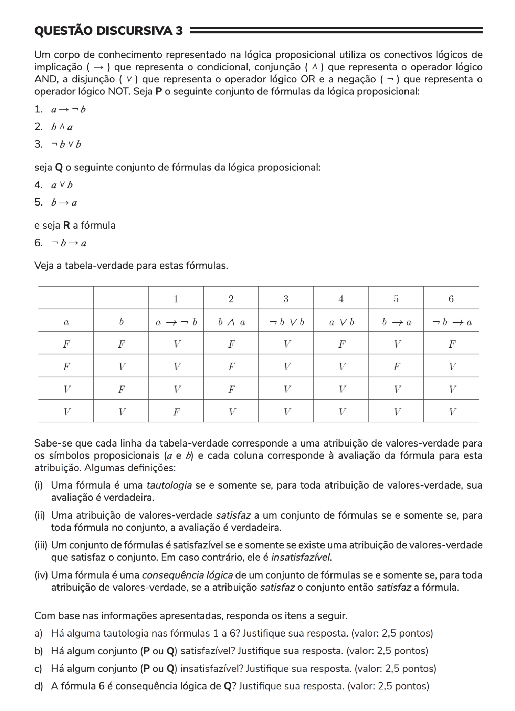

\[ [Next question](q04-eng.md) \] \[ [Main menu](/README.md) \] \[ [Portuguese version](q03-por.md) \] 

## Question 03 ##

**English transcription of the question:**

A body of knowledge represented in propositional logic uses logical connectives of implication (→) which represents the conditional, conjunction (∧) which represents the logical AND, the disjunction (∨) which represents the logical OR and the negation (¬) which represents the logical operator NOT. Let **P** be the following set of formulas of propositional logic:

1. a → ¬b
2. b ∧ a
3. ¬b ∨ b

let **Q** be the following set of formulas of propositional logic:

4. a ∨ b
5. b → ¬a

and let **R** be the formula

6. ¬b → a

See the truth table for these formulas.

\[Table displaying truth values for propositions a and b, and corresponding truth values for formulas 1 through 6. The table has columns labeled "a", "b", "a → ¬b", "b ∧ a", "¬b ∨ b", "a ∨ b", "b → ¬a", "¬b → a", with rows that provide the truth values (True or False) for each formula based on the combination of truth values for a and b.\]

It is known that each row in the truth table corresponds to an attribution of truth values for the propositional symbols (a and b) and each column corresponds to the evaluation of the formula for that attribution. Some definitions:

(i) A formula is a *tautology* if and only if, for every attribution of truth-values, its evaluation is true.

(ii) An attribution of truth-values *satisfies* a set of formulas if and only if, for every formula in the set, the evaluation is true.

(iii) A set of formulas is *satisfiable* if and only if there exists an attribution of truth-values that satisfies the set. Otherwise, it is *unsatisfiable*.

(iv) A formula is a *logical consequence* of a set of formulas if and only if, for every truth-value attribution that satisfies the set, the attribution also *satisfies* the formula.

Based on the information presented, answer the following items:

a) Is there any tautology in formulas 1 to 6? Justify your answer. (value: 2.5 points)

b) Is there any satisfiable set (**P** or **Q**)? Justify your answer. (value: 2.5 points)

c) Is there any unsatisfiable set (**P** or **Q**)? Justify your answer. (value: 2.5 points)

d) Is formula 6 a logical consequence of **Q**? Justify your answer. (value: 2.5 points)**Prompt**: Answer the question(s) in this image by explaining step by step the reasoning used to answer it (them). Inform if any question is not clear or does not have a possible answer.

---

**Response standard**:

a) The respondent must say that formula 3 contains a tautology, as it presents a true evaluation for every assignment (column of Vs).

b) The respondent must indicate that the set Q is satisfiable, as all formulas of Q (4 and 5) are true for assignments 3 and 4 (one would be enough).

c) The respondent must indicate that the set P is not satisfiable, as there is no assignment for which the formulas of P (1, 2, and 3) are all true.

d) The respondent must indicate that formula 6 is a logical consequence of Q, as all assignments that satisfy Q (3 and 4) also satisfy 6.

---

**Prompt**: Answer the question in this image. Explain your reasoning step by step. Inform if the question is unclear or has no possible answer.

---

**ChatGPT-4 Vision response**:

Understood, let's address the questions.

a) Is there any tautology in formulas 1 to 6?

First, let's define what a tautology is: A formula in propositional logic is a tautology if, and only if, it is true for all possible truth-value assignments to its variables.

Looking at the provided truth table:

- Formula 1 (a → b): Not a tautology, as it is false when a is true and b is false.
- Formula 2 (b ∧ a): Not a tautology, as it is false for three out of the four possible combinations.
- Formula 3 (¬b ∨ b): Is a tautology, as it is true in all assignments.
- Formula 4 (a ∨ b): Not a tautology, as it is false when both a and b are false.
- Formula 5 (b → a): Not a tautology, as it is false when b is true and a is false.
- Formula 6 (¬b → a): Not a tautology, as it is false when ¬b is true and a is false.

Answer: The only tautology is formula 3.

b) Is there any satisfiable set (P or Q)?

A set of formulas is satisfiable if there is some truth-value assignment that makes all the formulas in the set true simultaneously.

- Set P: We see that the second line of the table (where a is false and b is true) satisfies all three formulas in P.
- Set Q: The third line of the table (where a is true and b is false) satisfies both formulas in Q.

Answer: Both sets, P and Q, are satisfiable.

c) Is there any unsatisfiable set (P or Q)?

Using the information from the previous item, we know that both sets are satisfiable, so none of them are unsatisfiable.

Answer: No set is unsatisfiable.

d) Is formula 6 a logical consequence of Q?

A formula is a logical consequence of a set if, whenever all the formulas in the set are true, the formula is also true.

To check this, we observe any line where all formulas of Q are true and verify if formula 6 is true on the same line.

Formula 6 is true on lines 2, 3, and 4. The formulas in Q are both true on lines 3 and 4. In both these lines, formula 6 is true.

Answer: Yes, formula 6 is a logical consequence of Q.

---

**Prompt**: Your answers are not completely consistent with the response standard released for this question:

[response standard]

After analyzing the response standard, do you maintain or change your original answers? If you decide to change your answers, explain the possible reasons that led you to errors in the previous answers. Try to identify the concrete causes of errors, rather than listing generic reasons like misunderstanding the statement of the question.

---

**ChatGPT-4 Vision response**:

I change my original answers to align with the released response standard:

a) The only tautology is formula 3.

b) The set Q is satisfiable, as all formulas of Q (4 and 5) are true for assignments 3 and 4.

c) The set P is not satisfiable, as there is no assignment for which the formulas of P (1, 2, and 3) are all true simultaneously.

d) Formula 6 is a logical consequence of Q, as all assignments that satisfy Q (3 and 4) also satisfy 6.

Upon examining the truth table and previous answers, we can identify some more specific errors:

1. **Satisfiable Set P**: By stating that set P was satisfiable, it seems I confused the columns. Looking at the truth table, no single line makes all three formulas in P true simultaneously. The error here was clearly a failure in analyzing the truth table, perhaps giving too much attention to one column or line and losing sight of the overall picture.

2. **Evaluation of Tautologies**: The tautology in formula 3 was correctly identified, but errors in other items may have arisen from a rushed analysis or not properly cross-referencing information between the formulas and the truth table.

3. **About Logical Consequence**: The original answer to item d was correct. However, a mistake in understanding set P may have led to misunderstandings in the relationships between the formulas and their sets.

4. **Failure in the Verification Process**: In stating something about satisfiability or logical consequence, an additional check of the truth table would have helped avoid errors. It seems the verification process was not rigorous enough.

In summary, the errors seem to center on a combination of rushed analysis of the truth table and failure to follow a rigorous verification process. The complexity of the problem is not an excuse, as propositional logic and truth tables are something the model should be able to handle accurately. The most concrete failure was in meticulous analysis and cross-validation of information from the truth table with the given formulas and sets.

---

**Identified challenge categories / error types**

**Visual Acuity / Misidentification of Visual Elements**: upon self-reflection, the model admitted it did a rushed analysis of the truth table and confused the labels of some columns.

**Logical Reasoning / Incorrect Multi-Step Reasoning**: the model failed to cross-reference information between the formulas and the truth table, perhaps due to the error described above, leading to the incorrect evaluation of the satisfiability of set P.

---

**Expert evaluation of ChatGPT-4 Vision's first response based on the response standard**

a) Correct answer (ChatGPT-4 Vision correctly identified that formule 3 contains a tautology): 2.5/2.5 scores

b) Partially correct answer (ChatGPT-4 Vision correctly identified that set Q is satisfiable, but incorrectly identified that set P is also satisfiable): 1.25/2.5 scores

c) Incorrect answer (ChatGPT-4 Vision incorrectly identified that set P is satisfiable): 0/2.5 scores

d) Correct answer (ChatGPT-4 Vision correctly identified that formula 6 is a logical consequence of set Q): 2.5/2.5 scores

Total scores: 2.5 + 1.25 + 0 + 2.5 = 6.25/10.0 (62.5/100)

\[ [Next question](q04-eng.md) \] \[ [Main menu](/README.md) \] \[ [Portuguese version](q03-por.md) \] 
