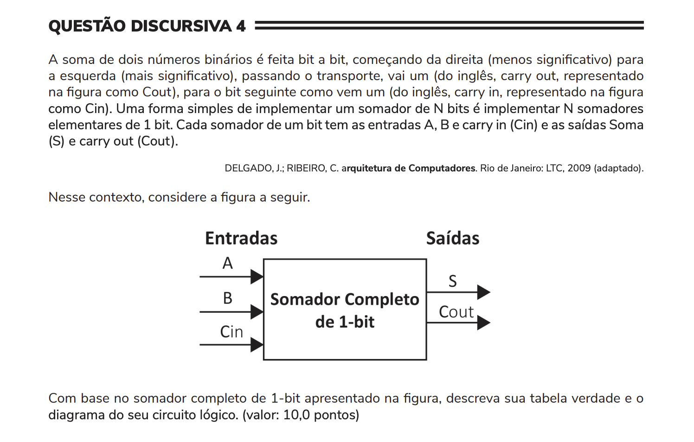

\[ [Previous question](q03-eng.md) \] \[ [Next question](q05-eng.md) \] \[ [Main menu](/README.md) \] \[ [Portuguese version](q04-por.md) \] 

## Question 04 ##

**English transcription of the question:**

The sum of two binary numbers is done bit by bit, starting from the right (less significant) to the left (more significant), and the carry over is forwarded, that is, carry out (represented in the figure as *Cout*), to the next *bit* as carry in (represented in the figure as *Cin*). A simple way to implement an N-bit adder is to implement N elementary 1-bit adders. Each 1-bit adder has inputs A, B, and carry in (Cin) and the outputs Sum (S) and carry out (Cout).

DELGADO, J.; RIBEIRO, C. Computer Architecture. Rio de Janeiro: LTC, 2009 (adapted).

In this context, consider the following figure.

\[The image shows a block diagram of a "1-bit Full Adder" with three inputs labeled A, B, and Cin and two outputs labeled S and Cout.\]

Based on the 1-bit full adder depicted in the figure, describe its truth table and the diagram of its logic circuit. (value: 10.0 points)**Prompt**: Answer the question(s) in this image by explaining step by step the reasoning used to answer it (them). Inform if any question is not clear or does not have a possible answer.

---

**Response standard**:

The respondent should describe the truth table and draw the diagram, as below.

The truth table can be created in different ways, swapping "1"s and "0"s for "V" and "F", or for "T" and "F". Moreover, the rows can appear in any arbitrary order.

The logic circuit can be solved in various ways, with variations in notation, and more than one circuit performing the same operation. The proposed circuit, in fact, combines the two outputs into a single circuit.

Possible notations are presented in the following image, from the IEC 60617-12 standard, and also from ANSI IEEE.

Other possible circuits, without being an exhaustive list, are:

Examples of possible answers for S:

Examples of possible answers for Cout:

---

**Prompt**: Answer the question in this image. Explain your reasoning step by step. Inform if the question is unclear or has no possible answer.

---

**ChatGPT-4 Vision response**:

Understood. Let's address the problem of the 1-bit full adder.

A 1-bit full adder has three inputs: A, B, and Cin (carry-in) and two outputs: S (sum) and Cout (carry-out). The aim of this adder is to add the three input bits and produce the corresponding sum bit and carry bit.

Let's start with the truth table:

| A | B | Cin | S | Cout |
|---|---|-----|---|------|
| 0 | 0 | 0   | 0 | 0    |
| 0 | 0 | 1   | 1 | 0    |
| 0 | 1 | 0   | 1 | 0    |
| 0 | 1 | 1   | 0 | 1    |
| 1 | 0 | 0   | 1 | 0    |
| 1 | 0 | 1   | 0 | 1    |
| 1 | 1 | 0   | 0 | 1    |
| 1 | 1 | 1   | 1 | 1    |

Now, let's deduce the logical expressions for S and Cout:

For the **S** output (sum):
S = A XOR B XOR Cin

For the **Cout** output (carry-out):
There are three scenarios where Cout is 1:
1. A = 1, B = 1
2. A = 1, Cin = 1
3. B = 1, Cin = 1

Therefore:
Cout = (A AND B) OR (A AND Cin) OR (B AND Cin)

Finally, the logical circuit diagram consists of:
1. Three XOR gates to calculate the sum S.
2. Two AND gates and one OR gate to calculate the carry-out Cout.

However, visualizing a logical circuit diagram is not possible here, but you can use the description above to draw it on paper or use a circuit drawing tool.

In summary, a 1-bit full adder adds three input bits and produces a 2-bit result (sum and carry). The logic to calculate these bits is determined by the expressions for S and Cout we just deduced.

---

**Identified challenge categories / error types**

**Visual Acuity / Lack of	Domain-Specific Visual Output**: the model failed to draw the diagram for the logic circuit, as requested by the question.

---

**Expert evaluation of ChatGPT-4 Vision's first response based on the response standard**

The truth table produced by ChatGPT-4 Vision is correct according to the response standard. However, since the model does not have the capability to generate diagrams, and was not explicitly instructed to "draw" a circuit using some textual notation, it merely described the gates that would be part of the requested circuit. As the question explicitly asks the respondent to draw a circuit, only half of the points for this question are attributed to the model's response.

Total scores: 5.0/10.0 (50/100)

\[ [Previous question](q03-eng.md) \] \[ [Next question](q05-eng.md) \] \[ [Main menu](/README.md) \] \[ [Portuguese version](q04-por.md) \] 
