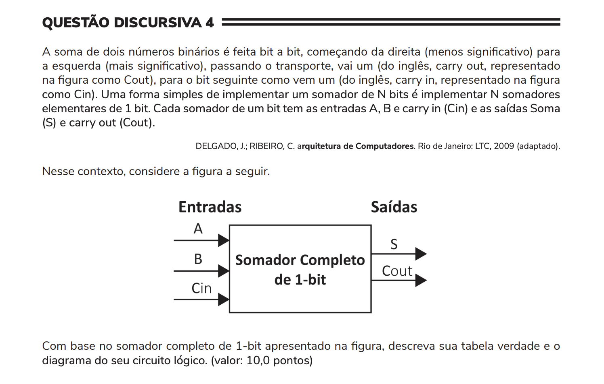

## Question 04 ##

### Original question in image format (in Portuguese): ###

### English translation: ###

**OPEN QUESTION 4**

The sum of two binary numbers is done bit by bit, starting from the right (less significant) to the left (more significant), and the carry over is forwarded, that is, carry out (represented in the figure as *Cout*), to the next *bit* as carry in (represented in the figure as *Cin*). A simple way to implement an N-bit adder is to implement N elementary 1-bit adders. Each 1-bit adder has inputs A, B, and carry in (Cin) and the outputs Sum (S) and carry out (Cout).

DELGADO, J.; RIBEIRO, C. Computer Architecture. Rio de Janeiro: LTC, 2009 (adapted).

In this context, consider the following figure.

\[The image shows a block diagram of a "1-bit Full Adder" with three inputs labeled A, B, and Cin and two outputs labeled S and Cout.\]

Based on the 1-bit full adder depicted in the figure, describe its truth table and the diagram of its logic circuit. (value: 10.0 points)