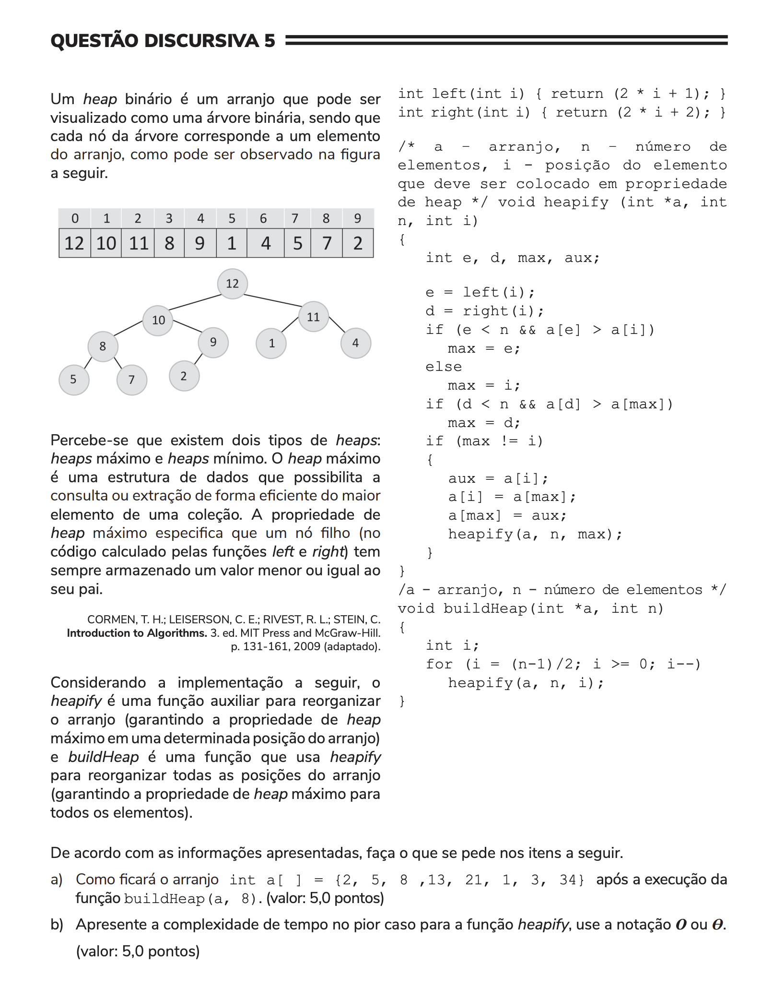

\[ [Previous question](q04-eng.md) \] \[ [Next question](q09-eng.md) \] \[ [Main menu](/README.md) \]

## Question 05 ##

Click [here](q05-por.md) to view ChaGPT-4 Vision's prompts and responses to this question in Portuguese.



**English transcription of the question:**

A binary heap is an array that can be visualized as a binary tree, where each tree node corresponds to an array element, as can be observed in the figure below.

\[An image of a binary tree with corresponding array indexes and values below it. The binary tree shows a tree structure with the number 12 at the root and subsequent child nodes displaying the numbers 10, 11, 8, 9, 1, 4, 5, 7 and 2. The corresponding array is shown above the tree with indices ranging from 0 to 9 and containing the values 12, 10, 11, 8, 9, 1, 4, 5, 7, 2.\]

There exist two types of heaps: maximum heaps and minimum heaps. The maximum heap is a data structure that allows efficient query or removal of the maximum element from the collection. The maximum heap specifies that a node (calculated by the functions *left* and *right* in the companying code) should store a value smaller or equal to its parent.

CORMEN, T. H.; LEISERSON, C. E.; RIVEST, R. L.; STEIN, C. Introduction to Algorithms. 3. ed. MIT Press and McGraw-Hill, p. 131-161, 2009 (adapted).

Considering the following implementation, *heapify* is a helper function to organize the array (ensuring the heap property for a certain position of the array) and *buildHeap* is a function that uses *heapify* to reorganize all the positions of the array (ensuring the heap property of maximum heap for all its elements).

```
int left(int i) { return (2 * i + 1); }
int right(int i) { return (2 * i + 2); }

/* a - array, n - number of elements, i - position of the element that must be placed in proper heap order */
void heapify(int *a, int n, int i)
{
    int e, d, max, aux;

    e = left(i);
    d = right(i);
    if (e < n && a\[e\] > a\[i\])
        max = e;
    else
        max = i;
    if (d < n && a\[d\] > a\[max\])
        max = d;
    if (max != i)
    {
        aux = a\[i\];
        a\[i\] = a\[max\];
        a\[max\] = aux;
        heapify(a, n, max);
    }
}

/* a - array, n - number of elements */
void buildHeap(int *a, int n)
{
    int i;
    for (i = (n-1)/2; i >= 0; i--)
        heapify(a, n, i);
}
```

Based on the information presented, do what is requested in the items below.

a) How will the array int a\[ \] = {2, 5, 8, 13, 21, 1, 3, 34} look like after the execution of the function *buildHeap*(a, 8). (value: 5.0 points)

b) Present the time complexity in the worst case for the function *heapify*, using the notation *O* or *Θ*. (value: 5.0 points)

---

**Prompt**: Answer the question in this image. Explain your reasoning step by step. Inform if the question is unclear or has no possible answer.

---

**ChatGPT-4 Vision response**:

Let's address the presented questions:

a) What will be the arrangement of `int a[] = {2, 5, 8, 13, 21, 1, 3, 34}` after executing the function `buildHeap(a, 8)`?

The function `buildHeap` begins by calling the `heapify` function at the penultimate level of the tree (or heap). In terms of the array, this translates to starting from the middle of the array and going backwards.

The `heapify` method is responsible for maintaining the max heap property. If an element is smaller than its children, it will be swapped with the larger of its children.

The initial arrangement is:
`2, 5, 8, 13, 21, 1, 3, 34`

Now, let's go through the array using `buildHeap`:
1. We start at i = 3 (remembering that indexing starts at 0), which is the value 13. Its children are 21 and 1. 21 is larger, and therefore, 13 and 21 swap places.
   Result: `2, 5, 8, 21, 13, 1, 3, 34`
2. i = 2, which is the value 8. Its children are 1 and 3. 8 is already larger than both, so nothing changes.
   Result: `2, 5, 8, 21, 13, 1, 3, 34`
3. i = 1, which is the value 5. Its children are 21 and 13. 21 is larger, so 5 and 21 swap places. Moreover, after this swap, 5 will be compared again with its new children (i.e., the `heapify` method is called again).
   Result after first swap: `2, 21, 8, 5, 13, 1, 3, 34`
   After the recursive call, 5 and 13 swap places.
   Result: `2, 21, 8, 13, 5, 1, 3, 34`
4. i = 0, which is the value 2. Its children are 21 and 8. 21 is larger, so 2 and 21 swap places.
   Result: `21, 2, 8, 13, 5, 1, 3, 34`

Thus, after the execution of the function `buildHeap`, the arrangement will be:
`21, 2, 8, 13, 5, 1, 3, 34`

b) Present the worst-case time complexity for the `heapify` function, using the O or Θ notation.

The complexity of the `heapify` function is determined by the height of the tree, because in the worst case, it may be necessary to swap an element with its child until it reaches the bottom of the tree. The height of a complete binary tree is log(n). Therefore, the worst-case time complexity for the `heapify` function is O(log n).

Answers:
a) `21, 2, 8, 13, 5, 1, 3, 34`
b) O(log n)

---

**Response standard**:

a) The respondent should show that after executing the function `buildHeap` the arrangement will be as follows: {34, 21, 8, 13, 2, 1, 3, 5}.

b) The respondent should present that in the worst case for the `heapify` function the time complexity will be as follows: O(log n), being n the number of elements in the heap.

---

**Prompt**: Your answers are not completely consistent with the response standard released for this question:

[response standard]

After analyzing the response standard, do you maintain or change your original answers? If you decide to change your answers, explain the possible reasons that led you to errors in the previous answers. Try to identify the concrete causes of errors, rather than listing generic reasons like misunderstanding the statement of the question.

---

**ChatGPT-4 Vision response**:

After reviewing the response standard, I would change my original answers as follows:

a) The arrangement after executing the function `buildHeap` is `{34, 21, 8, 13, 2, 1, 3, 5}`.

b) The worst-case time complexity of the `heapify` function is O(log n).

**Reasons for Errors**:

a) **Error in Executing `buildHeap`**: When executing the function `buildHeap`, I did not correctly apply the max heap property at some stages. For example, the value 34, which is the highest in the arrangement, should have risen to the root after the complete execution of `buildHeap`, but this did not happen in my original answer. This indicates a failure in my simulation of the algorithm's execution.

b) For the complexity, my answer was correct, but it could have been explained more clearly and directly.

**Concrete Causes of Errors**:

1. **Algorithm Simulation**: In simulating the algorithm, I did not apply all possible swaps that `heapify` could make. For example, the value 34 should have been promoted higher in the heap, but I missed this step. Algorithm simulation requires careful attention at each step, and it seems there was haste or lack of attention to details in my simulation.

2. **Review**: At the end of the simulation, I did not review the resulting structure to ensure it met the max heap property, which would have indicated that something was wrong with the original response.

In summary, the errors mainly stem from failing to simulate the algorithm correctly and not reviewing the resulting structure to ensure it adhered to the desired property.

---

**Expert evaluation of ChatGPT-4 Vision's first response based on the response standard**

a) Incorrect answer (ChatGPT-4 Vision produced an incorrect arrangement according to the response standard): 0.0/5.0 scores

b) Correct answer (ChatGPT-4 Vision correctly informed the algorithm complexity according to the response standard): 5.0/5.0 scores

Total scores: 0.0 + 5.0 = 5.0/10.0


\[ [Previous question](q04-eng.md) \] \[ [Next question](q09-eng.md) \] \[ [Main menu](/README.md) \]
