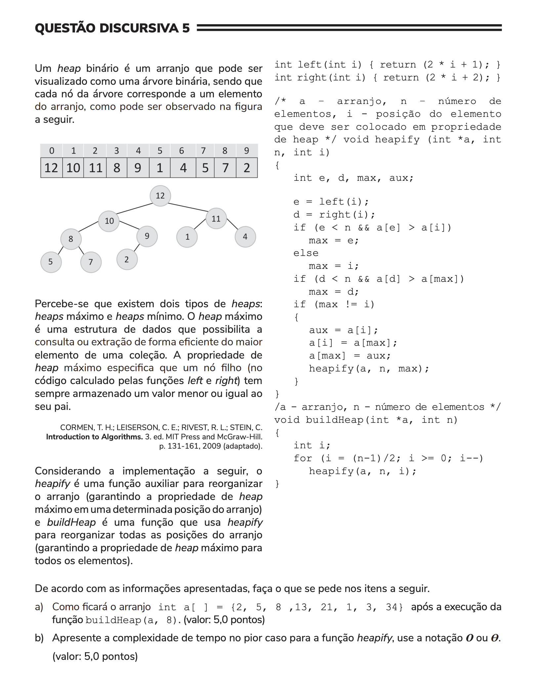

## Question 05 ##

### Original question in image format (in Portuguese): ###


### English translation: ###

**OPEN QUESTION 5**

A binary heap is an array that can be visualized as a binary tree, where each tree node corresponds to an array element, as can be observed in the figure below.

\[An image of a binary tree with corresponding array indexes and values below it. The binary tree shows a tree structure with the number 12 at the root and subsequent child nodes displaying the numbers 10, 11, 8, 9, 1, 4, 5, 7 and 2. The corresponding array is shown above the tree with indices ranging from 0 to 9 and containing the values 12, 10, 11, 8, 9, 1, 4, 5, 7, 2.\]

There exist two types of heaps: maximum heaps and minimum heaps. The maximum heap is a data structure that allows efficient query or removal of the maximum element from the collection. The maximum heap specifies that a node (calculated by the functions *left* and *right* in the companying code) should store a value smaller or equal to its parent.

CORMEN, T. H.; LEISERSON, C. E.; RIVEST, R. L.; STEIN, C. Introduction to Algorithms. 3. ed. MIT Press and McGraw-Hill, p. 131-161, 2009 (adapted).

Considering the following implementation, *heapify* is a helper function to organize the array (ensuring the heap property for a certain position of the array) and *buildHeap* is a function that uses *heapify* to reorganize all the positions of the array (ensuring the heap property of maximum heap for all its elements).

```
int left(int i) { return (2 * i + 1); }
int right(int i) { return (2 * i + 2); }

/* a - array, n - number of elements, i - position of the element that must be placed in proper heap order */
void heapify(int *a, int n, int i)
{
    int e, d, max, aux;

    e = left(i);
    d = right(i);
    if (e < n && a\[e\] > a\[i\])
        max = e;
    else
        max = i;
    if (d < n && a\[d\] > a\[max\])
        max = d;
    if (max != i)
    {
        aux = a\[i\];
        a\[i\] = a\[max\];
        a\[max\] = aux;
        heapify(a, n, max);
    }
}

/* a - array, n - number of elements */
void buildHeap(int *a, int n)
{
    int i;
    for (i = (n-1)/2; i >= 0; i--)
        heapify(a, n, i);
}
```

Based on the information presented, do what is requested in the items below.

a) How will the array int a\[ \] = {2, 5, 8, 13, 21, 1, 3, 34} look like after the execution of the function *buildHeap*(a, 8). (value: 5.0 points)

b) Present the time complexity in the worst case for the function *heapify*, using the notation *O* or *Θ*. (value: 5.0 points)
