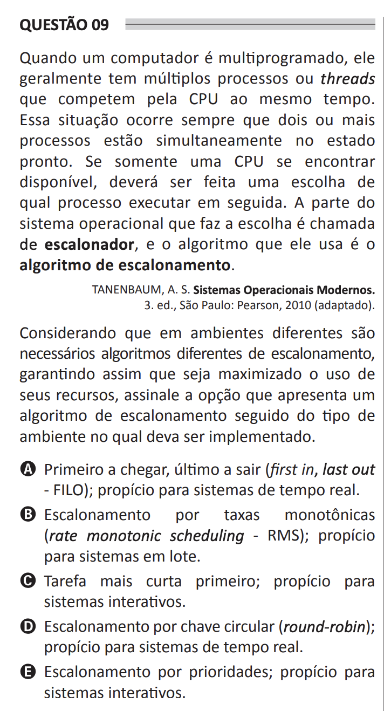

## Questão 09 ##

**Prompt**: Responda a questão nesta imagem. Explique o seu raciocínio passo a passo. Ao final, escolha qual das cinco alternativas fornecidas (A-E) é a correta. Informe caso haja mais de uma alternativa correta ou todas as cinco alternativas sejam incorretas.

---

**Resposta do ChatGPT-4 Vision**: 

Vamos analisar as opções fornecidas e determinar qual algoritmo de escalonamento é apropriado para o tipo de ambiente mencionado:

A) Primeiro a chegar, último a sair (first in, last out - FILO); propício para sistemas de tempo real.
   - Esse tipo de abordagem não é típico para sistemas de tempo real, pois sistemas de tempo real priorizam a execução das tarefas com base em seus prazos de execução, e não a ordem em que elas chegaram.

B) Escalonamento por taxas monotônicas (rate monotonic scheduling - RMS); propício para sistemas em lote.
   - O escalonamento por taxas monotônicas é, na verdade, mais adequado para sistemas de tempo real, pois atribui prioridades com base na frequência de execução das tarefas.

C) Tarefa mais curta primeiro; propício para sistemas interativos.
   - Este é um algoritmo clássico e faz sentido para sistemas interativos, onde queremos minimizar o tempo de resposta, dando preferência às tarefas que podem ser concluídas rapidamente.

D) Escalonamento por chave circular (round-robin); propício para sistemas de tempo real.
   - O escalonamento por chave circular, ou round-robin, é geralmente usado em sistemas interativos ou de propósito geral, pois permite que cada tarefa receba um "quantum" de tempo, garantindo que nenhuma tarefa monopolize a CPU. No entanto, não é ideal para sistemas de tempo real, que têm requisitos rigorosos de tempo.

E) Escalonamento por prioridades; propício para sistemas interativos.
   - Esse método também é adequado para sistemas interativos, pois tarefas com maior prioridade (como aquelas que um usuário está esperando) podem ser executadas antes de outras com menor prioridade.

Analisando as opções, a alternativa mais precisa e corretamente relacionada ao tipo de ambiente mencionado é:

Resposta: C) Tarefa mais curta primeiro; propício para sistemas interativos.

---

**Gabarito**: E

---

**Prompt**: A sua resposta difere do gabarito divulgado para esta questão: [gabarito]

Após analisar o gabarito, você mantém ou altera sua resposta? Se decidir alterar sua resposta, explique as possíveis razões que o induziram ao erro. Procure identificar as causas concretas do seu erro, ao invés de listar razões genéricas como falha de compreensão do enunciado da questão.

---

**Resposta do ChatGPT-4 Vision**:

Mantenho minha resposta original: **C) Tarefa mais curta primeiro; propício para sistemas interativos**.

Razão para a escolha:

- O algoritmo "Tarefa mais curta primeiro" é ideal para sistemas interativos. Em tais sistemas, priorizar a tarefa que pode ser concluída no menor tempo possível é benéfico para a resposta ao usuário. Ao executar tarefas mais curtas primeiro, o sistema pode responder rapidamente a muitas solicitações, reduzindo o tempo médio de espera e melhorando a interatividade.

Análise das possíveis causas de discrepância com o gabarito:

1. **Definição de Ambiente Interativo**: Pode haver uma diferença na interpretação do que constitui um "sistema interativo". Em minha análise, sistemas interativos são aqueles em que a interação rápida e responsiva com o usuário é essencial. Em tais sistemas, minimizar o tempo de resposta é crucial.

2. **Escolha de Algoritmo com base em Prioridade**: O algoritmo de "Escalonamento por prioridades" também é uma escolha válida para sistemas interativos. No entanto, o "Tarefa mais curta primeiro" é um tipo específico de escalonamento por prioridade onde a "duração da tarefa" determina sua prioridade.

3. **Diferença nas Fontes Referenciadas**: Pode haver uma diferença nas fontes ou literaturas de referência usadas para formular a questão e as que eu usei para formar minha resposta. Algumas literaturas podem dar mais ênfase ao escalonamento por prioridades em sistemas interativos em detrimento do algoritmo "Tarefa mais curta primeiro".

4. **Complexidade da Questão**: A área de sistemas operacionais e escalonamento é complexa, e a escolha do algoritmo ideal pode variar com base em nuances específicas do sistema em questão. A resposta pode variar dependendo da interpretação dessas nuances.

Em resumo, enquanto a resposta C é válida com base na minha análise e conhecimento, reconheço que diferentes interpretações e considerações podem levar a uma resposta diferente.

## Avaliação de especialistas ##

**Especialista #1**

O gabarito está correto, apesar da resposta da letra C poder ser mal interpretada e gerar confusão.

Alguém que entende bem de sistemas operacionais saberia que usar somente o tamanho da tarefa em um sistema multiprogramado pode gerar problema para tarefas interativas. Imagine uma situação, mesmo sendo em um ambiente com diversas tarefas interativas, na qual se houver algumas tarefas não interativas de tamanho pequeno, elas irão se sobrepor às interativas, fazendo com que estas tarefas interativas fiquem bloqueadas por longo período de tempo.

---

**Especialista #2**

A meu ver, o gabarito está correto e, de acordo com o meu raciocínio mais especializado em sistemas distribuídos que S.O., o erro do ChatGPT é assumir que as tarefas interativas são sempre as mais curtas. Se supormos que as tarefas interativas são sempre mais curtas, aí a resposta C estaria correta.

Quando ele mantém a resposta e diz que:

"O algoritmo de 'Escalonamento por prioridades' também é uma escolha válida para sistemas interativos. No entanto, o 'Tarefa mais curta primeiro' é um tipo específico de escalonamento por prioridade onde a 'duração da tarefa' determina sua prioridade."

Está implícito que assume que o esquema de prioridade "tarefa mais curta primeiro" é um esquema de prioridade que serve para qualquer sistema interativo, o que pode não ser verdade se temos tarefas de duração maior que devem ser priorizadas para interação em detrimento de tarefas curtas que não são interativas.

---

**Veredito**

De acordo com os especialistas, o gabarito está correto e a resposta do ChatGPT-4 Vision está incorreta.

## Análise do ChatGPT-4 Turbo dos principais desafios que o ChatGPT-4 Vision enfrentou ao responder a questão ##

**Prompt**: Seguem os prompts e as respostas de uma IA gerativa para a questão em anexo, juntamente com possíveis avaliações de dois ou mais especialistas humanos sobre as respostas da IA generativa e a qualidade geral da questão. Com base nas informações fornecidas, resuma as principais dificuldades enfrentadas pela IA gerativa ao tentar responder à questão, incluindo possíveis dificuldades resultantes do reconhecimento incorreto de algum elemento gráfico ou textual presente no enunciado da questão. Considere apenas dificuldades concretas cuja manifestação pode ser evidenciada pelas informações fornecidas nas respostas da IA gerativa. Ao final, discuta se essas dificuldades poderiam ser mitigadas ou eliminadas por meio de técnicas de engenharia de prompts ou se seriam inerentes às limitações dos atuais grandes modelos de linguagem de grande (LLMs).

---

**Resposta do ChatGPT-4 Turbo**:

Ao tentar responder a questão sobre algoritmos de escalonamento em sistemas operacionais, a IA gerativa enfrentou as seguintes dificuldades concretas:

1. **Interpretação do Conteúdo**: A IA escolheu a opção "C) Tarefa mais curta primeiro; propício para sistemas interativos" como a resposta correta, mas o gabarito oficial indicava a opção "E) Escalonamento por prioridades; propício para sistemas interativos". Isso sugere uma possível falha na interpretação do conteúdo da questão ou do contexto em que cada algoritmo é aplicado.

2. **Manutenção da Resposta Apesar do Gabarito**: Mesmo após ser informada de que sua resposta divergia do gabarito, a IA manteve sua escolha original, baseando-se na sua análise de que o algoritmo de "Tarefa mais curta primeiro" é ideal para sistemas interativos devido à priorização de tarefas que podem ser concluídas rapidamente, minimizando o tempo de resposta.

3. **Feedback de Especialistas**: Dois especialistas forneceram feedback indicando que o gabarito estava correto e explicaram que em ambientes multiprogramados, a escolha do algoritmo "Tarefa mais curta primeiro" poderia levar a problemas com tarefas interativas, pois tarefas não interativas mas curtas poderiam monopolizar a CPU.

Essas dificuldades sugerem que, apesar da capacidade da IA de analisar e raciocinar sobre a questão, ela pode ter se baseado em premissas incorretas ou ter uma compreensão limitada da aplicação prática dos algoritmos de escalonamento. A engenharia de prompt poderia potencialmente amenizar essas dificuldades, guiando a IA para considerar o contexto operacional mais amplo e as nuances associadas aos diferentes tipos de sistemas.

No entanto, a dificuldade em ajustar a resposta após o feedback do gabarito e dos especialistas reflete uma limitação inerente dos LLMs atuais: a dificuldade em reavaliar as informações e conclusões com base em novos dados. Essa limitação requer desenvolvimento de melhores estratégias para que os LLMs incorporem feedback e ajustem suas respostas de forma mais eficaz. Isso indica uma necessidade de avanço contínuo nos modelos de IA para melhorar sua capacidade de adaptação e reavaliação em contextos dinâmicos e complexos como a interpretação de questões de exame.
