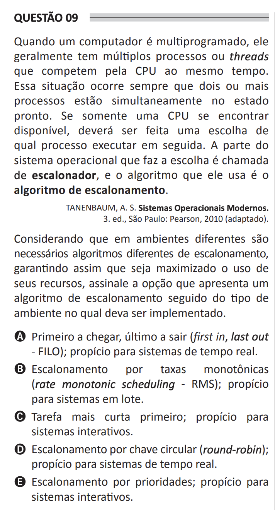

## Question 09 ##

### Original question in image format (in Portuguese): ###

### English translation: ###

**QUESTION 09**

When a computer is multi-programmed, it typically has multiple processes or threads competing for the CPU at the same time. This situation occurs whenever two or more processes are simultaneously in the ready state. If only one CPU is available, a choice must be made regarding which process to execute next. The part of the operating system that makes that choice is called the **scheduler**, and the algorithm it uses is the **scheduling algorithm**.

TANENBAUM, A. S. Modern Operating Systems. 3rd ed., São Paulo: Pearson, 2010 (adapted).

Considering that different environments require different scheduling algorithms, thus ensuring that the use of resources is maximized, select the option that presents a scheduling algorithm followed by the type of environment in which it should be implemented.

A) First in, last out (FILO); suitable for real-time systems.

B) Rate monotonic scheduling (RMS); suitable for batch systems.

C) Shortest job first; suitable for interactive systems.

D) Round-robin scheduling; suitable for real-time systems.

E) Priority scheduling; suitable for interactive systems.