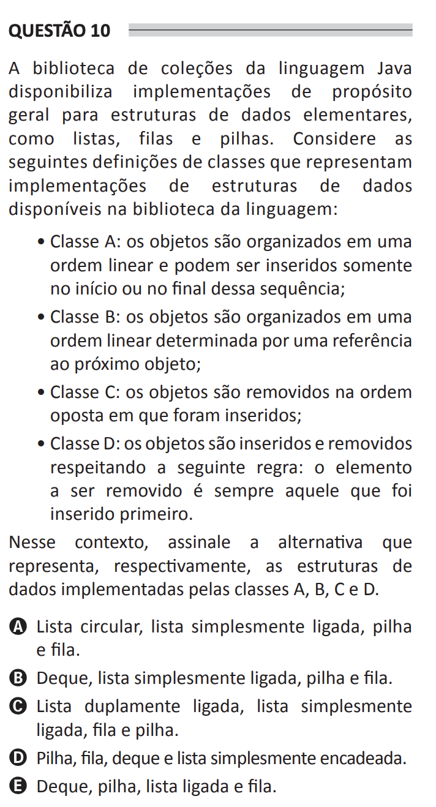

\[ [Questão anterior](q09-por.md) \] \[ [Próxima questão](q11-por.md) \] \[ [Menu inicial](/README.md) \]

## Questão 10 ##

Clique [aqui](q10-eng.md) para ver os prompts e as respostas do ChaGPT-4 Vision a esta questão em Inglês.

**Prompt**: Responda a questão nesta imagem. Explique o seu raciocínio passo a passo. Ao final, escolha qual das cinco alternativas fornecidas (A-E) é a correta. Informe caso haja mais de uma alternativa correta ou todas as cinco alternativas sejam incorretas.

---

**Resposta do ChatGPT-4 Vision**: 

Vamos analisar cada classe e identificar que tipo de estrutura de dados ela representa:

1. **Classe A**: Os objetos são organizados em uma ordem linear e podem ser inseridos somente no início ou no final dessa sequência.
   - Isso descreve uma estrutura de **deque** (Double Ended Queue). Em um deque, é possível inserir e remover elementos de ambas as extremidades.

2. **Classe B**: Os objetos são organizados em uma ordem linear determinada por uma referência ao próximo objeto.
   - Esta é a característica de uma **lista simplesmente ligada**, onde cada elemento aponta para o próximo elemento na lista.

3. **Classe C**: Os objetos são removidos na ordem oposta em que foram inseridos.
   - Essa é a definição básica de uma **pilha** (stack). Na pilha, o último objeto inserido é o primeiro a ser removido (LIFO - Last In First Out).

4. **Classe D**: Os objetos são inseridos e removidos respeitando a seguinte regra: o elemento a ser removido é sempre aquele que foi inserido primeiro.
   - Isso descreve uma **fila** (queue). Na fila, o primeiro objeto inserido é o primeiro a ser removido (FIFO - First In First Out).

Dadas essas análises, a alternativa que corresponde corretamente à descrição das classes A, B, C e D é:

Resposta: B) Deque, lista simplesmente ligada, pilha e fila.

---

**Gabarito**: B

---

**Veredito**

A resposta do ChatGPT é consistente com o gabarito.

\[ [Questão anterior](q09-por.md) \] \[ [Próxima questão](q11-por.md) \] \[ [Menu inicial](/README.md) \]
