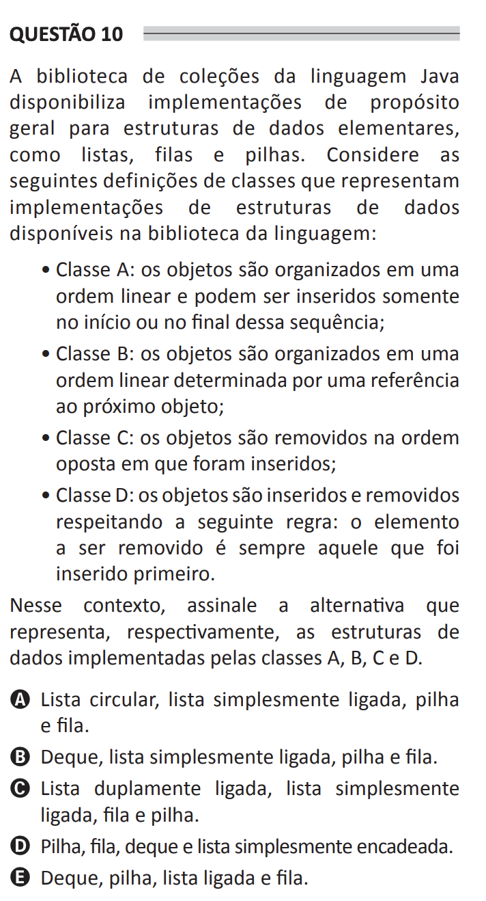

## Question 10 ##

### Original question in image format (in Portuguese): ###

### English translation: ###

**QUESTION 10**

The Java language collections library provides implementations intended for elementary data structures, such as lists, queues, and stacks. Consider the following definitions of classes that represent implementations of data structures available in the language library:

- Class A: objects are organized in a linear order and can only be inserted at the beginning or end of this sequence;

- Class B: objects are organized in a linear order determined by a reference to the next object;

- Class C: objects are removed in the opposite order in which they were inserted;

- Class D: objects are inserted and removed following the rule: the element to be removed is always the one that was inserted first.

In this context, select the alternative that represents, respectively, the data structures implemented by classes A, B, C, and D.

A) Circular list, simply linked list, stack, and queue.

B) Deque, simply linked list, stack, and queue.

C) Doubly linked list, simply linked list, queue, and stack.

D) Stack, queue, deque, and simply chained list.

E) Deque, stack, linked list, and queue.