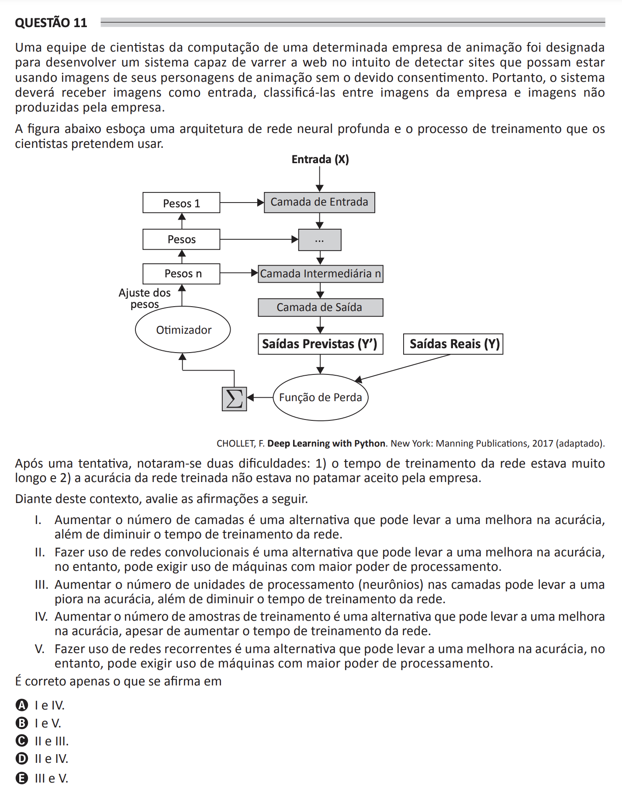

## Question 11 ##

### Original question in image format (in Portuguese): ###

### English translation: ###

**QUESTION 11**

A team of computer scientists from a certain animation company has been tasked with developing a system capable of scanning the web to detect sites that might be using the company's animation character images without proper consent. Therefore, the system should receive images as input, classify them between company images and images not produced by the company.

The figure below outlines a deep neural network architecture and the training process the scientists intend to use.

\[The image shows a flow diagram for a deep neural network architecture, consisting of an input layer (Entrada (X)), a series of intermediary layers (Pesos 1, ..., Pesos n, with Camada de Entrada, ..., and Camada Intermediária n between the weight layers), leading to an output layer (Camada de Saída). This is followed by Predicted Outputs (Saídas Previstas (Y')) being compared with Real Outputs (Saídas Reais (Y)) using a Loss Function (Função de Perda), which feeds into an Optimizer (Otimizador) that adjusts the weights (Ajuste dos pesos).\]

CHOULLET, F. Deep Learning with Python. New York: Manning Publications, 2017 (adapted).

After one attempt, two difficulties were noticed: 1) the network training time was too long, and 2) the network's accuracy was not at an acceptable level for the company.

Given these findings, consider the following statements.

I.    Increasing the number of layers is an alternative that can lead to an improvement in accuracy, as well as decreasing the network training time.

II.   Making use of convolutional networks is an alternative that can lead to an improvement in accuracy, however, it may require the use of machines with greater processing power.

III.  Increasing the number of processing units (neurons) in the layers may lead to an improvement in accuracy, as well as decreasing the network training time.

IV.   Increasing the number of training samples is an alternative that can lead to an improvement in accuracy, as well as decreasing the network training time.

V.    Making use of recurrent networks is an alternative that can lead to an improvement in accuracy, however, it may require the use of machines with greater processing power.

It is correct only what is stated in

A) I and IV.

B) I and V.

C) II and III.

D) II and IV.

E) III and V.