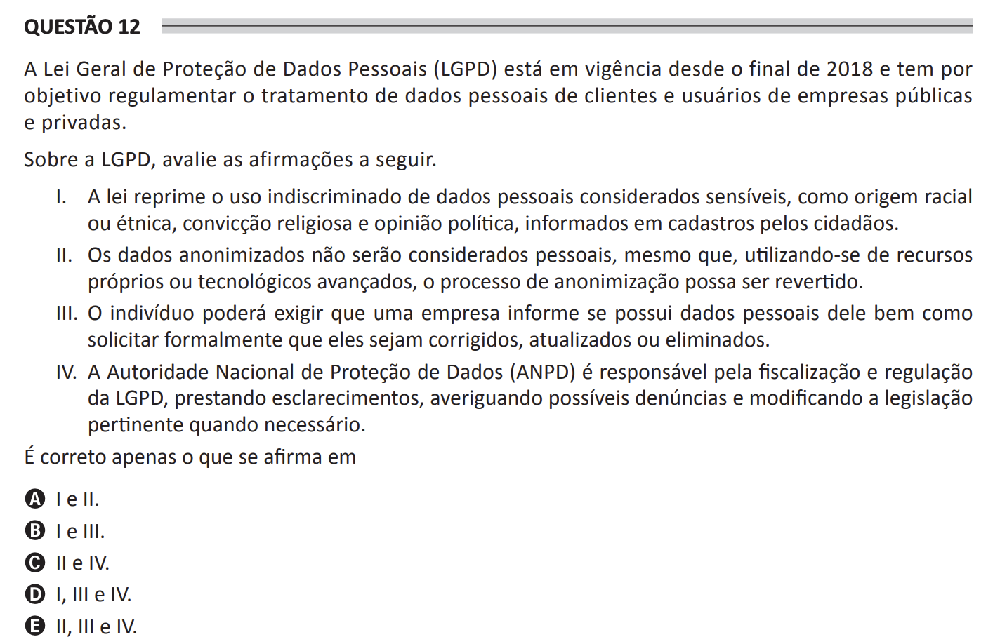

\[ [Questão anterior](q11-por.md) \] \[ [Próxima questão](q13-por.md) \]

## Questão 12 ##

**Prompt**: Responda a questão nesta imagem. Explique o seu raciocínio passo a passo. Ao final, escolha qual das cinco alternativas fornecidas (A-E) é a correta. Informe caso haja mais de uma alternativa correta ou todas as cinco alternativas sejam incorretas.

---

**Resposta do ChatGPT-4 Vision**: 

Vamos analisar as afirmações sobre a Lei Geral de Proteção de Dados Pessoais (LGPD) uma por uma:

I. **A lei reprime o uso indiscriminado de dados pessoais considerados sensíveis, como origem racial ou étnica, convicção religiosa e opinião política, informados em cadastros pelos cidadãos.**
   - Isso é correto. A LGPD classifica certos tipos de dados, como origem racial, convicção religiosa e opinião política, como "dados sensíveis". Esses dados têm proteções adicionais sob a lei, e o uso indiscriminado deles é reprimido.

II. **Os dados anonimizados não serão considerados pessoais, mesmo que, utilizando-se de recursos próprios ou tecnológicos avançados, o processo de anonimização possa ser revertido.**
   - Isso é parcialmente correto. A LGPD estabelece que dados anonimizados não são considerados dados pessoais, a menos que a anonimização possa ser revertida usando meios razoavelmente disponíveis. Portanto, se o processo de anonimização puder ser facilmente revertido, os dados ainda podem ser considerados pessoais.

III. **O indivíduo poderá exigir que uma empresa informe se possui dados pessoais dele bem como solicitar formalmente que eles sejam corrigidos, atualizados ou eliminados.**
   - Isso é correto. Um dos principais princípios da LGPD é o direito do titular dos dados de acessar, corrigir e solicitar a eliminação de seus dados pessoais.

IV. **A Autoridade Nacional de Proteção de Dados (ANPD) é responsável pela fiscalização e regulação da LGPD, prestando esclarecimentos, averiguando possíveis denúncias e modificando a legislação pertinente quando necessário.**
   - Isso é majoritariamente correto. A ANPD é o órgão responsável por fiscalizar e aplicar a LGPD. No entanto, a ANPD não tem o poder de modificar a legislação; isso é uma prerrogativa do Poder Legislativo. A ANPD pode, no entanto, emitir diretrizes e regulamentações para esclarecer e auxiliar na aplicação da lei.

Com base nas análises acima, as afirmações **I, III e IV** (com uma ressalva para IV) são as mais precisas.

Resposta: D) I, III e IV.

---

**Gabarito**: B

---

**Prompt**: A sua resposta difere do gabarito divulgado para esta questão: [gabarito]

Após analisar o gabarito, você mantém ou altera sua resposta? Se decidir alterar sua resposta, explique as possíveis razões que o induziram ao erro. Procure identificar as causas concretas do seu erro, ao invés de listar razões genéricas como falha de compreensão do enunciado da questão.

---

**Resposta do ChatGPT-4 Vision**:

Mantenho a resposta original: **D) I, III e IV.**

Razões para a manutenção da resposta original:

1. **A afirmação I** é claramente correta, como mencionado anteriormente. A LGPD de fato classifica certos tipos de dados como "sensíveis" e reprime o uso indiscriminado desses dados.
  
2. **A afirmação II** é um pouco ambígua, mas conforme explicado anteriormente, a LGPD considera que dados anonimizados não são dados pessoais a menos que a anonimização possa ser revertida usando meios razoavelmente disponíveis. A maneira como a afirmação foi redigida sugere que mesmo que a anonimização possa ser revertida com tecnologia avançada, esses dados ainda não seriam considerados pessoais, o que não está totalmente alinhado com a LGPD. Portanto, esta afirmação pode ser considerada imprecisa.

3. **A afirmação III** é definitivamente correta, e está de acordo com os princípios fundamentais da LGPD sobre os direitos do titular dos dados.

4. **A afirmação IV** é majoritariamente correta. A única ressalva, como mencionado, é que a ANPD não pode modificar a legislação, embora possa emitir diretrizes e regulamentações.

A possível razão para o erro em minha resposta anterior seria a interpretação da afirmação II, que pode ser entendida de diferentes maneiras dependendo de como se interpreta a capacidade de reverter a anonimização.

A discrepância entre minha resposta e o gabarito divulgado pode ser devido a diferentes interpretações da afirmação II ou a diferentes compreensões de certos aspectos da LGPD.

---

**Prompt**: No contexto de uma prova objetiva com múltiplas alternativas, uma afirmação _majoritariamente_ correta não seria, para todos os efeitos, incorreta? Especificamente, se a afirmação IV foi interpretada como parcialmente correta, com uma ressalva mencionada explicitamente, no caso da ANPD não ter poder para modificar a legislação, isso, por si só, já não seria suficiente para interpretar a afirmação como falsa? Parece que houve uma "forçação de barra" para interpretar essa afirmação como verdadeira, o que acabou induzindo à escolha da alternativa errada. Concorda?

---

**Resposta do ChatGPT-4 Vision**:

Concordo. Em provas objetivas, normalmente espera-se que uma afirmação seja completamente correta para ser considerada verdadeira. Qualquer parte da afirmação que seja falsa torna a afirmação inteira falsa. Considerando essa lógica estrita, a afirmação IV seria incorreta devido à sua parte imprecisa sobre a ANPD ter o poder de modificar a legislação. Assim, a minha interpretação anterior foi, de fato, indulgente ao considerar a afirmação IV como majoritariamente correta em vez de simplesmente falsa. Peço desculpas pelo erro e agradeço por apontá-lo.

---

**Veredito**

ChatGPT-4 Vision voltou atrás na sua resposta e concordou com o gabarito.

## Análise do ChatGPT-4 Turbo dos principais desafios que o ChatGPT-4 Vision enfrentou ao responder a questão ##

**Prompt**: Seguem os prompts e as respostas de uma IA gerativa para a questão em anexo, juntamente com possíveis avaliações de dois ou mais especialistas humanos sobre as respostas da IA generativa e a qualidade geral da questão. Com base nas informações fornecidas, resuma as principais dificuldades enfrentadas pela IA gerativa ao tentar responder à questão, incluindo possíveis dificuldades resultantes do reconhecimento incorreto de algum elemento gráfico ou textual presente no enunciado da questão. Considere apenas dificuldades concretas cuja manifestação pode ser evidenciada pelas informações fornecidas nas respostas da IA gerativa. Ao final, discuta se essas dificuldades poderiam ser mitigadas ou eliminadas por meio de técnicas de engenharia de prompts ou se seriam inerentes às limitações dos atuais grandes modelos de linguagem de grande (LLMs).

---

**Resposta do ChatGPT-4 Turbo**:

A IA enfrentou dificuldades ao responder à questão sobre a Lei Geral de Proteção de Dados Pessoais (LGPD) principalmente devido a nuances na interpretação da lei e do texto da questão. Aqui estão algumas dificuldades identificadas:

1. **Interpretação Ambígua**: A afirmação II da questão era ambígua, o que levou a uma interpretação que não estava totalmente alinhada com a LGPD. A IA considerou a afirmação parcialmente correta porque interpretou que dados anonimizados não são considerados pessoais a menos que a anonimização possa ser revertida facilmente, o que é uma interpretação razoável da lei mas não reflete necessariamente o espírito ou a letra exata da LGPD.

2. **Erro de Interpretação**: Na afirmação IV, a IA interpretou incorretamente que a ANPD tinha o poder de modificar a legislação, o que não é verdade. A IA mais tarde reconheceu que em provas objetivas, uma afirmação majoritariamente correta ainda é considerada incorreta se qualquer parte dela for falsa.

3. **Rigidez nas Provas Objetivas**: A IA teve dificuldade em aplicar a rigidez necessária para responder a uma questão objetiva, onde uma afirmação precisa ser completamente verdadeira para ser considerada correta.

Essas dificuldades são parcialmente inerentes às limitações dos LLMs atuais, que podem interpretar texto de maneira flexível mas podem falhar em contextos que exigem uma precisão absoluta. No entanto, algumas dessas dificuldades poderiam ser amenizadas com a engenharia de prompts, onde a formulação de perguntas pode ser ajustada para guiar a IA para uma interpretação mais precisa do texto e da lei. Por exemplo, um prompt poderia enfatizar a necessidade de considerar qualquer parte da afirmação que seja falsa para tornar a afirmação inteira falsa em um contexto de múltipla escolha.

No caso específico, a IA ajustou sua resposta após reconhecer o erro, o que indica que com a reflexão e o feedback corretos, até mesmo as limitações de interpretação podem ser superadas. A chave seria desenvolver prompts que antecipem e corrijam essas tendências interpretativas dos LLMs, o que poderia melhorar a precisão em contextos que exigem respostas objetivas e inequívocas.

\[ [Questão anterior](q11-por.md) \] \[ [Próxima questão](q13-por.md) \]
