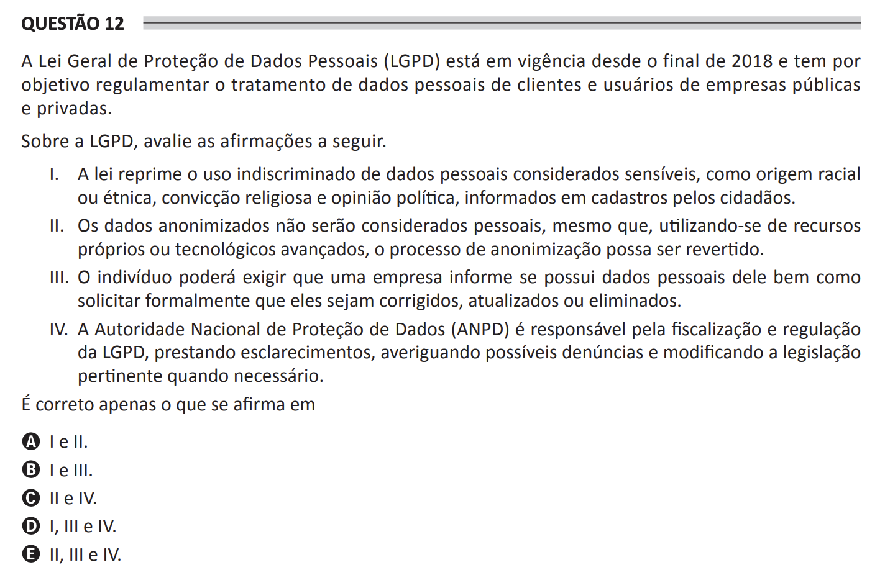

## Question 12 ##

### Original question in image format (in Portuguese): ###

### English translation: ###

**QUESTION 12**

Brazil's General Data Protection Law (LGPD) has been in effect since the end of 2018 and aims to regulate the processing of personal data from clients and users of public and private companies.

Regarding the LGPD, assess the following statements.

I. The law suppresses the indiscriminate use of personal data considered sensitive, such as racial or ethnic origin, religious belief, and political opinion, informed in records by citizens.

II. Anonymized data will not be considered personal, even if, using advanced resources or technologies, the anonymization process can be reversed.

III. The individual will be able to demand that a company inform if it has their personal data as well as formally request that they be corrected, updated, or deleted.

IV. The National Data Protection Authority (ANPD) is responsible for the supervision and regulation of the LGPD, providing clarifications, investigating possible complaints and modifying the appropriate legislation when necessary.

It is correct only what is stated in

A) I and II.

B) I and III.

C) II and IV.

D) I, III, and IV.

E) II, III, and IV.