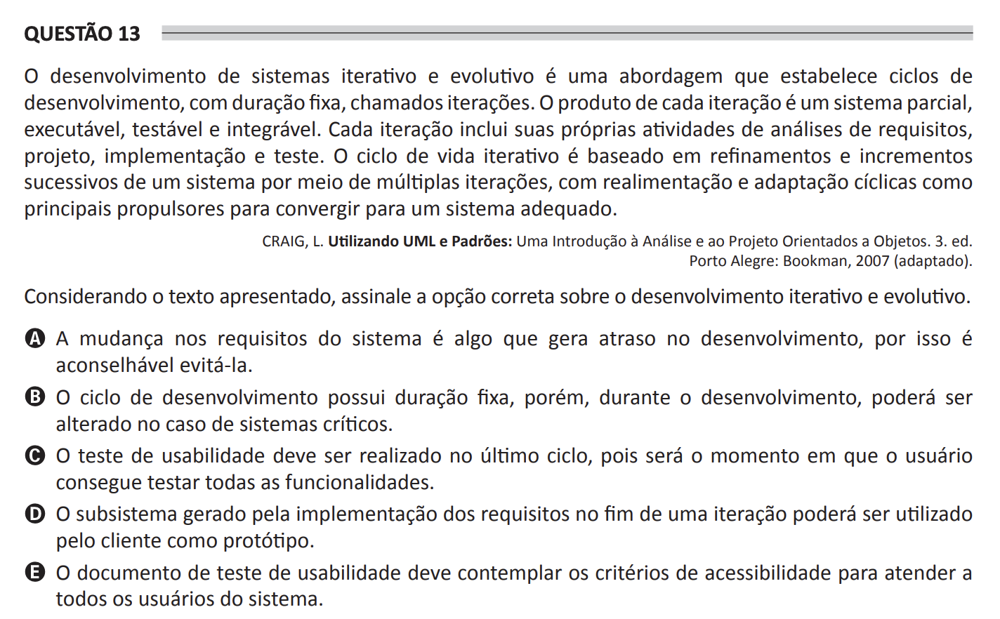

\[ [Previous question](q12-eng.md) \] \[ [Next question](q14-eng.md) \] \[ [Main menu](/README.md) \] \[ [Portuguese version](q13-por.md) \] 

## Question 13 ##

**English transcription of the question:**

Iterative and evolutionary systems development is an approach that establishes cycles of development with a fixed duration, called iterations. The product of each iteration is a partial, executable, testable, and integrable system. Each iteration includes its own requirement analysis, project, implementation, and test activities. The iterative lifecycle is based on refinements and increments of a system through multiple iterations, with cyclical feedback and adaptation as the main drivers to converge to a suitable system.

CRAIG, L. Using UML and Patterns: An Introduction to Object-Oriented Analysis and Design. 3rd ed. Porto Alegre: Bookman, 2007 (adapted).

Considering the presented text, select the correct option about iterative and evolutionary development.

A) Changing system requirements is something that causes delays in development, so it is advisable to avoid doing it.

B) The development cycle has a fixed duration but may be changed in the case of critical systems.

C) Usability testing should be carried out in the last cycle because it is the moment when the user can test all functionalities.

D) The subsystem generated by the implementation of requirements at the end of an iteration may be used by the customer as a prototype.

E) The usability testing document must contemplate accessibility criteria to serve all system users.

---

**Prompt**: Answer the question in this image. Explain your reasoning step by step. At the end, choose which of the five alternatives (A-E) is correct. Inform if there is more than one correct alternative or if all five alternatives are incorrect.

---

**ChatGPT-4 Vision response**:

Let's analyze the text and the options provided step by step:

**Text:** Iterative and evolutionary systems development is an approach that establishes cycles of development with a fixed duration, called iterations. The product of each iteration is a partial, executable, testable, and integrable system. Each iteration includes its own requirement analysis, project, implementation, and test activities. The iterative lifecycle is based on refinements and increments of a system through multiple iterations, with cyclical feedback and adaptation as the main drivers to converge to a suitable system.

Based on the text, let's analyze the alternatives:

**A)** Changing system requirements is something that causes delays in development, so it is advisable to avoid doing it.
- The text does not mention that changes in requirements cause delays, and iterative and evolutionary systems, in general, are designed to accommodate changes in requirements. Therefore, this option seems incorrect.

**B)** The development cycle has a fixed duration but may be changed in the case of critical systems.
- The text mentions that the cycle has a "fixed duration," but it does not make any reference to changes in the case of "critical systems." Therefore, this alternative is partially true, but not entirely based on text.

**C)** Usability testing should be carried out in the last cycle because it is the moment when the user can test all functionalities.
- The text does not specifically mention "usability testing," nor does it state that it should be performed in the last cycle. Therefore, this option seems incorrect.

**D)** The subsystem generated by the implementation of requirements at the end of an iteration may be used by the customer as a prototype.
- The text mentions that the "product of each iteration is a partial system, executable, testable, and integrable," which can be interpreted as a "prototype" that the client can view and test. This alternative seems to be aligned with the text.

**E)** The usability testing document must contemplate accessibility criteria to serve all system users.
- Again, the text does not specifically mention "usability testing" or "accessibility" criteria. Therefore, this option seems incorrect.

Conclusion:
Alternative **D** "The subsystem generated by the implementation of requirements at the end of an iteration may be used by the customer as a prototype" is the most aligned with the information presented in the text. Hence, the correct alternative is **D**.

---

**Answer key**: E

---

**Prompt**: Your answer differs from the answer key released for this question: [answer key]

After analyzing the answer key, do you maintain or change your response? If you decide to change your response, explain the possible reasons that led you to errors in the previous answer. Try to identify the concrete causes of the errors instead of listing generic reasons, such as a failure to understand the question statement.

---

**ChatGPT-4 Vision response**:

I maintain response **D** as correct based on the analysis of the text provided. Option D aligns with the concept of iterative and evolutionary development, where each iteration results in a product or subsystem that is "executable, testable, and integrable". This subsystem can indeed be used by the client as a prototype or an incremental version of the final system.

Regarding alternative **E**, which was chosen in the answer key, I can highlight the following points:
- The text does not mention "accessibility" criteria.
- "Usability testing" is not mentioned in the text.

The previous error may have been caused by the attempt to interpret the statement too broadly, trying to infer information that was not explicitly mentioned in the text. Option E may have been chosen based on the idea that usability tests usually consider accessibility, but this is not indicated in the presented text. In objective assessments, it is crucial to base oneself strictly on the information given in the statement and the text, avoiding assumptions or inferences that go beyond what is provided.

In conclusion, the previous error was caused by the attempt to infer information not explicitly mentioned in the text, leading to the choice of an option that was not directly supported by the content presented.

---

**Prompt**: To be clear: if you maintain the choice of alternative D as correct, what do you mean by "previous error"? Who would have committed such an error? The one who elaborated the answer key?

---

**ChatGPT-4 Vision response**:

I apologize for the confusion. By mentioning "previous error", I was referring to the discrepancy between the choice in the answer key and the analysis made here. If response **D** is the one I consider correct based on the analysis of the text, then the "error" would be in the creation of the answer key that indicated alternative **E** as correct. That is, the possible error would be from the part of those who elaborated the answer key or, alternatively, there could be additional information or contexts that were not considered in the analysis made here. Again, I apologize for the confusion and hope to have clarified the point.

## Experts assessment ##

**Expert #1**

ChatGPT is correct.

If the question statement asks to consider the reference text, the correct choice is indeed D. I agree with ChatGPT's analysis of the alternatives.

---

**Expert #2**

**Text:** Iterative and evolutionary systems development is an approach that establishes cycles of development, _with fixed duration_, called iterations. The product of each iteration is a _partial system_, executable, testable, and integrable. Each iteration includes its own activities of requirement analysis, design, implementation, and testing. The iterative life cycle is based on successive refinements and increments of a system through multiple iterations, with cyclical feedback and adaptation as the main drivers for converging towards a suitable system.

**A)** Changes in system requirements are something that delays development, so it is advisable to avoid doing it.
- The text does not mention that changes in requirements cause delays, and iterative and evolutionary systems are generally designed to accommodate changes in requirements. Therefore, this option seems incorrect.

ChatGPT's answer is dubious, as it is common knowledge in software engineering (SE) that changes in requirements cause delays. There is an incompatibility with the text. To avoid doubt, the question should say: it is something that CAN cause delays ... Therefore, the alternative is not entirely incorrect.

**B)** The development cycle has a fixed duration but may be changed in the case of critical systems.
- The text mentions that the cycle has a "fixed duration," but it does not make any reference to changes in the case of "critical systems." Therefore, this alternative is partially true, but not entirely based on text.

The text does not mention it, but we know that the cycles must be followed, although their duration varies according to the system or size, so the statement is not entirely incorrect.

**C)** Usability testing should be carried out in the last cycle because it is the moment when the user can test all functionalities.
- The text does not specifically mention "usability testing," nor does it state that it should be performed in the last cycle. Therefore, this option seems incorrect.

Neither the text mentions nor is it common sense in SE, I agree that the alternative is incorrect.

**D)** The subsystem generated by the implementation of requirements at the end of an iteration may be used by the customer as a prototype.
- The text mentions that the "product of each iteration is a partial system, executable, testable, and integrable," which can be interpreted as a "prototype" that the client can view and test. This alternative seems to be aligned with the text.

It is common sense in software engineering that we should not use the prototype as the final system. The text mentions a partial system, so the alternative is incorrect.

**E)** The usability testing document must contemplate accessibility criteria to serve all system users.
- Again, the text does not specifically mention "usability testing" or "accessibility" criteria. Therefore, this option seems incorrect.

The text does not mention, but it is common sense that usability tests should include non-functional requirements like accessibility. So the alternative is correct.

**Conclusion:**

The question is ambiguous and should be invalidated, as alternatives A, B, C, and E are not contained in the text. It seems to me that the text was used as an inducer of the questions, but the intention is to put general alternatives about the iterative and incremental life cycle. Thinking this way, I arrived at two possible answers A and E. However, as there was no CAN in A, then E would be more appropriate, so the answer key would be correct. However, the candidate has to make a reflection outside the text, so I consider the question ambiguous. The text hinders the interpretation of the alternatives.

---

**Expert #3**

Analyzing all the material, I conclude that the official answer key is correct.

Justification: options A-D contain errors based on my knowledge of Software Engineering, knowledge that is not limited to the statement of the question. It seems to me that ChatGPT's choice and justification are based solely on the statement because it repeatedly says that the text does not mention certain concepts. But at the same time, ChatGPT chooses option D, which mentions a subsystem that, in turn, was not defined in the text of the statement. It seems to me that it inferred what a subsystem would be, and in my opinion, its inference is incorrect (i.e., a subsystem is not a partial system).

---

**Verdict**

The response from ChatGPT is inconsistent with the answer key and the experts did not reach a consensus on what the correct answer would be or whether the question should be invalidated. 

## ChatGPT-4 Turbo's analysis of ChatGPT-4 Vision's main challenges in answering the question ##

**Prompt**: The following are the prompts and responses of a generative AI for the attached question, along with possible assessments by two or more human experts on the generative AI's responses and the general quality of the question. Based on the provided information, summarize the main difficulties faced by the generative AI in attempting to answer the question, including possible difficulties resulting from incorrect recognition of some graphical or textual element present in the statement of the question. Consider only concrete difficulties whose manifestation can be evidenced by the information provided in generative AI's responses. At the end, discuss if these difficulties could be mitigated or eliminated by using prompt engineering techniques or if they would be inherent to the limitations of current large language models (LLMs).

---

**ChatGPT-4 Turbo response**:

The generative AI faced difficulty in attempting to answer the question on iterative and evolutionary systems development, resulting in a discrepancy between its answer and the official key. The main difficulties identified include:

1. **Strict Text Interpretation**: The AI chose alternative D based on a literal interpretation of the text, which mentions a "partial system" as the outcome of each iteration, interpreting it as a prototype. However, the official answer key indicated alternative E as correct, which the AI did not consider based on the provided text.

2. **Focus on Explicit Details**: The AI maintained its answer, even after the discrepancy with the answer key was pointed out, arguing that its choice was closely in line with the information given in the text and that criteria for "accessibility" could not be inferred to justify alternative E.

3. **Expert Feedback**: The human experts provided conflicting feedback. One agreed with the AI, deeming alternative D as correct. Others considered the question ambiguous or suggested that the correct alternative should be E, arguing the question required knowledge beyond the text.

These difficulties suggest that while the AI can analyze text and choose answers based on explicit information, it may struggle with interpretations requiring implicit knowledge or inferences beyond the provided text. Prompt engineering could be used to guide the AI to consider knowledge beyond the text, but this remains a limitation of current LLMs, which rely heavily on the input text and may not fully understand context or the expectations for implicit knowledge in specific domains, such as software engineering. It indicates a continued need for the advancement of AI models to better integrate textual comprehension with contextualized knowledge.

---

**Prompt**: And as for the fact that the experts did not come to a consensus on the question, any additional comments?

---

**ChatGPT-4 Turbo response**:

The lack of consensus among human experts on the correct response to the question underscores the complexity and inherent ambiguity in some exam questions. This may arise for several reasons:

1. **Ambiguity in the Statement**: If the statement of the question is ambiguous or insufficiently detailed, it may lead to multiple valid interpretations.

2. **Interpretation Differences**: Experts can have different perspectives based on their experiences, contextual knowledge, and understanding of the subject. What may appear clear to one might be debatable to another.

3. **Implicit Knowledge Expectations**: Some questions may presuppose knowledge that is not explicitly declared in the text of the question. Experts might disagree on how much of this implicit knowledge should be applied when interpreting the question.

4. **Variable Evaluation Criteria**: Experts might value different criteria when assessing the correct response, such as practical relevance versus theoretical accuracy.

This challenge is not only for AI but also for question design and assessments in general. In the context of AI, such ambiguity and the discrepancy of human opinions expose the limitations of AI systems in dealing with uncertainty and making judgments when there is no clear answer or defined consensus.

Prompt engineering might help AI to ask for clarifications or to consider a broader range of interpretations, but the limitations of current LLMs mean there is still no reliable way for AI to resolve ambiguities without a clear consensus or well-defined criteria. This underscores the importance of continuing to develop LLM capacities for navigating the complexities and nuances of human communication and information interpretation.

\[ [Previous question](q12-eng.md) \] \[ [Next question](q14-eng.md) \] \[ [Main menu](/README.md) \] \[ [Portuguese version](q13-por.md) \] 
