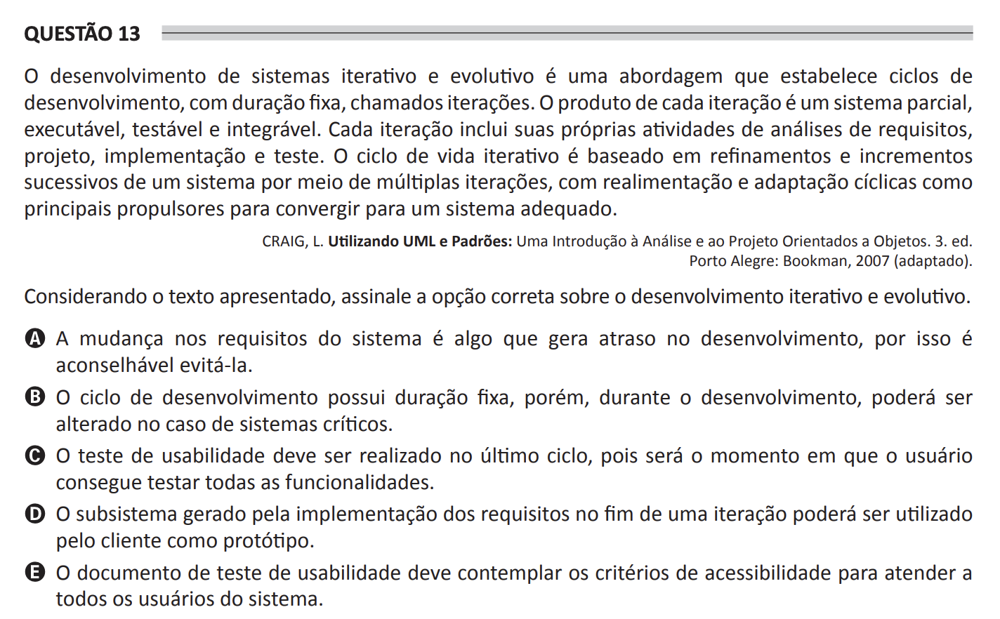

## Questão 13 ##

**Prompt**: Responda a questão nesta imagem. Explique o seu raciocínio passo a passo. Ao final, escolha qual das cinco alternativas fornecidas (A-E) é a correta. Informe caso haja mais de uma alternativa correta ou todas as cinco alternativas sejam incorretas.

---

**Resposta do ChatGPT-4 Vision**: 

Vamos analisar o texto e as opções fornecidas passo a passo:

**Texto:** O desenvolvimento de sistemas iterativo e evolutivo é uma abordagem que estabelece ciclos de desenvolvimento, com duração fixa, chamados iterações. O produto de cada iteração é um sistema parcial, executável, testável e integrável. Cada iteração inclui suas próprias atividades de análises de requisitos, projeto, implementação e teste. O ciclo de vida iterativo é baseado em refinamentos e incrementos sucessivos de um sistema por meio de múltiplas iterações, com realimentação e adaptação cíclicas como principais propulsores para convergir para um sistema adequado.

Com base no texto, vamos analisar as alternativas:

**A)** A mudança nos requisitos do sistema é algo que gera atraso no desenvolvimento, por isso é aconselhável evitá-la.
- O texto não menciona que mudanças nos requisitos causam atrasos, e sistemas iterativos e evolutivos, em geral, são projetados para acomodar mudanças nos requisitos. Logo, esta opção parece incorreta.

**B)** O ciclo de desenvolvimento possui duração fixa, porém, durante o desenvolvimento, poderá ser alterado no caso de sistemas críticos.
- O texto menciona que o ciclo tem "duração fixa", mas não faz qualquer referência a alterações no caso de "sistemas críticos". Portanto, essa alternativa é parcialmente verdadeira, mas não totalmente baseada no texto.

**C)** O teste de usabilidade deve ser realizado no último ciclo, pois será o momento em que o usuário consegue testar todas as funcionalidades.
- O texto não menciona especificamente o "teste de usabilidade", nem afirma que deve ser realizado no último ciclo. Logo, esta opção parece incorreta.

**D)** O subsistema gerado pela implementação dos requisitos no fim de uma iteração poderá ser utilizado pelo cliente como protótipo.
- O texto menciona que o "produto de cada iteração é um sistema parcial, executável, testável e integrável", o que pode ser interpretado como um "protótipo" que o cliente pode visualizar e testar. Essa alternativa parece estar alinhada com o texto.

**E)** O documento de teste de usabilidade deve contemplar os critérios de acessibilidade para atender a todos os usuários do sistema.
- Novamente, o texto não menciona especificamente o "teste de usabilidade" ou critérios de "acessibilidade". Logo, esta opção parece incorreta.

Conclusão: 
A alternativa **D** "O subsistema gerado pela implementação dos requisitos no fim de uma iteração poderá ser utilizado pelo cliente como protótipo" é a mais alinhada com as informações apresentadas no texto. Portanto, a alternativa correta é **D**.

---

**Gabarito**: E

---

**Prompt**: A sua resposta difere do gabarito divulgado para esta questão: [gabarito]

Após analisar o gabarito, você mantém ou altera sua resposta? Se decidir alterar sua resposta, explique as possíveis razões que o induziram ao erro. Procure identificar as causas concretas do seu erro, ao invés de listar razões genéricas como falha de compreensão do enunciado da questão.

---

**Resposta do ChatGPT-4 Vision**:

Mantenho a resposta **D** como a correta com base na análise do texto fornecido. A opção D está alinhada com o conceito de desenvolvimento iterativo e evolutivo, onde cada iteração resulta em um produto ou subsistema que é "executável, testável e integrável". Este subsistema pode, de fato, ser utilizado pelo cliente como um protótipo ou uma versão incremental do sistema final.

Em relação à alternativa **E**, que foi a escolhida no gabarito, posso destacar os seguintes pontos:
- O texto não faz menção a critérios de "acessibilidade".
- O "teste de usabilidade" não é mencionado no texto.

O erro anterior pode ter sido causado pela tentativa de interpretar o enunciado de forma muito abrangente, tentando inferir informações que não estavam explicitamente mencionadas no texto. A opção E pode ter sido escolhida com base na ideia de que testes de usabilidade geralmente consideram acessibilidade, mas isso não é indicado no texto apresentado. Em avaliações objetivas, é crucial basear-se estritamente nas informações fornecidas no enunciado e no texto, evitando fazer suposições ou inferências que vão além do que é fornecido.

Em conclusão, o erro anterior foi causado pela tentativa de inferir informações não explicitamente mencionadas no texto, levando à escolha de uma opção que não estava diretamente respaldada pelo conteúdo apresentado.

---

**Prompt**: Para deixar claro: se você mantém a escolha pela alternativa D como a correta, o que você quer dizer com "erro anterior"? Quem teria cometido tal erro? Quem elaborou o gabarito?

---

**Resposta do ChatGPT-4 Vision**:

Peço desculpas pela confusão. Ao mencionar "erro anterior", estava me referindo à discrepância entre a escolha do gabarito e a análise feita aqui. Se a resposta **D** é a que considero correta com base na análise do texto, então o "erro" estaria na elaboração do gabarito que indicou a alternativa **E** como a correta. Ou seja, o possível erro seria da parte de quem elaborou o gabarito ou, alternativamente, pode haver informações ou contextos adicionais que não foram considerados na análise aqui feita. Mais uma vez, peço desculpa pela confusão e espero ter esclarecido o ponto.

## Avaliação de especialistas ##

**Especialista #1**

O ChatGPT está correto.

Se o enunciado diz para considerar o texto de referência, a alternativa correta é a D mesmo. Eu concordo com a análise das alternativas que o ChatGPT fez. 

---

**Especialista #2**

**Texto:** O desenvolvimento de sistemas iterativo e evolutivo é uma abordagem que estabelece ciclos de desenvolvimento, _com duração fixa_, chamados iterações. O produto de cada iteração é um _sistema parcial_, executável, testável e integrável. Cada iteração inclui suas próprias atividades de análises de requisitos, projeto, implementação e teste. O ciclo de vida iterativo é baseado em refinamentos e incrementos sucessivos de um sistema por meio de múltiplas iterações, com realimentação e adaptação cíclicas como principais propulsores para convergir para um sistema adequado.

**A)** A mudança nos requisitos do sistema é algo que gera atraso no desenvolvimento, por isso é aconselhável evitá-la.
- O texto não menciona que mudanças nos requisitos causam atrasos, e sistemas iterativos e evolutivos, em geral, são projetados para acomodar mudanças nos requisitos. Logo esta opção parece incorreta. 

A resposta é duvidosa, pois é senso comum na engenharia de software (ES) que mudança de requisitos causa atraso. Existe incompatibilidade com o texto. Para não gerar dúvida, a questão deveria dizer: é algo de PODE gerar atraso .... Logo a alternativa não está totalmente incorreta.

**B)** O ciclo de desenvolvimento possui duração fixa, porém, durante o desenvolvimento, poderá ser alterado no caso de sistemas críticos.
- O texto menciona que o ciclo tem "duração fixa", mas não faz qualquer referência a alterações no caso de "sistemas críticos". Portanto, essa alternativa é parcialmente verdadeira, mas não totalmente baseada no texto. 

O texto não menciona, mas sabemos que os ciclos devem ser seguidos, mas a duração deles varia conforme o sistema ou o tamanho, então a afirmação não está totalmente incorreta.

**C)** O teste de usabilidade deve ser realizado no último ciclo, pois será o momento em que o usuário consegue testar todas as funcionalidades.
- O texto não menciona especificamente o "teste de usabilidade", nem afirma que deve ser realizado no último ciclo. Logo, esta opção parece incorreta. 

Nem o texto menciona nem é senso comum na ES, estou de acordo que a alternativa é incorreta.

**D)** O subsistema gerado pela implementação dos requisitos no fim de uma iteração poderá ser utilizado pelo cliente como protótipo.
- O texto menciona que o "produto de cada iteração é um sistema parcial, executável, testável e integrável", o que pode ser interpretado como um "protótipo" que o cliente pode visualizar e testar. Essa alternativa parece estar alinhada com o texto.

É senso comum na engenharia de software que não devemos aproveitar o protótipo como sistema final. O texto menciona sistema parcial, então a alternativa é incorreta.

**E)** O documento de teste de usabilidade deve contemplar os critérios de acessibilidade para atender a todos os usuários do sistema.
- Novamente, o texto não menciona especificamente o "teste de usabilidade" ou critérios de "acessibilidade". Logo, esta opção parece incorreta. 

O texto não menciona, mas é senso comum que os testes de usabilidade devem incluir requisitos não funcionais como acessibilidade. Então a alternativa está correta.

**Conclusão:**

A questão é ambígua e deve ser anulada, as alternativas A, B, C e E não estão contidas no texto. Parece-me que o texto foi usado como indutor das questões, mas a intenção é colocar alternativas gerais sobre o ciclo de vida iterativo e incremental. Ao pensar dessa forma cheguei a duas respostas possíveis A e E. Porém, como não havia o PODE na A, então a E seria mais adequada, então o gabarito estaria certo. Porém, o candidato tem que fazer uma reflexão fora o texto então considero a questão ambígua. O texto atrapalha a interpretação das alternativas.

---

**Especialista #3**

Analisando todo o material, concluo que o gabarito oficial está correto.

Justificativa: as opções A-D contém erros com base no meu conhecimento sobre Engenharia de Software, conhecimento esse que não se restringe ao enunciado da questão. Me parece que a escolha e justificativa dada pelo chatGPT se baseia somente no enunciado porque ele várias vezes fala que o texto não menciona determinados conceitos. Mas ao mesmo tempo o chatGPT escolhe a opção D que menciona subsistema que, por sua vez, não foi definido no texto do enunciado. Me parece que ele inferiu o que seria subsistema e, na minha opinião, a inferência dele está incorreta (i.e. um subsistema não é um sistema parcial).

---

**Veredito**

A resposta do ChatGPT-4 Vision é inconsistente com o gabarito e os especialistas não chegaram em um consenso sobre qual seria a resposta correta nem se a questão deveria ser anulada.

## Análise do ChatGPT-4 Turbo dos principais desafios que o ChatGPT-4 Vision enfrentou ao responder a questão ##

**Prompt**: Seguem os prompts e as respostas de uma IA gerativa para a questão em anexo, juntamente com possíveis avaliações de dois ou mais especialistas humanos sobre as respostas da IA generativa e a qualidade geral da questão. Com base nas informações fornecidas, resuma as principais dificuldades enfrentadas pela IA gerativa ao tentar responder à questão, incluindo possíveis dificuldades resultantes do reconhecimento incorreto de algum elemento gráfico ou textual presente no enunciado da questão. Considere apenas dificuldades concretas cuja manifestação pode ser evidenciada pelas informações fornecidas nas respostas da IA gerativa. Ao final, discuta se essas dificuldades poderiam ser mitigadas ou eliminadas por meio de técnicas de engenharia de prompts ou se seriam inerentes às limitações dos atuais grandes modelos de linguagem de grande (LLMs).

---

**Resposta do ChatGPT-4 Turbo**:

A IA gerativa, ao responder a questão sobre desenvolvimento iterativo e evolutivo, enfrentou dificuldades em alinhar sua interpretação do texto com o gabarito oficial. As principais dificuldades identificadas foram:

1. **Interpretação Estrita do Texto**: A IA escolheu a alternativa D baseada numa interpretação literal do texto, que mencionava um "sistema parcial" como resultado de cada iteração, interpretando-o como um protótipo. No entanto, o gabarito oficial indicou a alternativa E como correta, o que a IA não considerou baseada no texto fornecido.

2. **Foco nos Detalhes Explícitos**: A IA manteve sua resposta, mesmo após a discrepância com o gabarito ser apontada, argumentando que sua escolha estava estritamente alinhada com as informações fornecidas no texto, e que não era possível inferir critérios de acessibilidade que justificassem a alternativa E.

3. **Feedback dos Especialistas**: Os especialistas forneceram feedbacks divergentes. Um concordou com a IA, considerando a alternativa D como correta. Outros especialistas consideraram a questão ambígua ou apontaram que a resposta correta seria a alternativa E, argumentando que a questão exigia conhecimento além do texto.

Essas dificuldades sugerem que, enquanto a IA pode analisar textos e escolher respostas baseadas em informações explícitas, ela pode ter dificuldades com interpretações que exigem conhecimento implícito ou inferências que vão além do texto fornecido. A engenharia de prompt poderia ser utilizada para orientar a IA a considerar conhecimento além do texto, mas isso ainda é uma limitação dos LLMs atuais, que se baseiam fortemente no texto de entrada e podem não compreender totalmente o contexto ou as expectativas de conhecimento implícito em determinados domínios, como o da engenharia de software. Isso indica uma necessidade de avanço contínuo nos modelos de IA para melhorar a integração entre compreensão textual e conhecimento contextualizado.

---

**Prompt**: E quanto ao fato dos especialistas não terem chegado a um consenso sobre a questão, algum comentário adicional?

---

**Resposta do ChatGPT-4 Turbo**:

A falta de consenso entre especialistas humanos sobre a resposta correta da questão ressalta a complexidade e a ambiguidade inerente a algumas questões de exame. Isso pode ocorrer por várias razões:

1. **Ambiguidade no Enunciado**: Se o enunciado da questão é ambíguo ou insuficientemente detalhado, isso pode levar a diferentes interpretações válidas.

2. **Diferenças na Interpretação**: Especialistas podem ter diferentes perspectivas baseadas em suas próprias experiências, conhecimento do contexto e entendimento do assunto. O que parece claro para um pode ser questionável para outro.

3. **Expectativas de Conhecimento Implícito**: Algumas questões podem pressupor conhecimento que não é explicitamente declarado no texto da questão. Especialistas podem discordar sobre o quanto desse conhecimento implícito deve ser aplicado na interpretação da questão.

4. **Critérios de Avaliação Variáveis**: Especialistas podem valorizar diferentes critérios ao avaliar a resposta correta, como relevância prática versus precisão teórica.

Este é um desafio não apenas para uma IA, mas também para o design de questões e avaliações em geral. No contexto de uma IA, esse tipo de ambiguidade e discrepância de opiniões humanas expõe as limitações dos sistemas de IA em lidar com a incerteza e em fazer julgamentos quando não há uma resposta clara ou consenso.

A engenharia de prompt pode ajudar a IA a pedir esclarecimentos ou a considerar uma gama mais ampla de interpretações, mas as limitações dos LLMs atuais significam que ainda não há uma maneira confiável para as IA resolverem ambiguidades sem um consenso claro ou critérios bem definidos. Isso sublinha a importância de continuar a desenvolver a capacidade dos LLMs para navegar em complexidades e nuances humanas na comunicação e na interpretação de informações.
