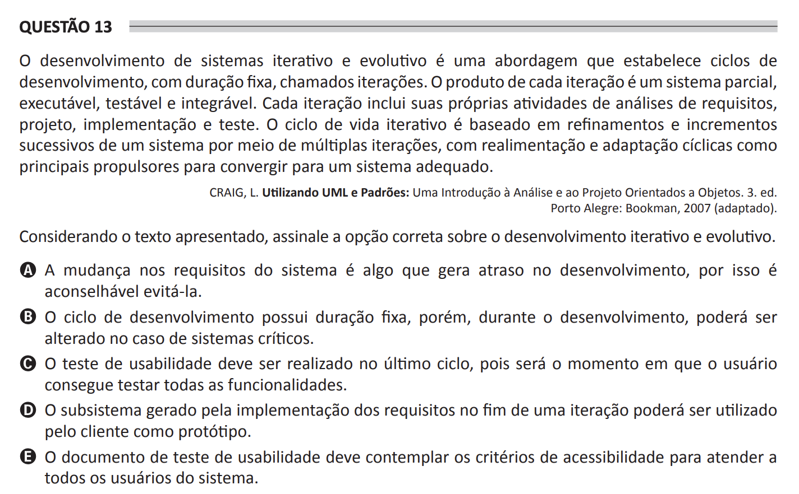

## Question 13 ##

### Original question in image format (in Portuguese): ###

### English translation: ###

**QUESTION 13**

Iterative and evolutionary systems development is an approach that establishes cycles of development with fixed duration, called iterations. The product of each iteration is a partial, executable, testable, and integrable system. Each iteration includes its own requirement analysis, project, implementation, and test activities. The iterative lifecycle is based on refinements and increments of a system through multiple iterations, with cyclical feedback and adaptation as the main drivers to converge to a suitable system.

CRAIG, L. Using UML and Patterns: An Introduction to Object-Oriented Analysis and Design. 3rd ed. Porto Alegre: Bookman, 2007 (adapted).

Considering the presented text, select the correct option about iterative and evolutionary development.

A) Changing system requirements is something that causes delays in the development, so it is advisable to avoid them.

B) The development cycle has a fixed duration but may be changed in the case of critical systems.

C) Usability testing should be carried out in the last cycle because it is the moment when the user can test all functionalities.

D) The subsystem generated by the implementation of requirements at the end of an iteration may be used by the customer as a prototype.

E) The usability testing document must contemplate accessibility criteria to serve all system users.