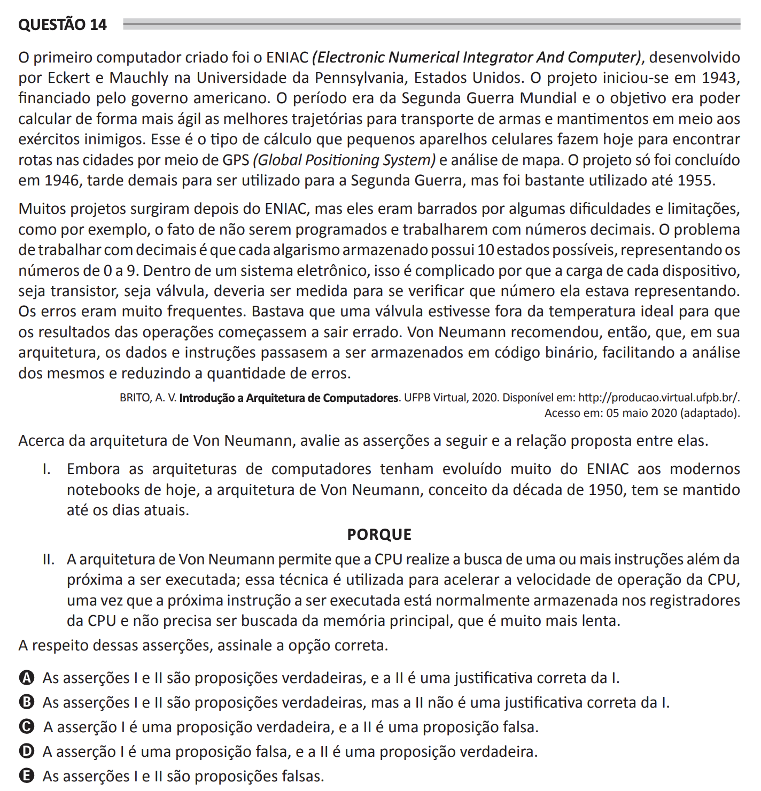

\[ [Questão anterior](q13-por.md) \] \[ [Próxima questão](q15-por.md) \] \[ [Menu inicial](/README.md) \]

## Questão 14 ##

**Prompt**: Responda a questão nesta imagem. Explique o seu raciocínio passo a passo. Ao final, escolha qual das cinco alternativas fornecidas (A-E) é a correta. Informe caso haja mais de uma alternativa correta ou todas as cinco alternativas sejam incorretas.

---

**Resposta do ChatGPT-4 Vision**: 

Vamos analisar o texto e as opções fornecidas passo a passo:

**Texto:** O segmento faz uma descrição sobre a história do ENIAC e destaca a contribuição de Von Neumann na arquitetura de computadores, enfatizando que ele recomendou que, em sua arquitetura, os dados e as instruções fossem armazenados em código binário.

Agora, analisando as asserções:

**I.** Embora as arquiteturas de computadores tenham evoluído muito do ENIAC aos modernos notebooks de hoje, a arquitetura de Von Neumann, conceito da década de 1950, tem se mantido até os dias atuais.

**II.** A arquitetura de Von Neumann permite que a CPU realize a busca de uma ou mais instruções além da próxima a ser executada; essa técnica é utilizada para acelerar a velocidade de operação da CPU, uma vez que a próxima instrução a ser executada está normalmente armazenada nos registradores da CPU e não precisa ser buscada da memória principal, que é muito mais lenta.

**Análise:**

**I:** A primeira afirmação está alinhada com o texto, pois enfatiza a relevância contínua da arquitetura de Von Neumann, mesmo com as evoluções tecnológicas desde o ENIAC. Logo, a asserção I é verdadeira.

**II:** A segunda afirmação discute uma característica da arquitetura de Von Neumann relacionada à CPU buscando várias instruções além da próxima a ser executada. No entanto, o texto original não menciona especificamente essa característica da arquitetura de Von Neumann. Portanto, não temos evidências no texto para confirmar ou refutar a asserção II.

Agora, analisando as alternativas em relação às asserções:

**A)** As asserções I e II são proposições verdadeiras, e a II é uma justificativa correta da I.
**B)** As asserções I e II são proposições verdadeiras, mas a II não é uma justificativa correta da I.
**C)** A asserção I é uma proposição verdadeira, e a II é uma proposição falsa.
**D)** A asserção I é uma proposição falsa, e a II é uma proposição verdadeira.
**E)** As asserções I e II são proposições falsas.

Conclusão: 
A asserção I é definitivamente verdadeira com base no texto. A asserção II não tem evidências suficientes no texto para ser confirmada ou refutada. No entanto, mesmo que assumamos que a asserção II é verdadeira, ela não serve como uma justificativa para a asserção I. Portanto, a alternativa mais adequada é **B** "As asserções I e II são proposições verdadeiras, mas a II não é uma justificativa correta da I.".

---

**Gabarito**: C

---

**Prompt**: A sua resposta difere do gabarito divulgado para esta questão: [gabarito]

Após analisar o gabarito, você mantém ou altera sua resposta? Se decidir alterar sua resposta, explique as possíveis razões que o induziram ao erro. Procure identificar as causas concretas do seu erro, ao invés de listar razões genéricas como falha de compreensão do enunciado da questão.

---

**Resposta do ChatGPT-4 Vision**:

Mantendo minha análise anterior, a resposta correta é a alternativa **B**. 

Razões para o erro na resposta anterior (caso minha análise inicial estivesse errada):

1. **Detalhe não mencionado no texto**: A segunda asserção discute um detalhe específico sobre a arquitetura de Von Neumann que não foi mencionado no texto original. Portanto, a ausência dessa informação específica pode ter levado a uma resposta incorreta.
2. **Relação entre as asserções**: Pode haver uma possível falta de clareza na relação entre as duas asserções. Mesmo que ambas as asserções fossem verdadeiras, a segunda não justifica diretamente a primeira.
3. **Interpretação de "Porque"**: A relação causal entre as duas asserções não foi estabelecida com clareza no enunciado. O uso da palavra "Porque" sugere uma justificativa, mas a asserção II não serve como uma justificativa direta para a asserção I, com base nas informações fornecidas no texto.

Em conclusão, com base na análise do texto e das asserções fornecidas, a alternativa **B** é a resposta mais adequada.

## Avaliação de especialistas ##

**Especialista #1**

A arquitetura von Neumann tem como  característica fundamental que dados e instruções usados por um programa estão numa mesma memória. Durante a execução do programa, instruções e dados são buscados na memória de acordo com a lógica definida por esse programa. Portanto a asserção I é verdadeira.

A asserção II deveria ser considerada como falsa (ou não podemos considerá-la verdadeira pelo que foi apresentado...). A arquitetura von Neumann, na forma como foi proposta, previa a busca apenas da próxima instrução a cada ciclo. Esta instruções é então armazenada em um registrador de instrução, que é decodificada e executada pela CPU. Sendo assim, a busca de "mais instruções além da próxima" não deveria ser aceita aqui como característica intrínseca da arquitetura von Neumann. Outra afirmação incorreta é que a busca de mais instruções na memória é uma técnica que acelera a velocidade da CPU. De fato, o aumento de desempenho da CPU depende de muitos outros fatores mais importantes (que inclusive fizeram parte das primeiras versões de microprocessadores) como o aumento da frequência de clock, múltiplas vias de dados, novos protocolos de comunicação memória-processador e, mais recentemente, múltiplos cores.

Outro ponto não totalmente correto é que as instruções a mais que são buscadas estariam nos registradores e por isso não precisariam ser mais buscadas na memória. Isso só é válido se não existirem pontos de decisão e 100% das instruções buscadas especulativamente forem efetivamente executados o que não é o caso para a imensa maioria dos programas a serem executados.

Além disso, o chamado gargalo de von Neumann, muito conhecido quando se pensa em limite de desempenho, designa tão somente a comunicação processador-memória e a busca de mais instruções resolve muito mais um problema de VAZÃO do que de VELOCIDADE da CPU. Como a sentença II não falou claramente sobre VAZÃO, seria mais um motivo para não considerá-la 100% verdadeira

Portanto, eu escolheria a opção C, ou seja, I - verdadeira e II - falsa.

---

**Especialista #2**

Esse é o tipo de questão que eu não gosto, pois usa-se um detalhe para invalidar a questão, ou seja a questão dos registradores. Foi uma coisa bem sutil que o chatGPT não pegou. Na verdade, com a localidade de cache as próximas instruções já são trazidas para o L1.

Logo, infelizmente o gabarito oficial está correto, mas a questão é do tipo pegadinha.

---

**Especialista #3**

A minha resposta é que eu concordo com o gabarito.

A asserção I é definitivamente verdadeira, não exatamente por causa do texto em si, que é resumido, mas muito mais por causa dos meus conhecimentos. Embora a questão não peça que se atenha ao texto. 

A asserção II, em minha opinião, é falsa porque a próxima instrução a ser executada NÃO fica armazenada nos registradores da CPU. Dependendo do processador, as próximas instruções poderiam até ter seu desempenho aumentado se estivessem na CACHE de instruções, mas mesmo assim, em algum momento, as instruções precisariam ser copiadas da RAM para a cache. Adicionalmente, o fato de "acelerar a velocidade da CPU" buscando mais instruções do que a próxima a ser executada independe da arquitetura. Ou seja, qualquer arquitetura que não seja a de Von Neumann pode implementar tranquilamente esta estratégia.

Portanto, digo e repito que eu concordo com o gabarito e a resposta é C.

Com relação à resposta do ChatGPT, eu achei que ele ficou meio que em cima do muro quando disse que a asserção II "não tem evidências suficientes no texto para ser confirmada ou refutada". Em primeiro lugar, não tinha nada falando que a resposta tinha que ser baseada no texto. Em segundo lugar, achei que o chatGPT, pelo menos até o momento, desconhece esse detalhe bastante específico dos registradores das arquiteturas de computadores.

---

**Veredito**

De acordo com os especialistas, o gabarito está correto e a resposta do ChatGPT-4 Vision está incorreta.

## Análise final das respostas do ChatGPT-4 Vision e dos comentários dos especialistas pelo ChatGPT-4 Turbo ##

**Prompt**: Os arquivos em anexo contêm a imagem de uma questão, os prompts e as respostas de uma IA gerativa utilizada para responder essa questão, e os comentários de dois ou mais especialistas humanos sobre as respostas da IA gerativa e a qualidade da questão de forma geral. Com base nas informações presentes nesses arquivos, sumarize as principais dificuldades enfrentadas pela IA gerativa ao tentar responder a questão, incluindo possíveis dificuldades decorrentes do reconhecimento incorreto de algum elemento gráfico ou textual presente no enunciado da questão. Considere apenas dificuldades concretas cuja manifestação possa ser evidenciada pelas informações presentes nos arquivos. Ao final, discuta se essas dificuldades poderiam ser amenizadas ou eliminadas utilizando técnicas de engenharia de prompt, ou se seriam inerentes às limitações dos grandes modelos de linguagem (LLMs) atuais.

---

**Resposta do ChatGPT-4 Turbo**:

A IA gerativa foi solicitada a responder a uma questão sobre a arquitetura de Von Neumann e a evolução das arquiteturas de computadores desde o ENIAC até os notebooks modernos. A resposta da IA foi que, enquanto a afirmação I era verdadeira, a afirmação II não poderia ser confirmada ou refutada com base no texto, levando-a a escolher a opção B como a resposta correta. No entanto, o gabarito oficial indicou que a resposta correta era a C.

As principais dificuldades enfrentadas pela IA gerativa ao responder a questão pareciam decorrer de:

1. Uma interpretação incorreta da afirmação II sobre a CPU buscando instruções além da próxima a ser executada. A IA não encontrou evidências no texto para confirmar ou refutar isso, mas especialistas apontaram que isso era um detalhe específico não mencionado no texto original e que a IA não estava ciente das nuances da arquitetura de Von Neumann relacionadas à busca de instruções.

2. A IA pode ter sido induzida ao erro pela palavra "Porque", que sugeriu uma justificativa causal entre as afirmações I e II, mas, como os especialistas observaram, a IA falhou em reconhecer que a velocidade da CPU não depende exclusivamente da estratégia de busca de instruções.

Quanto a se essas dificuldades poderiam ser atenuadas ou eliminadas através de técnicas de engenharia de prompt ou são inerentes às limitações atuais dos grandes modelos de linguagem (LLMs), há alguns pontos a considerar:

- A falha da IA em fornecer uma posição definitiva sobre a afirmação II sugere uma falta de conhecimento específico sobre os detalhes da arquitetura de Von Neumann, o que pode não ser completamente atenuado apenas pela engenharia de prompt.

- A dependência da IA em evidências textuais para a validação das afirmações mostra uma limitação potencial em sua capacidade de aplicar conhecimento externo ou inferir além do texto fornecido. Embora a engenharia de prompt possa potencialmente encorajar a IA a recorrer mais ao conhecimento externo, isso não compensaria as lacunas fundamentais da IA na compreensão profunda de conteúdo técnico.

- A má interpretação da relação causal implícita por "Porque" aponta para uma possível limitação linguística ou de raciocínio, que poderia ser melhorada com prompts melhor projetados que orientem o processo de raciocínio da IA de forma mais eficaz.

Em conclusão, algumas das dificuldades da IA poderiam potencialmente ser abordadas através de engenharia de prompt mais sofisticada, mas outras são indicativas das limitações intrínsecas dos LLMs em seu estado atual, particularmente em relação à compreensão técnica profunda e à integração de informações complexas que não estão explicitamente declaradas no texto.

\[ [Questão anterior](q13-por.md) \] \[ [Próxima questão](q15-por.md) \] \[ [Menu inicial](/README.md) \]
