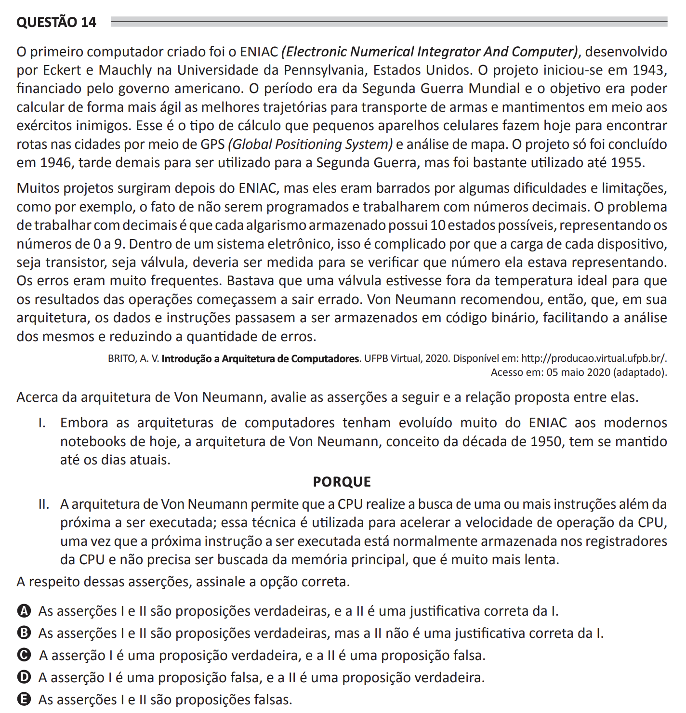

## Question 14 ##

### Original question in image format (in Portuguese): ###

### English translation: ###

**QUESTION 14**

The first computer created was the ENIAC (Electronic Numerical Integrator And Computer), developed by Eckert and Mauchly at the University of Pennsylvania, United States. The project began in 1943, funded by the American government. The period was World War II and the goal was to calculate more agilely the best trajectories for transporting weapons and supplies amidst enemy armies. This is the type of calculation that small cellular devices do today to find routes in cities through GPS (Global Positioning System) and map analysis. The project was only completed in 1946, too late to be used for the Second World War, but it was widely used until 1955.

Many projects emerged after ENIAC, but they were hindered by some difficulties and limitations, such as the fact that they were not programmed and worked with decimal numbers. The problem with working with decimals is that each stored digit has 10 possible states, representing numbers from 0 to 9. Within an electronic system, this is complicated because the charge of each device, whether it be a transistor or a valve, should be measured to verify which number it was representing. Errors were very frequent. It was enough for a valve to be outside the ideal temperature for the results of operations to start going wrong. Von Neumann then recommended that, in his architecture, data and instructions should begin to be stored in binary code, facilitating their analysis and reducing the amount of errors.

BRITO, A. V. Introduction to Computer Architecture. UFPB Virtual, 2020. Available at: http://producao.virtual.ufpb.br/. Accessed on: May 5th, 2020 (adapted).

Regarding the Von Neumann architecture, evaluate the assertions below and the proposed relationship between them.

I. Although computer architectures have evolved a lot from ENIAC to modern notebooks, the Von Neumann architecture, conceived in the 1950s, has remained up to this day.

BECAUSE

II. The Von Neumann architecture allows the CPU to perform a fetch of one or more instructions beyond the next one to be executed; this technique is used to accelerate the CPU's operating speed, since the next instruction to be executed is normally stored in the CPU's registers and not in the main memory, which is much slower.

Regarding these assertions, select the correct option.

A) Assertions I and II are true propositions, and II is a correct justification for I.

B) Assertions I and II are true propositions, but II is not a correct justification for I.

C) Assertion I is a true proposition, and II is a false proposition.

D) Assertion I is a false proposition, and II is a true proposition.

E) Assertions I and II are false propositions.
