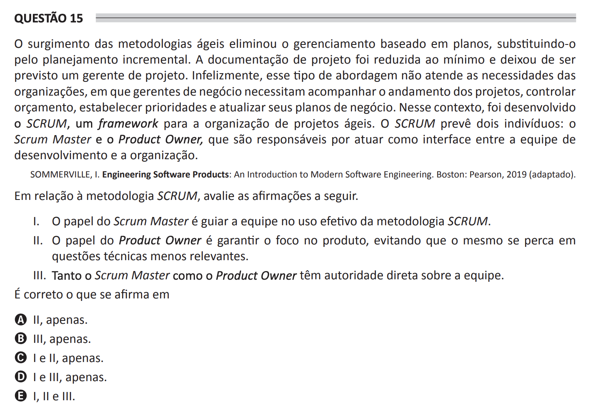

\[ [Questão anterior](q14-por.md) \] \[ [Próxima questão](q16-por.md) \] \[ [Menu inicial](/README.md) \] \[ [Versão em Inglês](q15-eng.md) \] 

## Questão 15 ##

**Prompt**: Responda a questão nesta imagem. Explique o seu raciocínio passo a passo. Ao final, escolha qual das cinco alternativas fornecidas (A-E) é a correta. Informe caso haja mais de uma alternativa correta ou todas as cinco alternativas sejam incorretas.

---

**Resposta do ChatGPT-4 Vision**: 

Vamos avaliar as afirmações em relação ao texto:

**I. O papel do Scrum Master é guiar a equipe no uso efetivo da metodologia SCRUM.**
A função do Scrum Master é, de fato, guiar e garantir que a equipe siga os princípios e práticas do SCRUM. Portanto, a afirmação I é verdadeira.

**II. O papel do Product Owner é garantir o foco no produto, evitando que o mesmo se perca em questões técnicas menos relevantes.**
O Product Owner é responsável pela visão do produto e pelas prioridades. Ele deve garantir que a equipe esteja trabalhando nas características mais valiosas e relevantes. A afirmação não detalha todas as responsabilidades do Product Owner, mas a essência do que é mencionado aqui está correta. Portanto, a afirmação II é verdadeira.

**III. Tanto o Scrum Master como o Product Owner têm autoridade direta sobre a equipe.**
Isso é um pouco mais complicado. O Scrum Master não tem autoridade sobre a equipe no sentido de gestão hierárquica; em vez disso, ele serve como um facilitador e guia. O Product Owner tem autoridade em relação ao que é trabalhado (por exemplo, definindo as prioridades), mas novamente, não no sentido tradicional de "chefe". Assim, a afirmação III é enganosa e pode ser considerada falsa.

Agora, vamos olhar para as opções:
**A)** II, apenas.
**B)** III, apenas.
**C)** I e II, apenas.
**D)** I e III, apenas.
**E)** I, II e III.

Considerando as avaliações acima, a alternativa correta é **C) I e II, apenas.**.

---

**Gabarito**: C

---

**Veredito**

A resposta do ChatGPT é consistente com o gabarito.

\[ [Questão anterior](q14-por.md) \] \[ [Próxima questão](q16-por.md) \] \[ [Menu inicial](/README.md) \] \[ [Versão em Inglês](q15-eng.md) \] 
