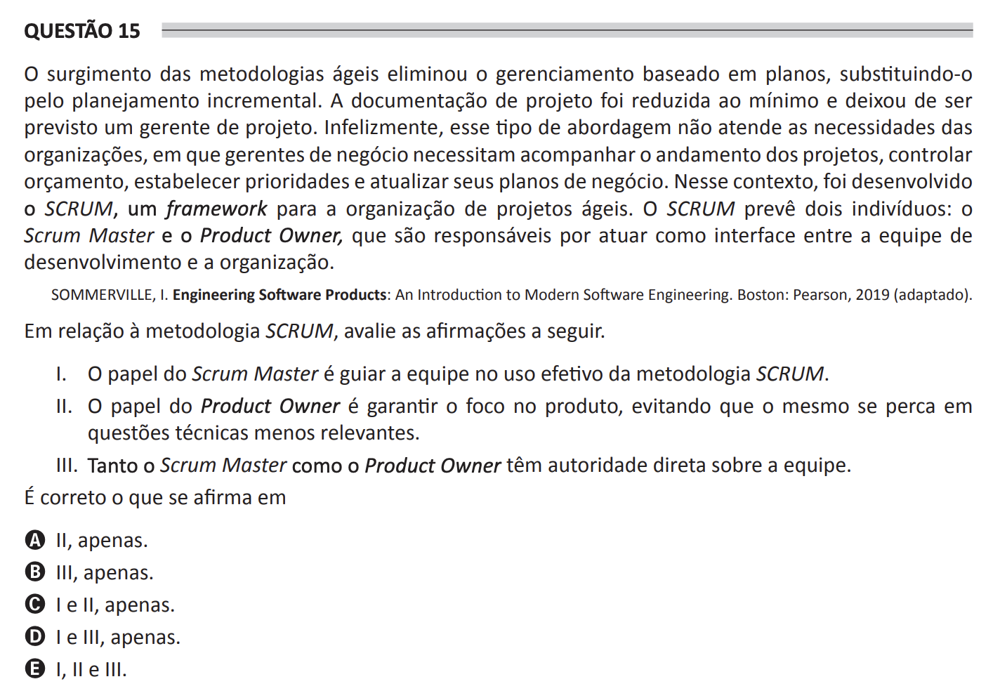

## Question 15 ##

### Original question in image format (in Portuguese): ###

### English translation: ###

**QUESTION 15**

The emergence of agile methodologies eliminated management based on plans, replacing it with incremental planning. Project documentation has been minimized and no longer calls for a project manager. Unfortunately, this type of approach does not meet the needs of organizations, where business managers need to follow the progress of projects, control the budget, establish priorities and update their business plans. In this context, SCRUM was developed, a framework for the organization of agile projects. SCRUM foresees two individuals: the Scrum Master and the Product Owner, who are responsible for acting as the interface between the development team and the organization.

SOMMERVILLE, I. Engineering Software Products: An Introduction to Modern Software Engineering. Boston: Pearson, 2019 (adapted).

Regarding the SCRUM methodology, evaluate the following statements.

I. The role of the Scrum Master is to guide the team in the effective use of the SCRUM methodology.

II. The role of the Product Owner is to ensure the focus on the product, avoiding getting lost in less relevant technical issues.

III. Both the Scrum Master and the Product Owner have direct authority over the team.

It is correct what is stated in

A) II, only.

B) III, only.

C) I and II, only.

D) I and III, only.

E) I, II, and III.