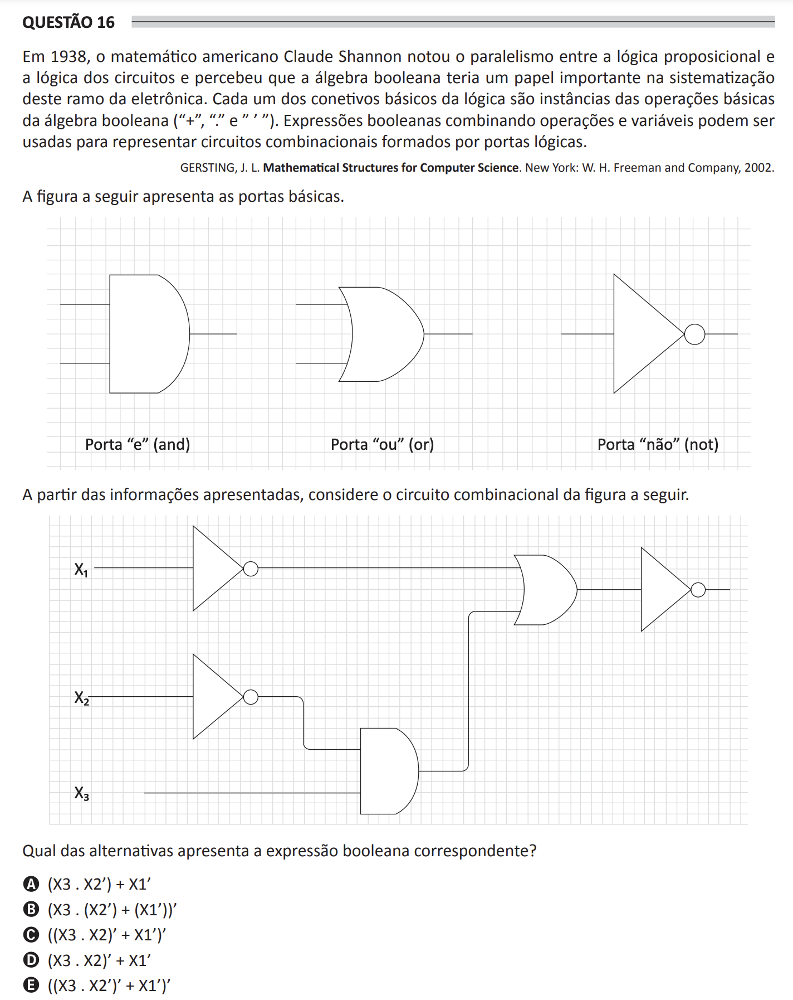

\[ [Previous question](q15-eng.md) \] \[ [Next question](q17-eng.md) \] \[ [Main menu](/README.md) \] \[ [Portuguese version](q16-por.md) \] 

## Question 16 ##

**English transcription of the question:**

In 1938, American mathematician Claude Shannon noticed the parallelism between propositional logic and the logic of circuits and realized that Boolean algebra played an important role in the systematization of this branch of electronics. Each of the basic connectives of logic are instances of the basic operations of Boolean algebra ("+", ".", and "'"). Boolean expressions combining operations and variables can be used to represent combinational circuits formed by logical gates.

GERSTING, J. L. Mathematical Structures for Computer Science. New York: W. H. Freeman and Company, 2002.

The figure below shows the basic gates.

\[The image displays symbols representing three basic logic gates: the "and" gate, the "or" gate, and the "not" gate.\]

Based on the information presented, consider the combinational circuit figure below.

\[The image shows a schematic of a combinational logic circuit with three inputs labeled X1, X2, X3, and using "not", "and", and "or" gates.\]

Which of the following alternatives presents the corresponding Boolean expression?

A) (X3 . X2') + X1'

B) (X3 . (X2') + (X1'))'

C) ((X3 . X2)' + X1')'

D) (X3 . X2)' + X1'

E) ((X3 . X2')' + X1')'

---

**Prompt**: Answer the question in this image. Explain your reasoning step by step. At the end, choose which of the five alternatives (A-E) is correct. Inform if there is more than one correct alternative or if all five alternatives are incorrect.

---

**ChatGPT-4 Vision response**:

Let's analyze the presented combinational circuit and determine the corresponding Boolean expression, step by step.

1. **First two NOT Gates**:
   - X1 goes through a NOT gate. Therefore, the output of this gate is X1' (negated).
   - X2 also passes through a NOT gate. The output is X2' (negated).

2. **AND Gate**:
   - There are two inputs to this gate: X3 and the output of the NOT gate of X2, which is X2'.
   - The expression for the AND gate is multiplication in Boolean algebra. Hence, the output of this gate is X3 . X2' or X3 AND X2'.

3. **OR Gate**:
   - The inputs to this gate are the output of the AND gate and the output of the NOT gate of X1, which is X1'.
   - The expression for the OR gate is addition in Boolean algebra. Thus, the output of this gate is (X3 . X2') + X1' or (X3 AND X2') OR X1'.

4. **Last NOT Gate**:
   - The output of the OR gate goes through the last NOT gate.
   - Therefore, the final expression is to negate the entire previous expression: [(X3 . X2') + X1']'

Putting it all together, we obtain the Boolean expression: **[(X3 . X2') + X1']'**

Now, let's compare this with the options provided:

A) (X3 . X2') + X1'
B) (X3 . (X2') + (X1'))'
C) (X3 . X2') + X1'
D) (X3 . X2') + X1'
E) (X3 . X2')' + X1'

The expression we have determined is **option B**, which is: (X3 . (X2') + (X1'))'

---

**Answer key**: B

---

**Verdict**

The response from ChatGPT is consistent with the answer key.

\[ [Previous question](q15-eng.md) \] \[ [Next question](q17-eng.md) \] \[ [Main menu](/README.md) \]
