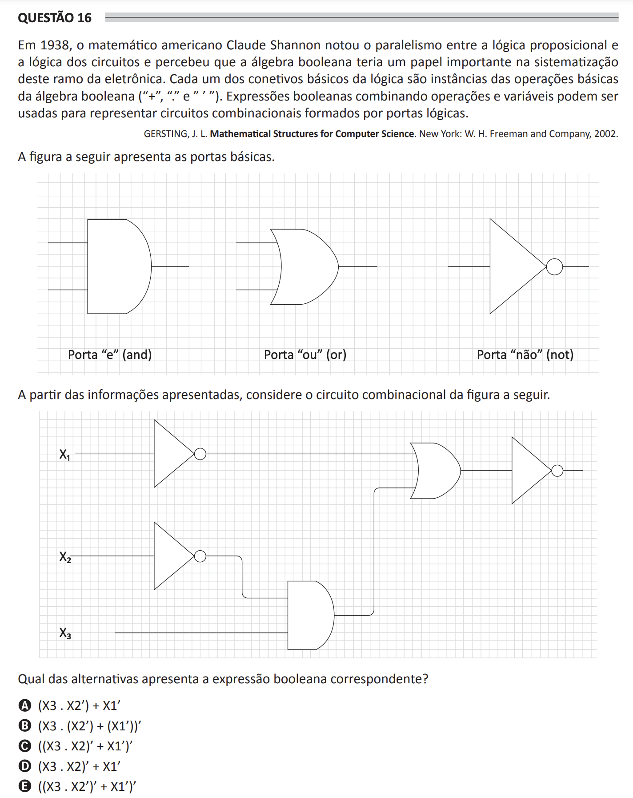

## Question 16 ##

### Original question in image format (in Portuguese): ###

### English translation: ###

**QUESTION 16**

In 1938, American mathematician Claude Shannon noticed the parallelism between propositional logic and the logic of circuits and realized that Boolean algebra played an important role in the systematization of this branch of electronics. Each of the basic connectives of logic are instances of the basic operations of Boolean algebra ("+", ".", and "'"). Boolean expressions combining operations and variables can be used to represent combinational circuits formed by logical gates.

GERSTING, J. L. Mathematical Structures for Computer Science. New York: W. H. Freeman and Company, 2002.

The figure below shows the basic gates.

\[The image displays symbols representing three basic logic gates: the "and" gate, the "or" gate, and the "not" gate.\]

Based on the information presented, consider the combinational circuit figure below.

\[The image shows a schematic of a combinational logic circuit with three inputs labeled X1, X2, X3, and using "not", "and", and "or" gates.\]

Which of the following alternatives presents the corresponding Boolean expression?

A) (X3 . X2') + X1'

B) (X3 . (X2') + (X1'))'

C) ((X3 . X2)' + X1')'

D) (X3 . X2)' + X1'

E) ((X3 . X2')' + X1')'