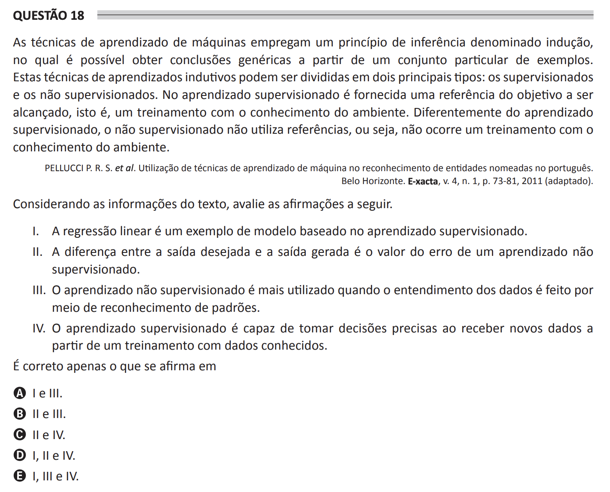

\[ [Previous question](q17-eng.md) \] \[ [Next question](q19-eng.md) \] \[ [Main menu](/README.md) \] \[ [Portuguese version](q18-por.md) \] 

## Question 18 ##

**English transcription of the question:**

Machine learning techniques employ an inference principle called induction, in which it is possible to obtain generic conclusions from a particular set of examples. These intuitive learning techniques can be divided into two main types: supervised and unsupervised. In supervised learning, a reference for the objective to achieve is provided, that is, a training with the knowledge of the environment. Differently, in unsupervised learning, no references are used, that is, there is no training with the knowledge of the environment.

PELLUCCI P. R. S. et al. Utilization of machine learning techniques in the recognition of named entities in Portuguese. Belo Horizonte. E-xacta, v. 4, n. 1, p. 73-81, 2011 (adapted).

Considering the information from the text, evaluate the following statements.

I. Linear regression is an example of a model based on supervised learning.

II. The difference between the desired output and the output generated is the error value of an unsupervised learning.

III. Unsupervised learning is more utilized when understanding of data is done through pattern recognition.

IV. Supervised learning is capable of making accurate decisions when receiving new data from training with known data.

It is correct only what is stated in

A) I and III.

B) II and III.

C) II and IV.

D) I, II, and IV.

E) I, III, and IV.**Prompt**: Answer the question(s) in this image by explaining step by step the reasoning used to answer it (them). In the end, choose which of the five alternatives provided (A-E) is the correct one. Report if more than one alternative is correct or if all five alternatives are incorrect.

---

**Prompt**: Answer the question in this image. Explain your reasoning step by step. At the end, choose which of the five alternatives (A-E) is correct. Inform if there is more than one correct alternative or if all five alternatives are incorrect.

---

**ChatGPT-4 Vision response**:

Let's evaluate the statements based on the text provided and on general knowledge about machine learning: 

**I. Linear regression is an example of a model based on supervised learning.**

This statement is true. Linear regression is a model that, given a set of features (or resources), attempts to predict a continuous output. During the training of a linear regression model, a set of input data along with the desired output is provided, which characterizes supervised learning.

**II. The difference between the desired output and the generated output is the error value of unsupervised learning.**

This statement is partially true, but it is ambiguous concerning the presented context. In supervised learning, the difference between the desired output and the generated output is indeed called error. In unsupervised learning, the idea of a "desired output" is not applicable in the same way, since there are no labels or outputs provided during training. However, unsupervised learning algorithms, like clustering, have their own error metrics, which are not based on the difference between desired and generated outputs.

**III. Unsupervised learning is most used when understanding data through pattern recognition.**

This statement is true. Unsupervised learning, like clustering or dimensionality reduction, is used to identify patterns in data without reference to specific labels. This is useful in situations where labels are unknown or when the goal is to discover hidden structures in data.

**IV. Supervised learning can make accurate decisions when receiving new data from training with known data.**

This statement is true. Supervised learning trains models using a dataset of input with known outputs. Once trained, the model can make predictions or decisions about new data based on what it has learned. The accuracy of these decisions depends on the quality of the model and the representativeness of the training data.

Given the evaluations:

- I is true.
- II is ambiguous but for the context of the question, can be considered incorrect.
- III is true.
- IV is true.

The correct alternative is: **D) I, III, and IV.**

---

**Answer key**: E

---

**Prompt**: Your response differs from the answer key released for this question: [answer key]

After analyzing the answer key, do you maintain or change your response? If you decide to change your response, explain the possible reasons that led you to errors in the previous answer. Try to identify the concrete causes of the errors instead of listing generic reasons, such as a failure to understand the question statement.

---

**ChatGPT-4 Vision response**:

I understand the concern and will review the evaluations to provide a detailed analysis.

Upon reevaluation:

**I. Linear regression is an example of a model based on supervised learning.**
As previously mentioned, this statement is true.

**II. The difference between the desired output and the generated output is the error value of unsupervised learning.**
Revisiting the statement, I reiterate my previous analysis: the statement is ambiguous and, in the context of unsupervised learning, we do not have a "desired output" as in supervised learning. Therefore, this statement can be considered incorrect.

**III. Unsupervised learning is most used when understanding data through pattern recognition.**
This statement is true. The text also states that unsupervised learning does not use references, which indicates that it relies on recognizing patterns in data.

**IV. Supervised learning can make accurate decisions when receiving new data from training with known data.**
As previously mentioned, this statement is true.

Given the review:

- I is true.
- II is considered incorrect.
- III is true.
- IV is true.

Therefore, the correct alternative is still **D) I, III, and IV.**

I recognize the discrepancy between my response and the official answer key. The cause of the error might have been a strict interpretation of statement II. In technical contexts, the term "error" is commonly associated with the difference between desired and generated outputs in supervised learning, which may have led to the earlier conclusion. However, the answer key considers statement II correct, indicating a broader interpretation of the term "error" in the context of unsupervised learning. I appreciate the feedback and apologize for any confusion.

## Experts assessment ##

**Expert #1**

According to my analysis, of all 4 statements, only the first (I) is valid.
Therefore, in my opinion, the question should have been annulled because none of the responses are correct.

Indeed, examining each of the alternatives we note that:

I. Linear regression is an example of a model based on supervised learning.

As mentioned above, this statement is valid.

II. The difference between the desired output and the generated output is the error value of unsupervised learning.

In unsupervised learning, there is no "desired output" as in supervised learning. Therefore, this statement is invalid. Moreover, the term "desired output" is extremely ambiguous and should not have been used.

III. Unsupervised learning is more used when understanding data is done through pattern recognition.

I consider this statement also invalid, as supervised learning also recognizes patterns, in this case in the training data.

IV. Supervised learning is capable of making precise decisions when receiving new data from training with known data.

This statement is also invalid, as nothing can be guaranteed about the precision of the decisions, this in any form of machine learning.

---

**Expert #2**

First, ChatGPT commits the classic error of rationalizing "correctly" but errs in the final selection. For it, there still seems to be a difficulty in dealing with numerals. The correctly is in quotes for the reasons below.

In my opinion, this question is poorly written and raises doubts:

In I), it seems strange to call linear regression a model when it is an algorithm used to train a model. But this is my nitpicking and could pass as true.

In II), I agree with his second explanation, but would say it's wrong and not ambiguous. Although it's possible to have expected outputs for evaluation, the premise of the method assumes that they don't need to exist.

In IV), I have difficulty assuming as true that supervised learning is capable of making precise decisions, as this may or may not happen after training. And it also speaks generically of supervised learning when _there is no free lunch_. I agree with the last part of his explanation (The accuracy of these decisions depends on the quality of the model and the representativeness of the training data.)

So, I would say that neither is correct (the correct answer would be different from the key and ChatGPT).

Because I would choose A.

---

**Expert #3**

The official answer key is correct.

ChatGPT identifies the ambiguity of item II (the only incorrect one), as probably the question's author did it purposefully so that it would be considered incorrect.

I emphasize that ChatGPT correctly identified the correct and incorrect items of the question, presented good justifications, but just got confused when choosing the letter/item of the response.

---

**Verdict**

The response from ChatGPT is inconsistent with the answer key and the experts did not reach a consensus on what would be the correct answer or whether the question should be canceled.

## ChatGPT-4 Turbo's analysis of ChatGPT-4 Vision's main challenges in answering the question ##

**Prompt**: The following are the prompts and responses of a generative AI for the attached question, along with possible assessments by two or more human experts on the generative AI's responses and the general quality of the question. Based on the provided information, summarize the main difficulties faced by the generative AI in attempting to answer the question, including possible difficulties resulting from incorrect recognition of some graphical or textual element present in the statement of the question. Consider only concrete difficulties whose manifestation can be evidenced by the information provided in generative AI's responses. At the end, discuss if these difficulties could be mitigated or eliminated by using prompt engineering techniques or if they would be inherent to the limitations of current large language models (LLMs).

---

**ChatGPT-4 Turbo response**:

The generative AI faced difficulties in answering the machine learning question, mainly due to ambiguities and varying interpretations of the assertions. The main difficulties faced by the AI were:

1. **Ambiguity in Assertion II**: The AI correctly identified the ambiguity in assertion II, regarding the difference between the desired and generated output as being the error value in unsupervised learning. The AI considered assertion II as ambiguous and potentially incorrect; however, official answer key indicated all assertions except II were true.

2. **Final Answer Selection**: Even after identifying the ambiguity in assertion II, the AI selected the option that included assertion II as true, which was in disagreement with the official answer key.

3. **Experts' Feedback**: The experts provided divergent opinions with one agreeing that only assertion I was valid, another criticizing the question’s wording and the accuracy of the assertions, and a third confirming the correctness of the assertions identified by the AI but disagreeing with the final choice of alternative. This highlights the question's complexity and the difficulties in interpreting and applying technical concepts unambiguously.

These difficulties could be mitigated with prompt engineering techniques, providing clarifications, or directing the AI to consider alternative interpretations and the underlying logic more explicitly. However, these issues also reflect current LLMs' limitations in dealing with ambiguities and conflicting interpretations, particularly when expert human opinions vary. This suggests that, alongside prompt engineering, there is a need to further develop language models' ability to integrate and weigh multiple sources of information and opinions to arrive at a more accurate conclusion.

---

**Prompt**: And what about the fact that the experts did not reach a consensus on the issue, any additional comments?

---

**ChatGPT-4 Turbo response**:

The lack of consensus among human experts on a technical question underscores several critical points that are not unique to, but also relevant for, the performance of AI systems:

1. **Complexity of the Subject Matter**: Technical questions, especially in the field of machine learning, can be intrinsically complex and subject to interpretations based on different theoretical foundations or practical experiences.

2. **Nuances in the Formulation of the Question**: How a question is phrased can lead to multiple valid interpretations. Precision in language is vital to avoid ambiguities that can confuse both AI and humans.

3. **Differences in Perspective**: Experts may have different viewpoints based on their academic and professional experiences, which can affect the interpretation and judgment of a technical question.

4. **Knowledge Updates**: The machine learning field is constantly evolving, and what might have been standard practice or accepted knowledge at one point can later be questioned or updated, leading to divergent opinions.

5. **Challenges in Education and Assessment**: This scenario highlights the inherent difficulties of teaching and assessment in technically advanced and rapidly evolving fields. Formulating clear and unequivocal questions is an ongoing challenge.

For AI systems, this type of situation underscores the need for advanced text interpretation skills, the ability to consider context and multiple perspectives, and the importance of staying updated with current field practices. While prompt engineering can help guide the AI to better interpretation and to request clarifications when needed, the discrepancy in expert human opinions reflects a complex area that LLMs still struggle to navigate efficiently. This suggests that, in addition to improved prompt engineering, a continuous enhancement of language models' capabilities to assess and synthesize conflicting information is necessary.

\[ [Previous question](q17-eng.md) \] \[ [Next question](q19-eng.md) \] \[ [Main menu](/README.md) \] \[ [Portuguese version](q18-por.md) \] 
