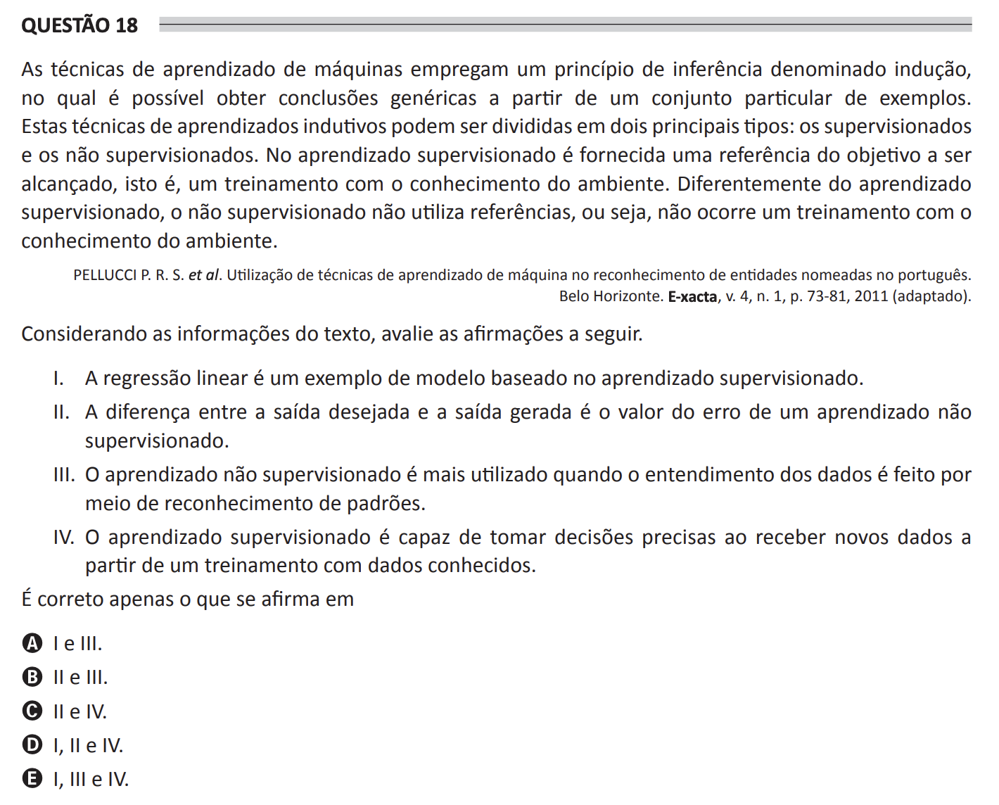

## Questão 18 ##

**Prompt**: Responda a questão nesta imagem. Explique o seu raciocínio passo a passo. Ao final, escolha qual das cinco alternativas fornecidas (A-E) é a correta. Informe caso haja mais de uma alternativa correta ou todas as cinco alternativas sejam incorretas.

---

**Resposta do ChatGPT-4 Vision**: 

Vamos avaliar as afirmações com base no texto fornecido e em conhecimentos gerais sobre aprendizado de máquina:

**I. A regressão linear é um exemplo de modelo baseado no aprendizado supervisionado.**

Esta afirmação é verdadeira. A regressão linear é um modelo que, dado um conjunto de características (ou recursos), tenta prever uma saída contínua. Durante o treinamento de um modelo de regressão linear, é fornecido um conjunto de dados de entrada junto com a saída desejada, o que caracteriza aprendizado supervisionado.

**II. A diferença entre a saída desejada e a saída gerada é o valor do erro de um aprendizado não supervisionado.**

Esta afirmação é parcialmente verdadeira, mas é ambígua em relação ao contexto apresentado. Em aprendizado supervisionado, a diferença entre a saída desejada e a saída gerada é de fato chamada de erro. No aprendizado não supervisionado, a ideia de uma "saída desejada" não é aplicável da mesma maneira, já que não há rótulos ou saídas fornecidas durante o treinamento. No entanto, algoritmos de aprendizado não supervisionado, como os de clusterização, têm suas próprias métricas de erro, que não se baseiam na diferença entre saídas desejadas e geradas.

**III. O aprendizado não supervisionado é mais utilizado quando o entendimento dos dados é feito por meio de reconhecimento de padrões.**

Esta afirmação é verdadeira. O aprendizado não supervisionado, como clusterização ou redução de dimensionalidade, é usado para identificar padrões nos dados sem referência a rótulos específicos. Isso é útil em situações onde os rótulos são desconhecidos ou quando o objetivo é descobrir estruturas ocultas nos dados.

**IV. O aprendizado supervisionado é capaz de tomar decisões precisas ao receber novos dados a partir de um treinamento com dados conhecidos.**

Esta afirmação é verdadeira. O aprendizado supervisionado treina modelos usando um conjunto de dados de entrada com saídas conhecidas. Uma vez treinado, o modelo pode fazer previsões ou tomar decisões sobre novos dados com base no que aprendeu. A precisão dessas decisões depende da qualidade do modelo e da representatividade dos dados de treinamento.

Dadas as avaliações:

- I é verdadeira.
- II é ambígua, mas para o contexto da pergunta, pode ser considerada incorreta.
- III é verdadeira.
- IV é verdadeira.

A alternativa correta é: **D) I, II e IV.**

---

**Gabarito**: E

---

**Prompt**: A sua resposta difere do gabarito divulgado para esta questão: [gabarito]

Após analisar o gabarito, você mantém ou altera sua resposta? Se decidir alterar sua resposta, explique as possíveis razões que o induziram ao erro. Procure identificar as causas concretas do seu erro, ao invés de listar razões genéricas como falha de compreensão do enunciado da questão.

---

**Resposta do ChatGPT-4 Vision**:

Entendo a preocupação e vou revisar as avaliações para fornecer uma análise detalhada.

Após a reavaliação:

**I. A regressão linear é um exemplo de modelo baseado no aprendizado supervisionado.**
Como mencionado anteriormente, essa afirmação é verdadeira.

**II. A diferença entre a saída desejada e a saída gerada é o valor do erro de um aprendizado não supervisionado.**
Ao revisitar a afirmação, reitero minha análise anterior: a afirmação é ambígua e, no contexto da aprendizagem não supervisionada, não temos uma "saída desejada" como no aprendizado supervisionado. Portanto, essa afirmação pode ser considerada incorreta.

**III. O aprendizado não supervisionado é mais utilizado quando o entendimento dos dados é feito por meio de reconhecimento de padrões.**
Essa afirmação é verdadeira. O texto também afirma que o aprendizado não supervisionado não utiliza referências, o que indica que se baseia no reconhecimento de padrões nos dados.

**IV. O aprendizado supervisionado é capaz de tomar decisões precisas ao receber novos dados a partir de um treinamento com dados conhecidos.**
Como mencionado anteriormente, essa afirmação é verdadeira. 

Dada a revisão:

- I é verdadeira.
- II é considerada incorreta.
- III é verdadeira.
- IV é verdadeira.

Portanto, a alternativa correta ainda é **D) I, II e IV.**

Reconheço a discrepância entre a minha resposta e o gabarito oficial. A causa do erro pode ter sido uma interpretação rigorosa da afirmação II. Em contextos técnicos, o termo "erro" é comumente associado à diferença entre saídas desejadas e geradas em aprendizado supervisionado, o que pode ter levado à conclusão anterior. Entretanto, o gabarito considera a afirmação II como correta, indicando uma interpretação mais ampla do termo "erro" no contexto do aprendizado não supervisionado. Agradeço pelo feedback e peço desculpas pela confusão.

## Avaliação de especialistas ##

**Especialista #1**

De acordo com a minha análise, de todas as 4 afirmações, somente a primeira (I) é válida. 
Portanto, em minha opinião, a questão deveria ter sido anulada porque nenhuma das respostas é correta.

De fato, examinando cada uma das alternativas notamos que:

I. A regressão linear é um exemplo de modelo baseado no aprendizado supervisionado.

Como mencionado acima, essa afirmação é válida.

II. A diferença entre a saída desejada e a saída gerada é o valor do erro de um aprendizado não supervisionado.

Em aprendizado não-supervisionado não há "saída desejada" como no aprendizado supervisionado. Portanto, essa afirmação é inválida. Além disso, o termo "saída desejada" é extremamente ambíguo e não deveria ter sido usado.

III. O aprendizado não supervisionado é mais utilizado quando o entendimento dos dados é feito por meio de reconhecimento de padrões.

Considero essa afirmação também inválida, uma vez que aprendizado supervisionado também reconhece padrões, nesse caso nos dados de treinamento. 

IV. O aprendizado supervisionado é capaz de tomar decisões precisas ao receber novos dados a partir de um treinamento com dados conhecidos.

Essa afirmação é também inválida, pois nada se pode garantir a respeito da precisão das decisões, isso em qualquer forma de aprendizado de máquina.

---

**Especialista #2**

Primeiro, o ChatGPT comete um erro clássico de racionalizar "corretamente", mas errar na seleção final. Para ele, ainda parece ser difícil lidar com algarismos. O corretamente está em " " pelos motivos abaixo.

Na minha opinião, essa questão está mal escrita e gera dúvidas:

Na I) parece estranho chamar a regressão linear de modelo, quando ele é um algoritmo usado para treinar um modelo. Mas isso é preciosismo meu e poderia passar como verdadeiro.

Na II), eu concordo com a segunda explicação dele, mas diria que é errada e não ambígua. Embora seja possível ter saídas esperadas para avaliação, a premissa do método assume que elas não precisam existir.

Na IV) eu tenho dificuldade de assumir como verdade que o aprendizado supervisionado é capaz de tomar decisões precisas, uma vez que isso pode acontecer ou não depois do treinamento. E também fala de forma genérica de aprendizado supervisionado, quando _there is no free lunch_. Eu concordo com a última parte da explicação dele (A precisão dessas decisões depende da qualidade do modelo e da representatividade dos dados de treinamento.)

Então, eu diria que nenhum dos dois está correto (a resposta correta seria diferente da do gabarito e do ChatGPT).

Pois eu marcaria A. 

---

**Especialista #3**

O gabarito oficial está correto.

O ChatGPT identifica a ambiguidade do item II (única incorreta), pois provavelmente o autor da questão fez de forma proposital para que ela fosse considerada incorreta.

Ressalto que o ChatGPT identificou corretamente os itens corretos e incorretos da questão, apresentou boas justificativas, apenas se atrapalhou na hora de escolher a letra/item da resposta.

---

**Veredito**

A resposta do ChatGPT-4 Vision é inconsistente com o gabarito e os especialistas não chegaram em um consenso sobre qual seria a resposta correta nem se a questão deveria ser anulada.

## Análise do ChatGPT-4 Turbo dos principais desafios que o ChatGPT-4 Vision enfrentou ao responder a questão ##

**Prompt**: Seguem os prompts e as respostas de uma IA gerativa para a questão em anexo, juntamente com possíveis avaliações de dois ou mais especialistas humanos sobre as respostas da IA generativa e a qualidade geral da questão. Com base nas informações fornecidas, resuma as principais dificuldades enfrentadas pela IA gerativa ao tentar responder à questão, incluindo possíveis dificuldades resultantes do reconhecimento incorreto de algum elemento gráfico ou textual presente no enunciado da questão. Considere apenas dificuldades concretas cuja manifestação pode ser evidenciada pelas informações fornecidas nas respostas da IA gerativa. Ao final, discuta se essas dificuldades poderiam ser mitigadas ou eliminadas por meio de técnicas de engenharia de prompts ou se seriam inerentes às limitações dos atuais grandes modelos de linguagem de grande (LLMs).

---

**Resposta do ChatGPT-4 Turbo**:

A IA gerativa teve dificuldade em responder à questão de aprendizado de máquina, principalmente devido a ambiguidades e interpretações variáveis das asserções. As principais dificuldades enfrentadas pela IA foram:

1. **Ambiguidade na Asserção II**: A IA identificou corretamente a ambiguidade na asserção II, referente à diferença entre a saída desejada e a saída gerada como sendo o valor do erro em um aprendizado não supervisionado. A IA considerou a asserção II como ambígua e potencialmente incorreta, mas o gabarito oficial indicava que todas as asserções, exceto a II, eram verdadeiras.

2. **Escolha da Resposta Final**: Mesmo após identificar a ambiguidade na asserção II, a IA selecionou a opção que incluía a asserção II como verdadeira, o que estava em desacordo com o gabarito oficial.

3. **Feedback dos Especialistas**: Os especialistas forneceram opiniões divergentes, com um deles concordando que a asserção I era a única válida, outro criticando a redação da questão e a precisão das asserções, e um terceiro confirmando a correção das asserções identificadas pela IA, mas discordando da escolha final da alternativa. Isso destaca a complexidade da questão e as dificuldades em interpretar e aplicar conceitos técnicos de forma unívoca.

Essas dificuldades poderiam ser mitigadas com técnicas de engenharia de prompt, fornecendo clarificações ou direcionando a IA a considerar interpretações alternativas e a lógica subjacente de forma mais explícita. No entanto, essas questões também refletem as limitações dos LLMs atuais em lidar com ambiguidades e interpretações conflitantes, especialmente quando as respostas dos especialistas variam. Isso sugere que, além da engenharia de prompt, há uma necessidade de desenvolver a capacidade dos modelos de linguagem para integrar e ponderar múltiplas fontes de informações e opiniões para chegar a uma conclusão mais precisa.

---

**Prompt**: E quanto ao fato dos especialistas não terem chegado a um consenso sobre a questão, algum comentário adicional?

---

**Resposta do ChatGPT-4 Turbo**:

A falta de consenso entre especialistas humanos em relação a uma questão técnica ressalta vários pontos críticos que não são exclusivos, mas também relevantes para o desempenho de sistemas de IA:

1. **Complexidade da Matéria**: Questões técnicas, especialmente na área de aprendizado de máquina, podem ser intrinsecamente complexas e sujeitas a interpretações baseadas em diferentes fundamentos teóricos ou experiências práticas.

2. **Nuances na Formulação da Questão**: A forma como a questão é redigida pode levar a múltiplas interpretações válidas. A precisão na linguagem é crucial para evitar ambiguidades que podem confundir tanto IA quanto humanos.

3. **Diferenças de Perspectiva**: Especialistas podem ter pontos de vista diferentes baseados em suas próprias experiências acadêmicas e profissionais, o que pode afetar a interpretação e o julgamento de uma questão técnica.

4. **Atualização de Conhecimento**: O campo de aprendizado de máquina está em constante evolução, e o que pode ter sido uma prática padrão ou conhecimento aceito em um ponto pode ser questionado ou atualizado mais tarde, levando a opiniões divergentes.

5. **Desafios na Educação e Avaliação**: Este cenário destaca as dificuldades inerentes ao ensino e avaliação em campos tecnicamente avançados e rapidamente evolutivos. Formular questões claras e inequívocas é um desafio contínuo.

Para sistemas de IA, esse tipo de situação ressalta a necessidade de habilidades avançadas de interpretação de texto, capacidade de considerar contexto e perspectivas múltiplas, e a importância de atualização contínua com as práticas atuais do campo. Enquanto a engenharia de prompt pode ajudar a guiar a IA para melhor interpretação e para pedir esclarecimentos quando necessário, a discrepância entre opiniões de especialistas humanos reflete uma área complexa que os LLMs ainda lutam para navegar eficientemente. Isso sugere que, além da melhoria na engenharia de prompt, é necessário um aprimoramento contínuo na capacidade dos modelos de linguagem de avaliar e sintetizar informações conflitantes.
