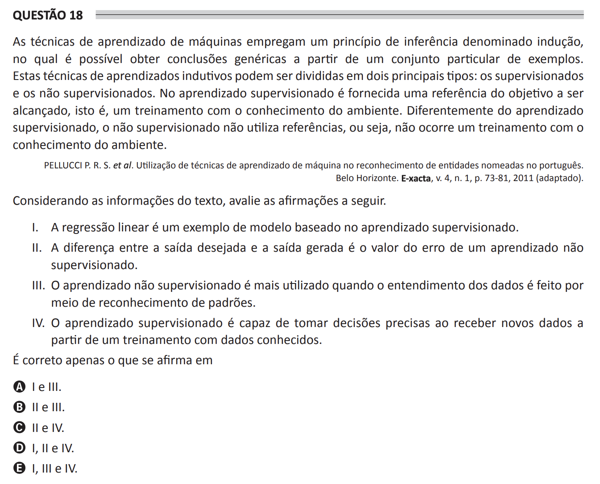

## Question 18 ##

### Original question in image format (in Portuguese): ###

### English translation: ###

**QUESTION 18**

Machine learning techniques employ an inference principle called induction, in which it is possible to obtain generic conclusions from a particular set of examples. These intuitive learning techniques can be divided into two main types: supervised and unsupervised. In supervised learning, a reference for the objective to achieve is provided, that is, a training with the knowledge of the environment. Differently, in unsupervised learning, no references are used, that is, there is no training with the knowledge of the environment.

PELLUCCI P. R. S. et al. Utilization of machine learning techniques in the recognition of named entities in Portuguese. Belo Horizonte. E-xacta, v. 4, n. 1, p. 73-81, 2011 (adapted).

Considering the information from the text, evaluate the following statements.

I. Linear regression is an example of a model based on supervised learning.

II. The difference between the desired output and the output generated is the error value of an unsupervised learning.

III. Unsupervised learning is more utilized when understanding of data is done through pattern recognition.

IV. Supervised learning is capable of making accurate decisions when receiving new data from training with known data.

It is correct only what is stated in

A) I and III.

B) II and III.

C) II and IV.

D) I, II, and IV.

E) I, III, and IV.