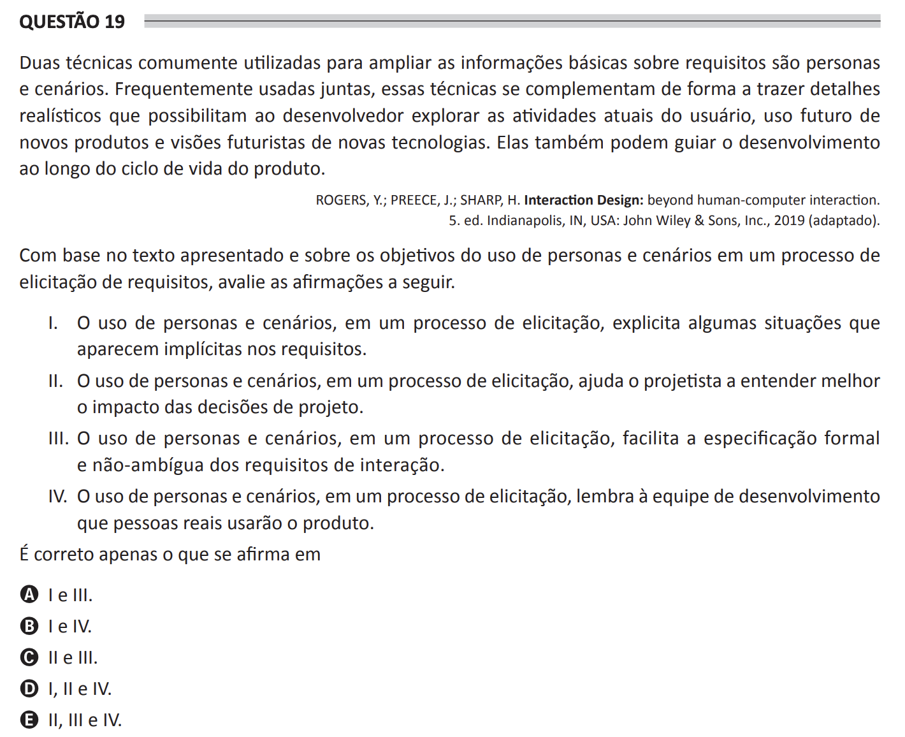

\[ [Previous question](q18-eng.md) \] \[ [Next question](q20-eng.md) \] \[ [Main menu](/README.md) \]

## Question 19 ##

Click [here](q19-por.md) to view ChaGPT-4 Vision's prompts and responses to this question in Portuguese.

**English transcription of the question:**

Two techniques commonly used to broaden basic information on requirements are personas and scenarios. Often used together, these techniques complement each other in a way that brings details to life and allows developers to explore current user activities, future use of new products, and futuristic visions of new technologies. They can also guide the development throughout the product life cycle.

ROGERS, Y.; PREECE, J.; SHARP, H. Interaction Design: beyond human-computer interaction. 5th ed. Indianapolis, IN, USA: John Wiley & Sons, Inc., 2019 (adapted).

Based on the text presented and on the objectives of the use of personas and scenarios in a requirements elicitation process, assess the following statements.

I. The use of personas and scenarios, in an elicitation process, makes explicit some situations that are implicit in the requirements.

II. The use of personas and scenarios, in an elicitation process, helps the designer to better understand the impact of design decisions.

III. The use of personas and scenarios, in an elicitation process, facilitates the formal and unambiguous specification of interaction requirements.

IV. The use of personas and scenarios, in an elicitation process, reminds the development team that real people will use the product.

It is correct only what is stated in

A) I and III.

B) I and IV.

C) II and III.

D) I, II and IV.

E) II, III and IV.

---

**Prompt**: Answer the question in this image. Explain your reasoning step by step. At the end, choose which of the five alternatives (A-E) is correct. Inform if there is more than one correct alternative or if all five alternatives are incorrect.

---

**ChatGPT-4 Vision response**: 

Let's analyze the statements one by one based on the text and knowledge about the use of personas and scenarios in requirement elicitation processes:

**I. The use of personas and scenarios, in an elicitation process, makes explicit some situations that are implicit in the requirements.**

This statement is supported by the text, which mentions that these techniques "complement in a way to bring realistic details that enable the developer to explore the current activities of the user, future use of new products, and futuristic visions of new technologies". Therefore, it can be inferred that personas and scenarios help clarify situations that might not be explicitly mentioned in the requirements.

**II. The use of personas and scenarios, in an elicitation process, helps the designer better understand the impact of design decisions.**

The text does not directly mention this statement, but knowing that the use of personas and scenarios provides realistic details and futuristic visions, it can be inferred that these techniques help designers better understand the impact of their decisions.

**III. The use of personas and scenarios, in an elicitation process, facilitates the formal and unambiguous specification of interaction requirements.**

The text does not directly refer to a "formal and unambiguous specification". However, the use of personas and scenarios aims to bring realistic details, which may help make requirements less ambiguous. But, the specificity of "formal and unambiguous" is not directly addressed in the text.

**IV. The use of personas and scenarios, in an elicitation process, reminds the development team that real people will use the product.**

This statement aligns with the purpose of personas, which are fictitious representations of real users. Therefore, the use of personas serves as a reminder that the solutions developed will be used by real people.

Based on the analysis, statements I, II, and IV seem to be correct, while statement III, although inferable, is not directly supported by the text.

Therefore, the correct alternative is: **D) I, II and IV.**

---

**Answer key**: D

---

**Verdict**

The ChatGPT's response is consistent with the answer key.

\[ [Previous question](q18-eng.md) \] \[ [Next question](q20-eng.md) \] \[ [Main menu](/README.md) \]
