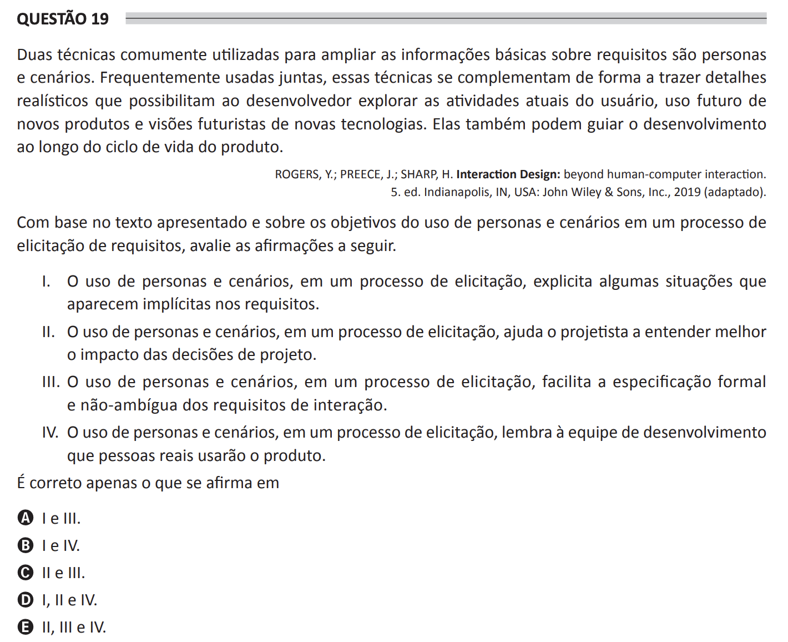

## Question 19 ##

### Original question in image format (in Portuguese): ###

### English translation: ###

**QUESTION 19**

Two techniques commonly used to broaden basic information on requirements are personas and scenarios. Often used together, these techniques complement each other in a way that brings details to life and allows developers to explore current user activities, future use of new products, and futuristic visions of new technologies. They can also guide the development throughout the product life cycle.

ROGERS, Y.; PREECE, J.; SHARP, H. Interaction Design: beyond human-computer interaction. 5th ed. Indianapolis, IN, USA: John Wiley & Sons, Inc., 2019 (adapted).

Based on the text presented and on the objectives of the use of personas and scenarios in a requirements elicitation process, assess the following statements.

I. The use of personas and scenarios, in an elicitation process, makes explicit some situations that are implicit in the requirements.

II. The use of personas and scenarios, in an elicitation process, helps the designer to better understand the impact of design decisions.

III. The use of personas and scenarios, in an elicitation process, facilitates the formal and unambiguous specification of interaction requirements.

IV. The use of personas and scenarios, in an elicitation process, reminds the development team that real people will use the product.

It is correct only what is stated in

A) I and III.

B) I and IV.

C) II and III.

D) I, II and IV.

E) II, III and IV.