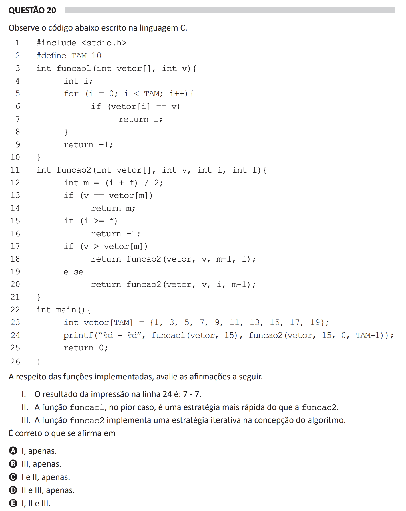

\[ [Questão anterior](q19-por.md) \] \[ [Próxima questão](q21-por.md) \] \[ [Menu inicial](/README.md) \]

## Questão 20 ##

**Prompt**: Responda a questão nesta imagem. Explique o seu raciocínio passo a passo. Ao final, escolha qual das cinco alternativas fornecidas (A-E) é a correta. Informe caso haja mais de uma alternativa correta ou todas as cinco alternativas sejam incorretas.

---

**Resposta do ChatGPT-4 Vision**: 

Vamos analisar o código e as afirmações passo a passo:

O código fornece duas funções, `funcao1` e `funcao2`, que parecem estar relacionadas à busca em um vetor.

### `funcao1`:
Esta função faz uma busca linear no vetor para encontrar o valor `v`. Se o valor for encontrado, ela retorna o índice do valor no vetor; caso contrário, ela retorna `-1`.

### `funcao2`:
Esta função implementa uma busca binária no vetor. A busca binária é uma estratégia que procura um valor em um vetor dividindo o vetor pela metade repetidamente até que o valor seja encontrado ou o intervalo de busca seja vazio. 

Agora, vamos analisar as afirmações:

**I. O resultado da impressão na linha 24 é: 7 - 7.**

Para verificar isso, precisamos ver o retorno de `funcao1(vetor, 15)` e `funcao2(vetor, 15, 0, TAM-1)`.

- `funcao1(vetor, 15)`: A função irá percorrer o vetor linearmente até encontrar o valor `15`. O valor `15` está no índice `7` do vetor. Portanto, `funcao1` retornará `7`.

- `funcao2(vetor, 15, 0, TAM-1)`: A função irá começar com a busca binária, começando pelo meio do vetor. O valor no meio (índice 5) é `11`, que é menor que `15`, então a função buscará na metade direita do vetor. Em seguida, o valor no meio dessa metade é `15`, que é o valor que estamos procurando. Portanto, `funcao2` também retornará `7`.

A afirmação I está correta.

**II. A função funcao1, no pior caso, é uma estratégia mais rápida do que a funcao2.**

Isso não é verdade. A `funcao1` é uma busca linear e, no pior caso, tem uma complexidade de tempo de O(n). A `funcao2` é uma busca binária e, no pior caso, tem uma complexidade de tempo de O(log n). Portanto, no pior caso, `funcao2` (busca binária) é mais rápida do que `funcao1` (busca linear).

A afirmação II está incorreta.

**III. A função funcao2 implementa uma estratégia iterativa na concepção do algoritmo.**

Na verdade, a função `funcao2` implementa uma abordagem recursiva, não iterativa. A cada chamada da função, ela chama a si mesma novamente com um novo conjunto de parâmetros, reduzindo o espaço de busca pela metade. Esta é uma característica da recursividade.

A afirmação III está incorreta.

Dada a análise, a alternativa correta é: **A) I, apenas.**

---

**Gabarito**: A

---

**Veredito**

A resposta do ChatGPT é consistente com o gabarito.

\[ [Questão anterior](q19-por.md) \] \[ [Próxima questão](q21-por.md) \] \[ [Menu inicial](/README.md) \]
