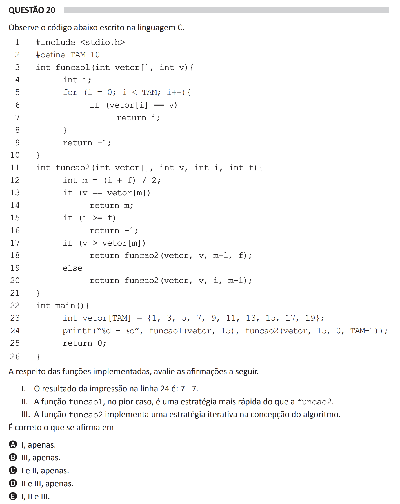

## Question 20 ##

### Original question in image format (in Portuguese): ###


### English translation: ###

**QUESTION 20**

Observe the code below written in the C language.

```
1  #include <stdio.h>
2  #define SIZE 10
3  int function1(int vector\[\], int v){
4      int i;
5      for (i = 0; i < SIZE; i++){
6          if (vector\[i\] == v)
7              return i;
8      }
9      return -1;
10 }
11 int function2(int vector\[\], int v, int i, int f){
12     int m = (i + f) / 2;
13     if (v == vector\[m\])
14         return m;
15     if (i >= f)
16         return -1;
17     if (v > vector\[m\])
18         return function2(vector, v, m+1, f);
19     else
20         return function2(vector, v, i, m-1);
21 }
22 int main(){
23     int vector\[SIZE\] = {1, 3, 5, 7, 9, 11, 13, 15, 17, 19};
24     printf("%d & %d", function1(vector, 15), function2(vector, 15, 0, SIZE-1));
25     return 0;
26 }
```

Regarding the implemented functions, evaluate the following statements:

I. The result of the print command on line 24 is: 7 - 7.

II. In the worst case, *function1* is a faster strategy than *function2*.

III. The function *function2* implements an iterative strategy in the design of the algorithm.

It is correct what is stated in

A) I, only.

B) III, only.

C) I and II, only.

D) II and III, only.

E) I, II and III.
