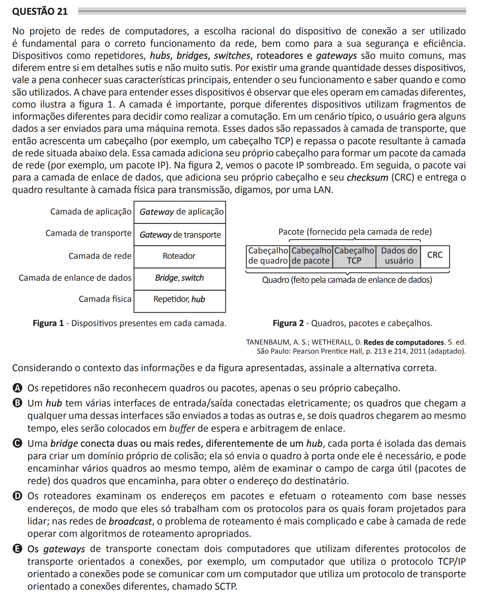

\[ [Questão anterior](q20-por.md) \] \[ [Próxima questão](q22-por.md) \] \[ [Menu inicial](/README.md) \]

## Questão 21 ##

Clique [aqui](q21-eng.md) para ver os prompts e as respostas do ChaGPT-4 Vision a esta questão em Inglês.

**Prompt**: Responda a questão nesta imagem. Explique o seu raciocínio passo a passo. Ao final, escolha qual das cinco alternativas fornecidas (A-E) é a correta. Informe caso haja mais de uma alternativa correta ou todas as cinco alternativas sejam incorretas.

---

**Resposta do ChatGPT-4 Vision**: 

Vamos analisar as opções apresentadas no contexto das informações fornecidas:

**A) Os repetidores não reconhecem quadros ou pacotes, apenas o seu próprio cabeçalho.**

Repetidores são dispositivos da camada física cuja principal função é ampliar o sinal para que ele possa cobrir distâncias maiores. Eles não estão preocupados com cabeçalhos, quadros ou pacotes. A função de um repetidor é simplesmente receber um sinal elétrico ou óptico e amplificar ou regenerar esse sinal. Portanto, essa afirmação é **correta**.

**B) Um hub tem várias interfaces de entrada/saída conectadas eletricamente; os quadros que chegam a qualquer uma dessas interfaces são enviados a todas as outras e, se dois quadros chegarem ao mesmo tempo, eles serão colocados em buffer de espera e arbitragem de enlace.**

Um hub é um dispositivo simples que retransmite o tráfego que recebe para todas as suas portas. No entanto, um hub não possui capacidade de buffering. Se dois quadros chegarem ao mesmo tempo, haverá uma colisão, e não um buffer de espera ou arbitragem de enlace. Portanto, essa afirmação é **incorreta**.

**C) Uma bridge conecta duas ou mais redes, diferentemente de um hub, cada porta é isolada das demais para criar um domínio próprio de colisão; ela só envia o quadro à porta onde ele é necessário, e pode encaminhar vários quadros ao mesmo tempo, além de examinar o campo de carga útil (pacotes de rede) dos quadros que encaminha, para obter o endereço do destinatário.**

Uma bridge é um dispositivo da camada de enlace de dados que é usado para dividir uma rede em domínios de colisão separados. Ela faz isso examinando o endereço MAC no cabeçalho do quadro e tomando decisões de encaminhamento com base nisso. A afirmação de que uma bridge só envia o quadro à porta onde ele é necessário é correta. No entanto, bridges não examinam o campo de carga útil do quadro, apenas o cabeçalho do quadro. Portanto, essa afirmação é **parcialmente correta**.

**D) Os roteadores examinam os endereços em pacotes e o efetuam o roteamento com base nesses endereços, de modo que eles só trabalham com os protocolos para os quais foram projetados para lidar; nas redes de broadcast, o problema de roteamento é mais complicado e cabe à camada de rede operar com algoritmos de roteamento apropriados.**

Roteadores operam na camada de rede e tomam decisões de roteamento com base nos endereços IP contidos nos pacotes. Eles não estão limitados a um protocolo específico e podem ser projetados para suportar múltiplos protocolos. A segunda parte da afirmação é verdadeira; nas redes de broadcast, o roteamento é mais desafiador e a camada de rede usa algoritmos de roteamento apropriados. Portanto, essa afirmação é **correta**.

**E) Os gateways de transporte conectam dois computadores que utilizam diferentes protocolos de transporte orientados a conexões, por exemplo, um computador que utiliza o protocolo TCP/IP orientado a conexões pode se comunicar com um computador que utiliza um protocolo de transporte orientado a conexões diferentes, chamado SCTP.**

Gateways são dispositivos que traduzem entre diferentes protocolos de comunicação. Um gateway de transporte, especificamente, pode traduzir entre diferentes protocolos de transporte, como TCP e SCTP, como mencionado. Portanto, essa afirmação é **correta**.

Com base na análise, as alternativas corretas são **A, D e E**. No entanto, como a questão pede para assinalar a alternativa correta (singular), todas as cinco alternativas são incorretas.

---

**Gabarito**: E

---

**Prompt**: A sua resposta difere do gabarito divulgado para esta questão: [gabarito]

Após analisar o gabarito, você mantém ou altera sua resposta? Se decidir alterar sua resposta, explique as possíveis razões que o induziram ao erro. Procure identificar as causas concretas do seu erro, ao invés de listar razões genéricas como falha de compreensão do enunciado da questão.

---

**Resposta do ChatGPT-4 Vision**:

Mantenho as respostas originais, mas entendo que a alternativa E é a mais completa e precisa entre as opções fornecidas. Minha análise considerou cada afirmação em detalhes, buscando precisão técnica em relação ao funcionamento e características de cada dispositivo mencionado.

Ao revisitar a alternativa C, posso ter sido muito rigoroso ao considerá-la "parcialmente correta" devido à menção sobre a bridge examinar o "campo de carga útil". A principal função da bridge é, de fato, observar o cabeçalho do quadro para tomar decisões de encaminhamento, e não a carga útil do quadro em si. Esta pequena imprecisão na declaração pode ter sido interpretada de maneira mais flexível no gabarito oficial, levando à seleção da alternativa E como a resposta correta.

As possíveis razões que induziram ao erro na resposta anterior incluem:

1. Uma interpretação rigorosa do termo "campo de carga útil" na alternativa C, levando a uma análise técnica detalhada em vez de considerar o contexto geral da declaração.
2. A ênfase em precisão técnica em vez de interpretar a questão no contexto de um exame, onde pequenas imprecisões podem ser aceitáveis se a declaração geral for correta ou mais correta do que as outras opções.

Nesse sentido, ao revisitar a análise, a alternativa E é a mais adequada, pois aborda corretamente o papel dos gateways de transporte em conectar computadores que usam diferentes protocolos de transporte.

---

**Veredito**

ChatGPT-4 Vision voltou atrás na sua resposta e concordou com o gabarito.

## Análise do ChatGPT-4 Turbo dos principais desafios que o ChatGPT-4 Vision enfrentou ao responder a questão ##

**Prompt**: Seguem os prompts e as respostas de uma IA gerativa para a questão em anexo, juntamente com possíveis avaliações de dois ou mais especialistas humanos sobre as respostas da IA generativa e a qualidade geral da questão. Com base nas informações fornecidas, resuma as principais dificuldades enfrentadas pela IA gerativa ao tentar responder à questão, incluindo possíveis dificuldades resultantes do reconhecimento incorreto de algum elemento gráfico ou textual presente no enunciado da questão. Considere apenas dificuldades concretas cuja manifestação pode ser evidenciada pelas informações fornecidas nas respostas da IA gerativa. Ao final, discuta se essas dificuldades poderiam ser mitigadas ou eliminadas por meio de técnicas de engenharia de prompts ou se seriam inerentes às limitações dos atuais grandes modelos de linguagem de grande (LLMs). 

---

**Resposta do ChatGPT-4 Turbo**:

As principais dificuldades enfrentadas pela IA ao tentar responder à questão relacionada à redes de computadores e dispositivos de rede foram:

1. **Precisão Técnica vs. Contexto de Prova**: A IA inicialmente avaliou as afirmações com um alto grau de precisão técnica, levando a considerar a alternativa C como "parcialmente correta" devido a uma pequena imprecisão técnica sobre o exame do "campo de carga útil" por parte da bridge.

2. **Interpretação Rígida**: A IA aplicou uma interpretação rigorosa dos termos técnicos, o que é adequado para um contexto técnico mas pode não ser apropriado para o contexto de um exame, onde pequenas imprecisões na linguagem podem ser aceitáveis.

3. **Erro de Análise**: A IA identificou corretamente que as afirmações A, D e E estavam corretas, mas falhou ao concluir que todas as alternativas eram incorretas, não percebendo que a questão pedia a alternativa correta no singular, e não todas as corretas.

A IA, ao perceber o erro, adaptou sua resposta para alinhar-se ao gabarito oficial, escolhendo a alternativa E como a mais correta, após reconhecer que a interpretação técnica detalhada não era necessária e que a ênfase deveria ser dada ao entendimento geral da função dos dispositivos em questão.

Essas dificuldades podem ser parcialmente amenizadas com engenharia de prompts, onde os prompts podem ser estruturados para enfatizar o contexto e a natureza da tarefa (por exemplo, responder dentro do contexto de um exame, onde a alternativa "mais correta" é a desejada, mesmo que outras alternativas contenham alguma verdade). No entanto, algumas limitações são inerentes aos LLMs atuais, como a dificuldade em aplicar flexibilidade na interpretação quando a precisão técnica é desafiada por nuances de linguagem em contextos de exame. As estratégias de engenharia de prompts podem melhorar a performance, mas os LLMs ainda precisam de avanços para lidar melhor com a ambiguidade e a interpretação contextual, especialmente em cenários de múltipla escolha onde as nuances são críticas.

\[ [Questão anterior](q20-por.md) \] \[ [Próxima questão](q22-por.md) \] \[ [Menu inicial](/README.md) \]
