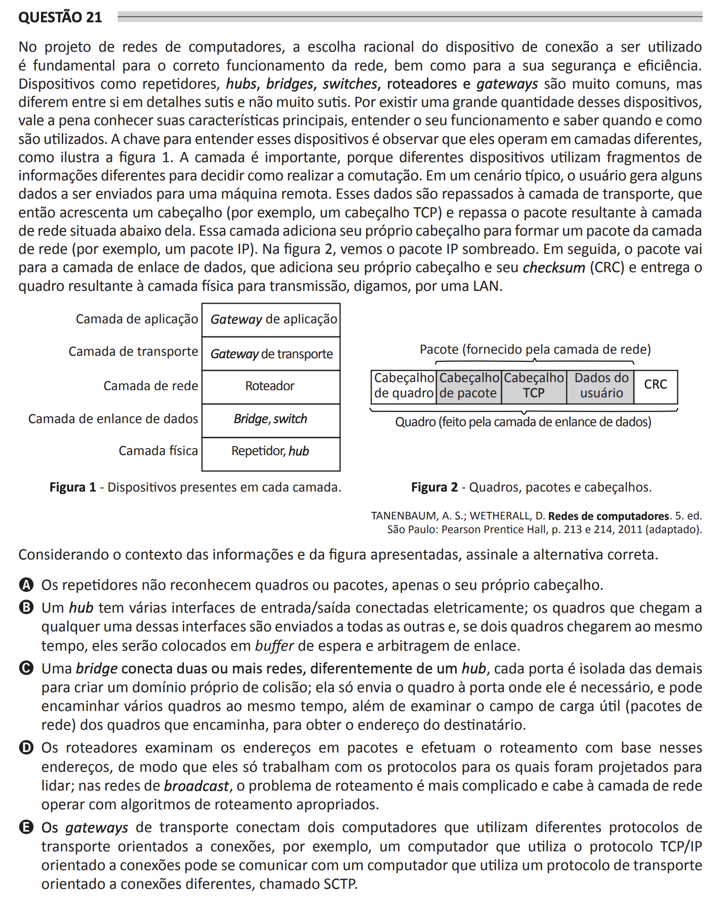

## Question 21 ##

### Original question in image format (in Portuguese): ###

### English translation: ###

**QUESTION 21**

In computer network design, the rational choice of a connection device to be used is fundamental for the correct functioning of the network, as well as for its security and efficiency. Devices such as repeaters, hubs, bridges, switches, routers, and gateways are quite common, but they differ from one another in both subtle and not-so-subtle details. Due to the large number of these devices, it is worthwhile to know their main characteristics, understand how they function, and know when and how they are used. The key to understanding these devices is to observe that they operate in different layers, as illustrated in Figure 1. The layer is important because different devices use different fragments of information to decide how to carry out switching. In a typical scenario, a user generates some data to be sent to a remote machine. These data are passed on to the transport layer, which then adds a header (for example, a TCP header) and passes the resulting packet to the network layer below it. This layer adds its own header to form a network layer packet (for example, an IP packet). In Figure 2, we see the IP packet shaded. Then, the packet goes to the data link layer, which adds its own header and checksum (CRC) and delivers the resulting frame to the physical layer for transmission, let's say, over a LAN.

\[Figure 1 - Devices present in each layer. This figure shows a vertical diagram illstrating different network devices associated with each corresponding layer of the OSI model.\]

\[Figure 2 - Frames, packets, and headers. This figure shows a horizontal diagram representing a data packet as it is wrapped in various layers of protocol information at each layer of the OSI model.\]

TANENBAUM, A. S.; WETHERALL, D. Computer Networks. 5th ed. São Paulo: Pearson Prentice Hall, p. 213-214, 2011 (adapted).

Considering the context of the information and figures presented, select the correct alternative.

A) Repeaters do not recognize frames or packets, only their own header.

B) A hub has several input/output interfaces connected electrically; the frames that arrive at any of these interfaces are sent to all the others, and if two frames arrive at the same time, they will be placed in a buffer for waiting and link arbitration.

C) A bridge connects two or more networks; unlike a hub, each port is isolated from the others to create its own collision domain; it only sends the frame to the port where it is needed, and can forward several frames at the same time, in addition to examining the payload field (network packets) of the frames it forwards, to obtain the recipient's address.

D) Routers examine addresses in packets and perform routing based on these addresses, so they only work with the protocols they were designed to handle; in broadcast networks, the routing problem is more complicated and it is up to the network layer to operate with appropriate routing algorithms.

E) Transport gateways connect two computers that use different connection-oriented transport protocols, for example, a computer that uses the TCP/IP connection-oriented protocol can communicate with a computer that uses a different transport protocol oriented to different connections, called SCTP.
