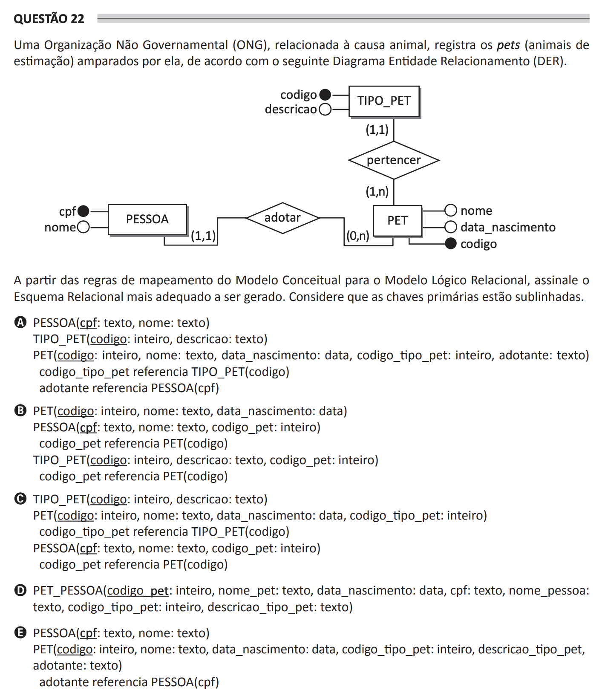

\[ [Previous question](q21-eng.md) \] \[ [Next question](q23-eng.md) \] \[ [Main menu](/README.md) \] \[ [Portuguese version](q22-por.md) \] 

## Question 22 ##

**English transcription of the question:**

An Non-Governmental Organization (NGO), related to the animal cause, registers the pets (companion animals) supported by it, according to the following Entity-Relationship Diagram (ERD).

\[The image shows an Entity-Relationship Diagram (ERD) consisting of three entities connected by relationships: PERSON connected to PET by an "adopt" relationship, and PET connected to PET_TYPE by a "belong" relationship. Attributes for each entity are as follows: PERSON has 'cpf' and 'name', PET has 'name', 'birth_date', and 'code', and PET_TYPE has 'code' and 'description'. The relationships also indicate cardinalities: (1,1) for PERSON to PET, (0,n) for PET to PERSON, (1,n) for PET to PET_TYPE, and (1,1) for PET_TYPE to PET.\]

Based on the mapping rules from the Conceptual Model to the Relational Logical Model, select the most appropriate Relational Schema to be generated. Consider that primary keys are underlined.

A)
PERSON(<u>cpf</u>: text, name: text)
PET_TYPE(<u>code</u>: integer, description: text)
PET(<u>code</u>: integer, name: text, birth_date: date, pet_type_code: integer, adopter: text)
pet_type_code references PET_TYPE(code) 
adopter references PERSON(cpf)

B)
PET(<u>code</u>: integer, name: text, birth_date: date) 
PERSON(<u>cpf</u>: text, name: text, pet_code: integer)
pet_code references PET(code)
PET_TYPE(<u>code</u>: integer, description: text, pet_code: integer)
pet_code references PET(code)

C)
PET_TYPE(<u>code</u>: integer, description: text)
PET(<u>code</u>: integer, name: text, birth_date: date, pet_type_code: integer)
pet_type_code references PET_TYPE(code) 
PERSON(<u>cpf</u>: text, name: text, pet_code: integer)
pet_code references PET(code)

D)
PET_PERSON(<u>pet_code</u>: integer, pet_name: text, birth_date: date, cpf: text, person_name: text, pet_type_code: integer, pet_type_description: text)

E) 
PERSON(<u>cpf</u>: text, name: text)
PET(<u>code</u>: integer, name: text, birth_date: date, pet_type_code: integer, pet_type_description, adopter: text)
adopter references PERSON(cpf)

---

**Prompt**: Answer the question in this image. Explain your reasoning step by step. At the end, choose which of the five alternatives (A-E) is correct. Inform if there is more than one correct alternative or if all five alternatives are incorrect.

---

**ChatGPT-4 Vision response**: 

Let's start by analyzing the Entity Relationship Diagram (ERD) presented and understand each of the entities and their relationships:

1. **PET_TYPE**: Represents the type of animal, with attributes code and description.
2. **PERSON**: Represents a person, with attributes cpf and name.
3. **PET**: Represents an animal supported by the NGO, with attributes name, birth_date, code and has relationships with PET_TYPE and PERSON.

Observed relationships:
1. Each PET belongs to a type, indicated by the "belong" relationship between PET and PET_TYPE.
2. Each PET can be adopted by a PERSON, as per the "adopt" relationship between PET and PERSON.

Based on this, let's examine the alternatives:

**A)**
- PERSON(cpf: text, name: text): Seems correct.
- PET_TYPE(code: integer, description: text): Seems correct.
- PET(code: integer, name: text, birth_date: date, code_pet_type: integer, adopter: text): Seems correct, since there is a reference to PET_TYPE by code and a reference to PERSON by cpf (adopter).

**B)**
- PET(code: integer, name: text, birth_date: date): Seems correct.
- PERSON(cpf: text, name: text, code_pet: integer): This suggests that a person can only adopt one pet, which contradicts the ERD that allows a person to adopt multiple pets (0, n).
- PET_TYPE(code: integer, description: text, code_pet: integer): This suggests that an animal type is linked to a single pet, which is not true.

**C)**
- PET_TYPE(code: integer, description: text): Seems correct.
- PET(code: integer, name: text, birth_date: date, code_pet_type: integer): Seems correct.
- PERSON(cpf: text, name: text, code_pet: integer): Again, this suggests that a person can only adopt one pet.

**D)**
- PET_PERSON(code_pet: integer, name_pet: text, birth_date: date, cpf: text, name_person: text, code_pet_type: integer, description_pet_type: text): This looks like a combination of all entities into a single table, which is not the appropriate relational model.

**E)**
- PERSON(cpf: text, name: text): Seems correct.
- PET(code: integer, name: text, birth_date: date, code_pet_type: integer, description_pet_type, adopter: text): Here, we are including the "description_pet_type" directly in the PET table, which is an unnecessary redundancy and not an appropriate practice.

The most suitable alternative that correctly translates the ERD into the relational schema is **Alternative A**.

---

**Answer key**: A

---

**Verdict**

The ChatGPT's answer is consistent with the answer key.

\[ [Previous question](q21-eng.md) \] \[ [Next question](q23-eng.md) \] \[ [Main menu](/README.md) \]
