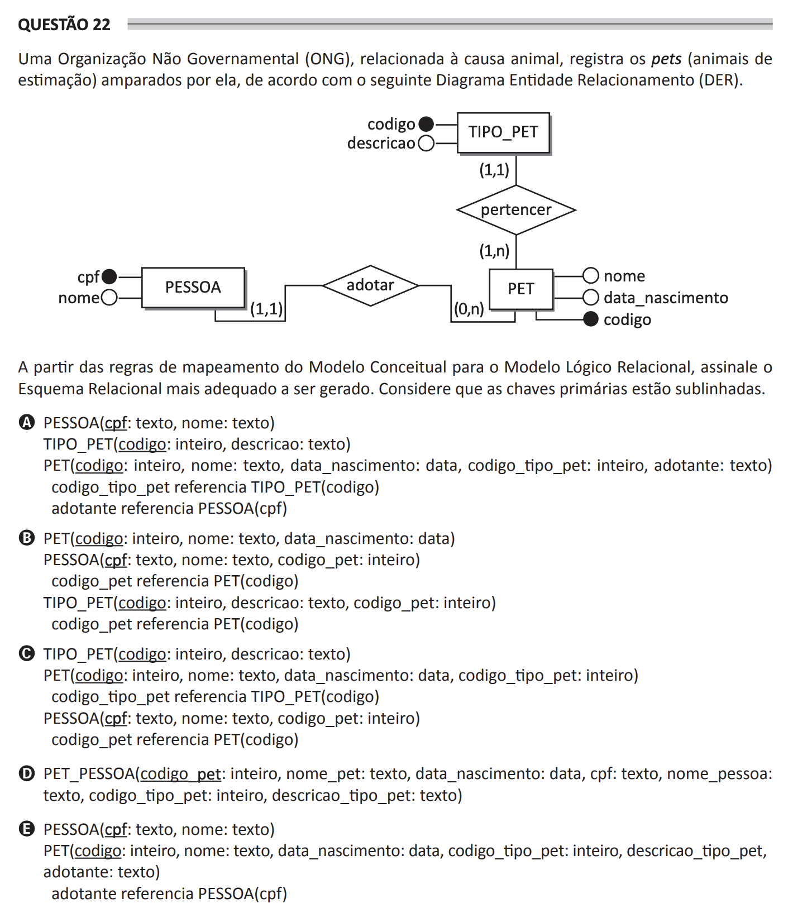

## Question 22 ##

### Original question in image format (in Portuguese): ###

### English translation: ###

**QUESTION 22**

An Non-Governmental Organization (NGO), related to the animal cause, registers the pets (companion animals) supported by it, according to the following Entity-Relationship Diagram (ERD).

\[The image shows an Entity-Relationship Diagram (ERD) consisting of three entities connected by relationships: PERSON connected to PET by an "adopt" relationship, and PET connected to PET_TYPE by a "belong" relationship. Attributes for each entity are as follows: PERSON has 'cpf' and 'name', PET has 'name', 'birth_date', and 'code', and PET_TYPE has 'code' and 'description'. The relationships also indicate cardinalities: (1,1) for PERSON to PET, (0,n) for PET to PERSON, (1,n) for PET to PET_TYPE, and (1,1) for PET_TYPE to PET.\]

Based on the mapping rules from the Conceptual Model to the Relational Logical Model, select the most appropriate Relational Schema to be generated. Consider that primary keys are underlined.

A)
PERSON(<u>cpf</u>: text, name: text)
PET_TYPE(<u>code</u>: integer, description: text)
PET(<u>code</u>: integer, name: text, birth_date: date, pet_type_code: integer, adopter: text)
pet_type_code references PET_TYPE(code) 
adopter references PERSON(cpf)

B)
PET(<u>code</u>: integer, name: text, birth_date: date) 
PERSON(<u>cpf</u>: text, name: text, pet_code: integer)
pet_code references PET(code)
PET_TYPE(<u>code</u>: integer, description: text, pet_code: integer)
pet_code references PET(code)

C)
PET_TYPE(<u>code</u>: integer, description: text)
PET(<u>code</u>: integer, name: text, birth_date: date, pet_type_code: integer)
pet_type_code references PET_TYPE(code) 
PERSON(<u>cpf</u>: text, name: text, pet_code: integer)
pet_code references PET(code)

D)
PET_PERSON(<u>pet_code</u>: integer, pet_name: text, birth_date: date, cpf: text, person_name: text, pet_type_code: integer, pet_type_description: text)

E) 
PERSON(<u>cpf</u>: text, name: text)
PET(<u>code</u>: integer, name: text, birth_date: date, pet_type_code: integer, pet_type_description, adopter: text)
adopter references PERSON(cpf)
