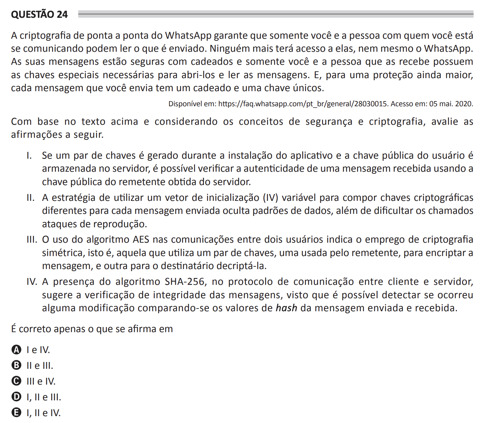

## Questão 24 ##

**Prompt**: Responda a questão nesta imagem. Explique o seu raciocínio passo a passo. Ao final, escolha qual das cinco alternativas fornecidas (A-E) é a correta. Informe caso haja mais de uma alternativa correta ou todas as cinco alternativas sejam incorretas.

---

**Resposta do ChatGPT-4 Vision**: 

Vamos avaliar cada afirmação separadamente, com base nos conceitos de segurança e criptografia:

I. Se um par de chaves é gerado durante a instalação do aplicativo e a chave pública do usuário é armazenada no servidor, é possível verificar a autenticidade de uma mensagem recebida usando a chave pública do remetente obtida do servidor.

- **Correto**. Na criptografia assimétrica, a chave pública é usada para verificar a assinatura digital feita com a chave privada do remetente, garantindo assim a autenticidade.

II. A estratégia de utilizar um vetor de inicialização (IV) variável para compor chaves criptográficas diferentes para cada mensagem enviada oculta padrões de dados, além de dificultar os chamados ataques de reprodução.

- **Correto**. O IV é usado para garantir que a mesma mensagem não seja cifrada da mesma forma todas as vezes. Ele adiciona aleatoriedade ao processo de cifragem e é uma prática padrão em muitos esquemas de criptografia para evitar a exposição de padrões e resistir a ataques de repetição.

III. O uso do algoritmo AES nas comunicações entre dois usuários indica o emprego de criptografia simétrica, isto é, aquela que utiliza um par de chaves, uma usada pelo remetente, para encriptar a mensagem, e outra para o destinatário decriptá-la.

- **Correto em parte**. O AES é um algoritmo de criptografia simétrica, o que significa que a mesma chave é usada tanto para cifrar quanto para decifrar a mensagem. No entanto, a frase é um pouco enganosa ao dizer "um par de chaves". Na criptografia simétrica, é uma única chave compartilhada, não um par de chaves distintas.

IV. A presença do algoritmo SHA-256, no protocolo de comunicação entre cliente e servidor, sugere a verificação de integridade das mensagens, visto que é possível detectar se ocorreu alguma modificação comparando-se os valores de hash da mensagem enviada e recebida.

- **Correto**. O SHA-256 é uma função hash criptográfica. Seu propósito é verificar a integridade dos dados. Ao criar um hash de uma mensagem e comparar esse hash no lado do receptor, pode-se verificar se a mensagem foi alterada durante a transmissão.

Dado o acima, as afirmações I, II e IV são corretas, enquanto a afirmação III é parcialmente correta. 

Portanto, a alternativa correta é **E, I, II e IV**.

---

**Gabarito**: E

---

**Veredito**

A resposta do ChatGPT é consistente com o gabarito.
