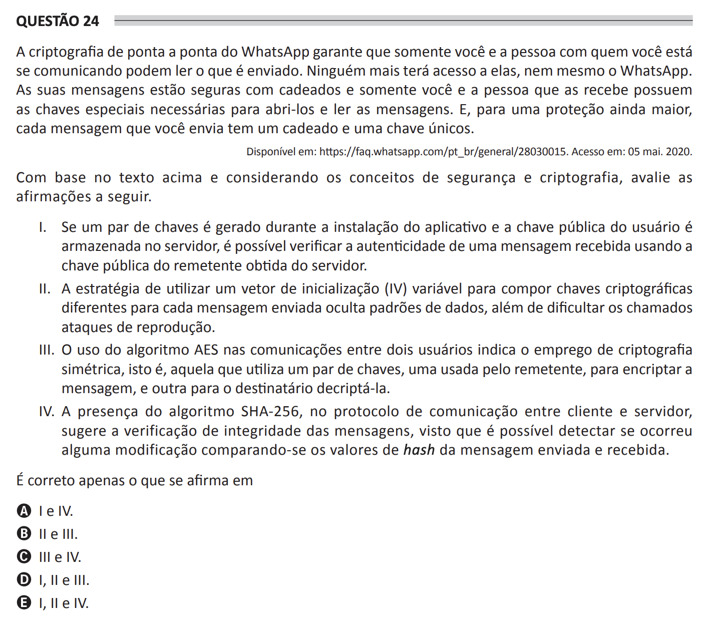

## Question 24 ##

### Original question in image format (in Portuguese): ###

### English translation: ###

**QUESTION 24**

WhatsApp's end-to-end encryption ensures that only you and the person with whom you're communicating can read what is sent. Nobody else will have access to it, not even WhatsApp. Your messages are secured with locks and only you and the recipient have the special keys needed to unlock and read your messages. And for even greater protection, each message you send comes with its own unique lock and key.

Available at: https://faq.whatsapp.com/pt_br/general/28030015. Accessed on: May 5, 2020.

Based on the text above and considering the concepts of security and cryptography, evaluate the following statements.

I. If a pair of keys is generated during the app installation and the user's public key is stored on the server, it is possible to verify the authenticity of a received message using the sender's public key obtained from the server.

II. The strategy of using a variable initialization vector (IV) for composing different cryptographic keys for each message sent hides data patterns, as well as making so-called replay attacks more difficult.

III. The use of the AES algorithm in communications between two users indicates the use of symmetric cryptography, that is, one that uses a pair of keys, one used by the sender to encrypt a message, and another by the recipient to decrypt it.

IV. The presence of the SHA-256 algorithm in the client-server communication protocol suggests the integrity verification of the messages, since it is possible to detect any alterations by comparing the hash values of the sent and received message.

It is correct only what is stated in

A) I and IV.

B) II and III.

C) III and IV.

D) I, II and III.

E) I, II and IV.