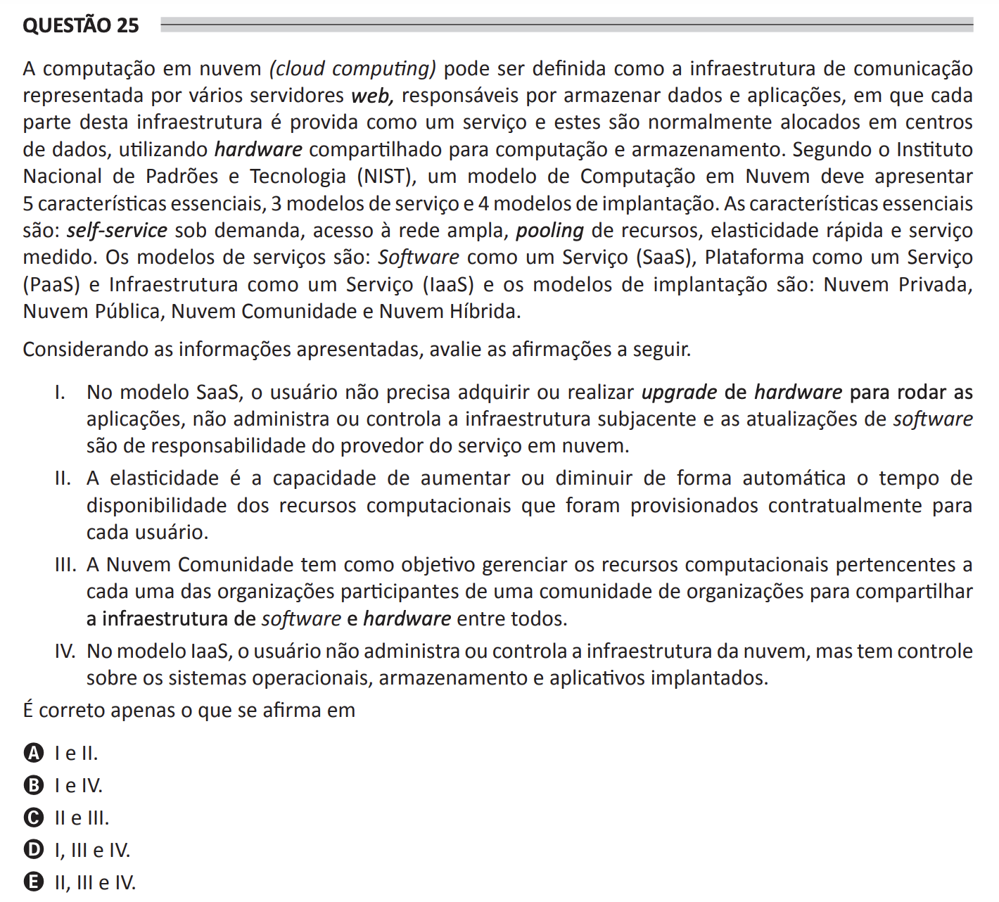

\[ [Questão anterior](q24-por.md) \] \[ [Próxima questão](q26-por.md) \] \[ [Menu inicial](/README.md) \] \[ [Versão em Inglês](q25-eng.md) \] 

## Questão 25 ##

**Prompt**: Responda a questão nesta imagem. Explique o seu raciocínio passo a passo. Ao final, escolha qual das cinco alternativas fornecidas (A-E) é a correta. Informe caso haja mais de uma alternativa correta ou todas as cinco alternativas sejam incorretas.

---

**Resposta do ChatGPT-4 Vision**: 

Vamos avaliar as afirmações baseadas nas informações fornecidas:

I. No modelo SaaS, o usuário não precisa adquirir ou realizar upgrade de hardware para rodar as aplicações, não administra ou controla a infraestrutura subjacente e as atualizações de software são de responsabilidade do provedor do serviço em nuvem.

- **Correto**. O Software como um Serviço (SaaS) é um modelo em que o usuário utiliza o software diretamente pela internet, sem se preocupar com infraestrutura, hardware ou atualizações. O provedor cuida de tudo isso.

II. A elasticidade é a capacidade de aumentar ou diminuir de forma automática o tempo de disponibilidade de recursos computacionais que foram provisionados contratualmente para cada usuário.

- **Incorreto**. A elasticidade, de fato, refere-se à capacidade de aumentar ou diminuir os recursos de acordo com a demanda, mas não especificamente "o tempo de disponibilidade". É mais sobre a capacidade de recursos, como CPU, memória e armazenamento.

III. A Nuvem Comunidade tem como objetivo gerenciar os recursos computacionais pertencentes a cada uma das organizações participantes de uma comunidade de organizações para compartilhar a infraestrutura de software e hardware entre todos.

- **Correto**. A Nuvem Comunidade é um modelo de implantação que atende a várias organizações com objetivos similares, compartilhando a infraestrutura entre elas.

IV. No modelo IaaS, o usuário não administra ou controla a infraestrutura da nuvem, mas tem controle sobre os sistemas operacionais, armazenamento e aplicativos implantados.

- **Correto**. A Infraestrutura como um Serviço (IaaS) fornece ao usuário acesso e controle sobre recursos de infraestrutura, como VMs, armazenamento e redes, mas a gestão da infraestrutura física subjacente (como data centers e hardware) é de responsabilidade do provedor.

Baseado nas avaliações acima, as afirmações I, III e IV são corretas, enquanto a afirmação II é incorreta.

Portanto, a alternativa correta é **E, II, III e IV**.

---

**Gabarito**: B

---

**Prompt**: A sua resposta difere do gabarito divulgado para esta questão: [gabarito]

Após analisar o gabarito, você mantém ou altera sua resposta? Se decidir alterar sua resposta, explique as possíveis razões que o induziram ao erro. Procure identificar as causas concretas do seu erro, ao invés de listar razões genéricas como falha de compreensão do enunciado da questão.

---

**Resposta do ChatGPT-4 Vision**:

Mantenho minhas respostas originais.

Razões para os erros nas respostas anteriores:

1. **Sobre a afirmação II**: Parece que houve uma interpretação errônea da palavra "tempo" na frase "tempo de disponibilidade de recursos computacionais". A elasticidade em computação em nuvem se refere à capacidade de um sistema ajustar a quantidade de recursos computacionais com base na demanda. Não é específico sobre "tempo de disponibilidade". Minha análise estava correta ao considerar essa afirmação como incorreta.

Concluindo, com base na análise, as afirmações I, III e IV são de fato corretas e a afirmação II é incorreta. Portanto, a alternativa correta deveria ser **E, II, III e IV** e não B, conforme indicado no gabarito.

---

**Prompt**: Parece que está havendo uma certa confusão aqui. Se a afirmação II é incorreta, porque a alternativa correta seria E, que inclui justamente a afirmação II como correta? Não faz sentido, faz?

---

**Resposta do ChatGPT-4 Vision**:

Peço desculpas pelo equívoco. Você está absolutamente certo. Se a afirmação II é incorreta, então ela não deve ser incluída entre as respostas corretas.

Dado que as afirmações I, III e IV são corretas, a resposta correta deve ser a alternativa **D, I, III e IV**.

Novamente peço desculpas pela confusão e agradeço por me corrigir.

---

**Prompt**: E quanto ao fato do gabarito considerar a afirmação III como incorreta (alternativa B)? Algo a discordar ou acrescentar?

---

**Resposta do ChatGPT-4 Vision**:

Vamos revisitar a afirmação III:

III. A Nuvem Comunidade tem como objetivo gerenciar os recursos computacionais pertencentes a cada uma das organizações participantes de uma comunidade de organizações para compartilhar a infraestrutura de software e hardware entre todos.

Baseando-nos na descrição da Nuvem Comunidade, conforme o texto, ela é um modelo de implantação usado para atender várias organizações com objetivos similares e compartilhar a infraestrutura entre elas. A afirmação parece estar em linha com essa descrição, pois a Nuvem Comunidade de fato gerencia recursos de várias organizações para que compartilhem uma infraestrutura comum.

Porém, se o gabarito considera a afirmação III como incorreta, podemos tentar identificar nuances que podem ter sido interpretadas de forma diferente:

1. **Gerenciamento de recursos**: A afirmação menciona que a Nuvem Comunidade "gerencia" os recursos. Pode ser que a ênfase esteja na palavra "gerenciar". A Nuvem Comunidade proporciona um ambiente para compartilhamento, mas não necessariamente "gerencia" os recursos de cada organização participante. Isso poderia ser interpretado como se a Nuvem Comunidade tivesse controle ativo sobre todos os recursos de cada organização, o que pode não ser o caso.

2. **Pertencentes a cada uma das organizações**: A estruturação desta parte da afirmação pode sugerir que cada organização tem uma propriedade definida e segregada dos recursos na nuvem, o que pode entrar em conflito com a ideia de compartilhamento.

Dito isso, embora a afirmação III pareça, à primeira vista, alinhar-se com a descrição geral da Nuvem Comunidade, a especificidade da linguagem e a interpretação de certos termos podem torná-la imprecisa, dependendo da definição exata que o Instituto Nacional de Padrões e Tecnologia (NIST) dá para a Nuvem Comunidade.

---

**Prompt**: Para ficar claro: você mantém a interpretação de que a afirmação III seria correta (portanto, a alternativa D seria a correta), apesar das nuances apontadas?

---

**Resposta do ChatGPT-4 Vision**:

Sim, com base na descrição fornecida no texto e na interpretação comum de "Nuvem Comunidade", eu mantenho a interpretação de que a afirmação III é correta. Portanto, a alternativa D (I, III e IV) seria a resposta correta, de acordo com essa interpretação. No entanto, reconheço que questões de múltipla escolha podem ter nuances e especificidades que podem levar a diferentes interpretações, e é sempre importante revisar o contexto e a fonte ao avaliar tais questões.

## Avaliação de especialistas ##

**Especialista #1**

Analisei a questão antes de ver as respostas do Gabarito Oficial e do ChatGPT. Vamos a análise dos itens:

**Item I**: Não há dúvida que a afirmação está correta e isto coincide nas respostas oficial e ChatGPT.

**Item II**: Elasticidade é a habilidade dos provedores de nuvem em aumentar/diminuir de forma automática a quantidade de recursos de acordo com o que for demandado pelas aplicações. Esta característica é ortogonal ao tempo. Em um cenário onde a empresa que contrata que usa o recurso elástico tenha dinheiro, o aumento podem ser "para sempre".

**Item III**: 

**O que está correto neste item**: (1) Nuvens comunitárias permitem o compartilhamento de recursos de hardware/software entre organizações. Para isto, é preciso respeitar as políticas de compartilhamento definidas pelas organizações. (2) Ao mesmo tempo, este compartilhamento só pode ser realizado se houver um gerenciamento dos recursos. 

**O que não está completamente correto**: O objetivo das nuvens comunitárias é gerenciar os recursos computacionais pertencentes a cada uma das organizações.  Uma redação mais clara seria: Nuvem Comunitária permite o compartilhamento de recursos computacionais entre organizações e, para isto, ela gerencia os recursos utilizando políticas de compartilhamento previamente estabelecidas pelas organizações.

**Item IV**: Não há dúvida de que a afirmação está correta e isto coincide nas respostas oficial e ChatGPT.

Há uma falta de clareza na redação do Item III e, por conta disto, **a questão deveria ter sido anulada (o enunciado é ambíguo ou incompleto)**.

---

**Especialista #2**

A primeira parte do enunciado faz afirmações incorretas (ex. computação em nuvem é uma infraestrutura de comunicação representada por vários servidores web). Porém, o comando da questão não diz respeito a esse pedaço, que poderia ter sido descartado sem prejuízo (na realidade com benefícios para o entendimento). Ou seja, não acredito que essa imprecisão seja suficiente para anular a questão. Entendo que o que se pretende avaliar é se o candidato conhece o modelo de cloud computing definido pelo NIST. Concordo com o ChatGPT e com o gabarito do ENADE que as afirmativas I e IV estão corretas e a II está incorreta. A questão então é se a alternativa III está correta, como afirma o ChatGPT, ou não, como indicado no gabarito oficial.

Vejamos o que diz o NIST sobre "Community Cloud" (que ao meu ver deveria ter sido traduzido para nuvem comunitária e não nuvem comunidade).

"Community cloud. The cloud infrastructure is provisioned for exclusive use by a specific community of consumers from organizations that have shared concerns (e.g., mission, security requirements, policy, and compliance considerations). It may be owned, managed, and operated by one or more of the organizations in the community, a third party, or some combination of them, and it may exist on or off premises."

O meu entendimento é que os modelos de implantação definem quem são os usuários que podem usar a nuvem. Apenas usuários internos, na cloud privada, qualquer usuário, na cloud pública e apenas os usuários das organizações participantes da comunidade, na cloud comunitária. Nas clouds híbridas, a definição dos usuários permitidos vai depender do arranjo. A forma como os recursos são gerenciados em cada modelo de implantação não é precisamente definida no modelo do NIST ("It may be owned, managed, and operated by one or more of the organizations in the community, a third party, or some combination of them, and it may exist on or off premises.”). Embora o propósito de uma cloud comunitária seja o que está escrito na alternativa III, o modelo de implantação versa sobre outra questão, que não enfatizada na afirmativa. Diante disso, eu entendo que a afirmação III está incorreta.

Conclusão: a resposta do gabarito está correta (embora a questão tenha sido pessimamente formulada).

---

**Especialista #3**

Minha resposta é: **a questão deveria ter sido anulada (por exemplo, porque há mais de uma resposta correta, nenhuma resposta é correta, ou o enunciado é ambíguo ou incompleto)**.

Esse tipo de questão é péssima e nunca deveria ter sido incluída no ENADE. Para mim, não avalia nada e é cheia de pegadinhas.

Na minha avaliação, a rigor o gabarito está correto, mas é algo totalmente injusto com os estudantes que fazem a prova.

Começa que a primeira frase do enunciado está errada:
"... infraestrutura de comunicação representada por vários servidores *web* ..."

Servidores web? Claro que não! Parece leigo falando!

Sobre a afirmação III, achei que estivesse certa, mas tive que ir no documento do NIST para entender um possível motivo para ela ter sido considerada errada!

Ou seja, a questão do ENADE fala que todas organizações da comunidade tem recursos mas a definição do NIST fala que nem todas precisam ter recursos.

Essa não é uma questão séria! E o ChatGPT não conseguiu pegar essa sutileza!

Por outro lado, numa leitura rápida no celular, me pareceu que a afirmação II também pudesse estar correta. Isso porque "tempo de disponibilidade" pode dar interpretações diversas. Fazendo uma prova, eu ficaria desconfiado!

Enfim, é isso!

Fico triste que uma questão tão mal formulada tenha sido usada para avaliar alunos da computação.

---

**Veredito**

A resposta do ChatGPT-4 Vision é inconsistente com o gabarito e os especialistas não chegaram em um consenso sobre qual seria a resposta correta nem se a questão deveria ser anulada.

## Análise do ChatGPT-4 Turbo dos principais desafios que o ChatGPT-4 Vision enfrentou ao responder a questão ##

**Prompt**: Seguem os prompts e as respostas de uma IA gerativa para a questão em anexo, juntamente com possíveis avaliações de dois ou mais especialistas humanos sobre as respostas da IA generativa e a qualidade geral da questão. Com base nas informações fornecidas, resuma as principais dificuldades enfrentadas pela IA gerativa ao tentar responder à questão, incluindo possíveis dificuldades resultantes do reconhecimento incorreto de algum elemento gráfico ou textual presente no enunciado da questão. Considere apenas dificuldades concretas cuja manifestação pode ser evidenciada pelas informações fornecidas nas respostas da IA gerativa. Ao final, discuta se essas dificuldades poderiam ser mitigadas ou eliminadas por meio de técnicas de engenharia de prompts ou se seriam inerentes às limitações dos atuais grandes modelos de linguagem de grande (LLMs).

---

**Resposta do ChatGPT-4 Turbo**:

A IA gerativa enfrentou dificuldades ao responder a questão relacionada à computação em nuvem, principalmente no que tange à interpretação e aplicação correta das informações do texto em relação às asserções apresentadas. As dificuldades enfrentadas incluem:

1. **Interpretação das Asserções**: A IA inicialmente interpretou que as asserções I, III e IV eram corretas e que a asserção II era incorreta. No entanto, após ser confrontada com o gabarito oficial, que considerava a asserção III como incorreta, a IA manteve sua interpretação original das asserções I e IV mas expressou incerteza quanto à asserção III.

2. **Confusão com o Gabarito**: A IA inicialmente selecionou a alternativa errada (E), incluindo a asserção II como correta, e depois corrigiu para a alternativa D (I, III e IV) ao perceber o erro. No entanto, o gabarito oficial marcava a alternativa B (II e III), contradizendo a resposta da IA e levando a uma revisão adicional.

3. **Feedback dos Especialistas**: Os especialistas forneceram diferentes perspectivas, com um apontando ambiguidade na questão e sugerindo anulação, enquanto outros mantiveram diferentes interpretações da asserção III com base nas definições do NIST, e um terceiro criticou a formulação da questão em geral.

Essas dificuldades demonstram um desafio para a IA em lidar com ambiguidades e nuances do texto, além de destacar a importância da clareza na formulação de questões de exame. A engenharia de prompt poderia ajudar a IA a solicitar esclarecimentos ou a considerar diferentes interpretações com base em fontes externas como as definições do NIST, mas não resolveria completamente o problema de discrepâncias entre interpretações variadas de especialistas ou ambiguidades no texto.

Portanto, as dificuldades enfrentadas pela IA refletem limitações dos LLMs atuais, que podem ter desafios em:
- Interpretar corretamente a linguagem ambígua ou tecnicamente complexa.
- Ajustar suas respostas com base em feedback contraditório ou gabaritos oficiais.
- Navegar efetivamente por questões mal formuladas que exigem conhecimento específico e atualizado.

Essas questões destacam a necessidade de avanços contínuos nos modelos de IA para melhorar a compreensão contextual e a habilidade de lidar com ambiguidades e feedback variado.

\[ [Questão anterior](q24-por.md) \] \[ [Próxima questão](q26-por.md) \] \[ [Menu inicial](/README.md) \]
