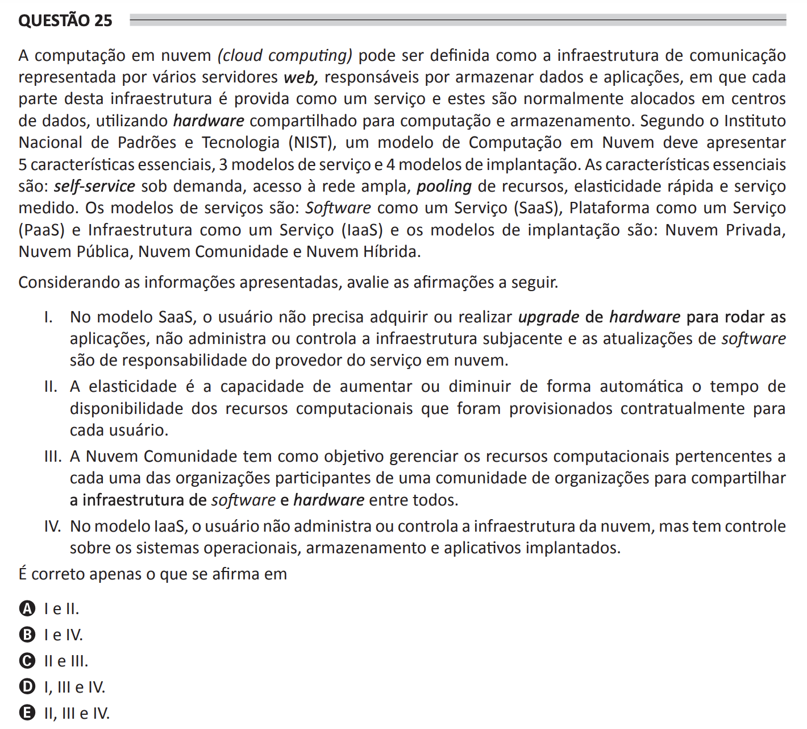

## Question 25 ##

### Original question in image format (in Portuguese): ###

### English translation: ###

**QUESTION 25**

Cloud computing can be defined as the communication infrastructure represented by several web servers, responsible for storing data and applications, where each part of this infrastructure is provided as a service and these are usually allocated in data centers, making use of shared hardware for computation and storage. According to the National Institute of Standards and Technology (NIST), a cloud computing model must present 5 essential characteristics, 3 service models, and 4 deployment models. The essential characteristics are: self-service on demand, broad network access, resource pooling, rapid elasticity, and measured service. Service models are Software as a Service (SaaS), Platform as a Service (PaaS), and Infrastructure as a Service (IaaS) and the deployment models are: Private Cloud, Community Cloud, and Hybrid Cloud.

Considering the presented information, evaluate the statements below.

I. In the SaaS model, the user does not need to acquire or perform a hardware upgrade to run applications, does not manage or control the underlying infrastructure, and the software updates are the cloud service provider's responsibility.

II. Elasticity is the capacity to automatically increase or decrease the time of availability of computational resources that were provisioned contractually for each user.

III. The Community Cloud has the objective of managing the computational resources belonging to each of the organizations participating in a community of organizations to share the software and hardware infrastructure among them.

IV. In the IaaS model, the user does not manage or control the cloud infrastructure but has control over operating systems, storage, and deployed applications.

It is correct only what is stated in

A) I and II.

B) I and IV.

C) II and III.

D) I, III, and IV.

E) II, III, and IV.