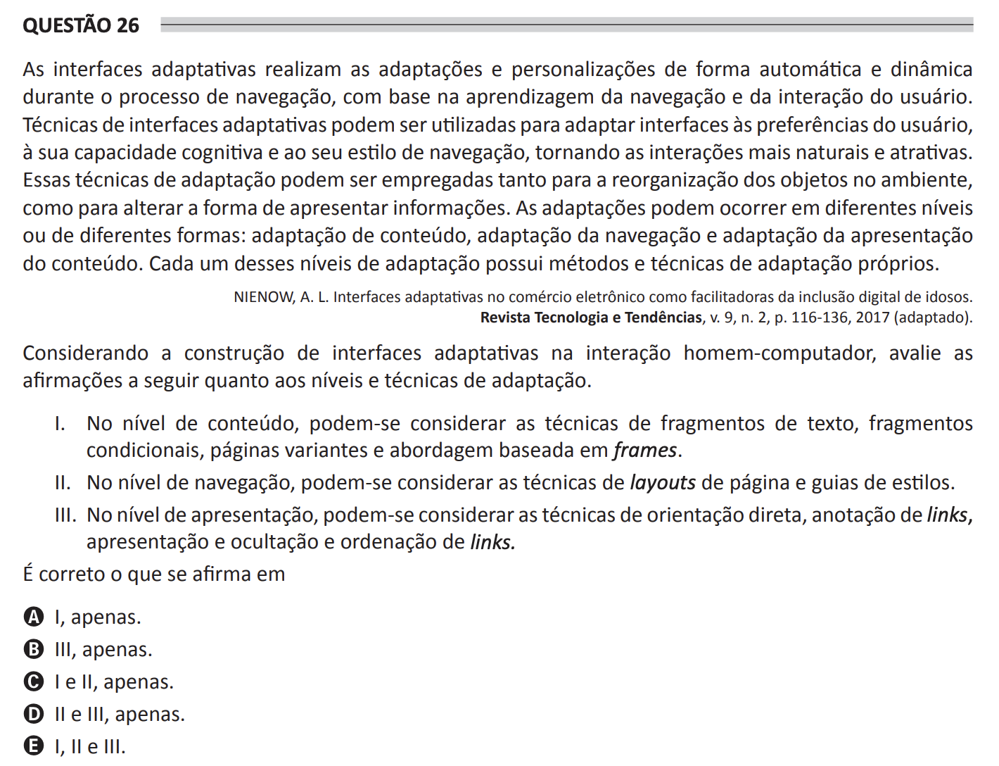

## Questão 26 ##

**Prompt**: Responda a(s) questão(ões) nesta imagem explicando passo a passo o raciocínio utilizado para respondê-la(s). Ao final, escolha qual das cinco alternativas fornecidas (A-E) é a correta. Informe caso haja mais de uma alternativa correta ou todas as cinco alternativas sejam incorretas.

**Resposta do ChatGPT-4 Vision**: 

Vamos avaliar as afirmações com base nas informações fornecidas:

1. **No nível de conteúdo, podem-se considerar as técnicas de fragmentos de texto, fragmentos condicionais, páginas variantes e abordagem baseada em frames.**

No texto, é mencionado que as adaptações podem ocorrer em diferentes níveis, incluindo adaptação de conteúdo. No entanto, o texto não especifica as técnicas exatas utilizadas para a adaptação de conteúdo. No entanto, considerando o conhecimento geral sobre interfaces adaptativas, a afirmação I faz sentido. Fragmentos de texto, fragmentos condicionais e páginas variantes são técnicas que se encaixam no conceito de adaptação de conteúdo. A abordagem baseada em frames, onde diferentes frames podem apresentar diferentes versões de conteúdo com base nas preferências ou comportamento do usuário, também se encaixa no conceito de adaptação de conteúdo. Portanto, a afirmação I é **correta**.

2. **No nível de navegação, podem-se considerar as técnicas de layouts de página e guias de estilos.**

A afirmação parece um pouco confusa à primeira vista. O layout de uma página e os guias de estilos são mais frequentemente associados à apresentação, e não à navegação. No entanto, dependendo de como o "layout" é interpretado, ele poderia potencialmente afetar a navegação - por exemplo, a disposição dos elementos de navegação ou a escolha de menus drop-down vs. barras laterais. Dito isto, essa afirmação é um pouco ambígua, mas com uma interpretação generosa, podemos considerá-la **correta**.

3. **No nível de apresentação, podem-se considerar as técnicas de orientação direta, anotação de links, apresentação e ocultação e ordenação de links.**

Esta afirmação está alinhada com o conceito de adaptação da apresentação. Técnicas que alteram como os links são apresentados, que links são mostrados ou escondidos, e em que ordem eles aparecem, são todas relevantes para a adaptação da apresentação. Portanto, a afirmação III é **correta**.

Dado o raciocínio acima, as três afirmações (I, II e III) parecem corretas.

Portanto, a alternativa correta é **E, I, II e III**.

---

**Gabarito**: A

---

**Prompt**: A sua resposta diverge do gabarito divulgado para esta questão: [gabarito]

Após analisar o gabarito, você mantém ou altera sua resposta? Se decidir alterar sua resposta, explique as possíveis razões que o induziram ao erro. Procure identificar as causas concretas do seu erro, ao invés de listar razões genéricas como falha de compreensão do enunciado da questão.

**Resposta do ChatGPT-4 Vision**:

Entendi sua preocupação e, após uma reavaliação detalhada da questão e das opções fornecidas, aqui está a análise:

1. **No nível de conteúdo**: Com base na informação fornecida no texto, podemos concluir que essa afirmação é coerente com o conceito de adaptação de conteúdo. No entanto, uma possível fonte de ambiguidade é a inclusão da "abordagem baseada em frames". Embora os frames possam ser utilizados para adaptar o conteúdo, a sua principal função é a estruturação da página. Portanto, pode haver um argumento contra a inclusão dos frames como uma técnica de adaptação de conteúdo.

2. **No nível de navegação**: O principal problema com esta afirmação é que os layouts de página e guias de estilos são, na maior parte das vezes, associados à apresentação e não à navegação. A navegação se refere a como os usuários se movimentam ou interagem com uma interface, enquanto o layout e os guias de estilos estão mais relacionados à aparência. A confusão aqui pode ter ocorrido devido a uma sobreposição entre os conceitos de navegação e apresentação. 

3. **No nível de apresentação**: Esta afirmação parece alinhada com o conceito de adaptação da apresentação e não vejo problemas com ela.

Conclusão: 
Dada a ambiguidade associada às afirmações I e II, eu reconsideraria minha avaliação anterior. A afirmação II, sobre o nível de navegação, é particularmente problemática, pois associa técnicas de apresentação ao conceito de navegação. Isso poderia ser a principal causa do erro na resposta anterior. 

Assim, com base na reavaliação:

- A afirmação I é ambígua, mas pode ser considerada correta.
- A afirmação II parece incorreta devido à associação equivocada de técnicas de apresentação com navegação.
- A afirmação III é correta.

Portanto, a resposta mais adequada seria **C, I e II, apenas**, em contraste com a resposta original de "E, I, II e III". A principal razão para o erro anterior foi a sobreposição dos conceitos de navegação e apresentação na afirmação II.

**Prompt**: Parece estar havendo uma certa confusão aqui. Se a firmação II parece incorreta, por que a alternativa correta seria C, que inclui justamente a afirmação II como correta? Além disso, como é possível associar links, a estrutura fundamental de navegação em páginas web, com o nível de apresentação? Isso não seria forçar a barra demais para considerar a afirmação III correta?

**Resposta do ChatGPT-4 Vision**:

Peço desculpas pela confusão. Está claro que cometi um erro ao sugerir a alternativa C como a correta, pois inclui a afirmação II, que identificamos como problemática. Vamos analisar novamente:

1. **No nível de conteúdo**: Esta afirmação se alinha ao que entendemos sobre adaptação de conteúdo, com uma possível ambiguidade em relação à "abordagem baseada em frames", mas pode ser considerada correta.

2. **No nível de navegação**: Concordamos que associar layouts de página e guias de estilos com a navegação é inadequado. Portanto, esta afirmação é incorreta.

3. **No nível de apresentação**: Aqui está o ponto que você mencionou, e tem razão. A orientação direta, anotação de links, apresentação e ocultação e ordenação de links estão, em essência, relacionados à navegação, e não à apresentação. Embora possa haver algum grau de apresentação associado (por exemplo, como um link é destacado ou como é ordenado), essencialmente, essas técnicas se referem a como os usuários interagem e navegam por uma interface. Assim, a afirmação III também parece inadequada.

Dado isso, a única afirmação que parece alinhada com o conceito correto é a I. Portanto, a resposta mais apropriada seria **A, I apenas**.

Errei ao não identificar a associação inadequada de links com apresentação na afirmação III. Obrigado por chamar a atenção para isso, e lamento pelo equívoco.

---

**Veredito**

ChatGPT voltou atrás na sua resposta e concordou com o gabarito.

---

**Análise dos prompts e respostas pelo ChatGPT-4 Turbo** 

**Prompt**: Os arquivos em anexo contêm a imagem de uma questão, e os os prompts e as respostas de uma IA gerativa utilizada para responder essa questão. Com base nas informações presentes nesses arquivos, sumarize as principais dificuldades enfrentadas pela IA gerativa ao tentar responder a questão, incluindo possíveis dificuldades decorrentes do reconhecimento incorreto de algum elemento gráfico ou textual presente no enunciado da questão. Considere apenas dificuldades concretas cuja manifestação possa ser evidenciada pelas informações presentes nos arquivos. Ao final, discuta se essas dificuldades poderiam ser amenizadas ou eliminadas utilizando técnicas de engenharia de prompt, ou se seriam inerentes às limitações dos grandes modelos de linguagem (LLMs) atuais. 

**Resposta do ChatGPT-4 Vision**:

As principais dificuldades enfrentadas pela IA gerativa ao responder a questão sobre interfaces adaptativas foram:

1. **Ambiguidade nas Definições**: A IA inicialmente interpretou as afirmações sobre adaptação de conteúdo, navegação e apresentação de forma ampla, considerando-as corretas com base em uma interpretação generosa dos termos. Entretanto, após um segundo exame, reconheceu que havia ambiguidade na inclusão da "abordagem baseada em frames" como uma técnica de adaptação de conteúdo e na associação de layouts de página e guias de estilos com navegação, que são mais comumente relacionados à apresentação.

2. **Confusão entre Navegação e Apresentação**: A IA errou ao inicialmente aceitar a afirmação II como correta, pois após revisão, identificou que os elementos mencionados são associados à apresentação e não à navegação. Isso mostra uma dificuldade em distinguir entre os conceitos de navegação e apresentação, que podem ter sobreposições mas não são idênticos.

3. **Erro de Análise de Contexto**: Houve uma falha em entender que técnicas de orientação direta, anotação de links, apresentação e ocultação e ordenação de links estão mais relacionadas à navegação do que à apresentação, o que levou a uma mudança na resposta final da IA.

4. **Mudança de Resposta após Reavaliação**: A IA mudou sua resposta após reavaliação detalhada e feedback, passando da opção "E" para "A". Isso indica uma dificuldade em chegar à resposta correta sem intervenção externa.

Essas dificuldades poderiam ser parcialmente amenizadas com técnicas de engenharia de prompt, orientando a IA a prestar mais atenção às definições técnicas e ao contexto específico do exame. Isso incluiria prompts que esclarecessem a necessidade de diferenciar claramente entre navegação e apresentação, e evitar generalizações amplas que podem não se aplicar ao contexto da questão.

No entanto, algumas dificuldades são inerentes às limitações dos LLMs atuais, como a capacidade de analisar criticamente as sobreposições entre conceitos técnicos e aplicar essa análise em um contexto de múltipla escolha. A melhoria contínua nos modelos para melhor compreensão do contexto e interpretação precisa das informações é necessária para superar esses desafios.

