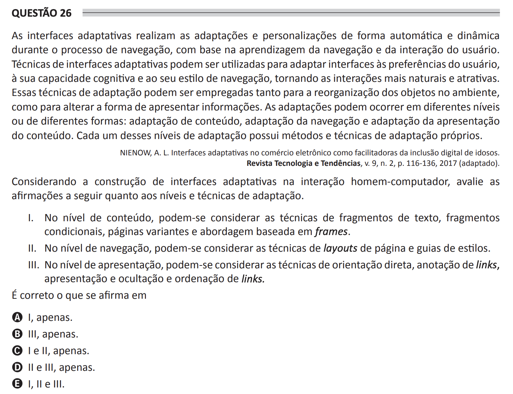

## Question 26 ##

### Original question in image format (in Portuguese): ###

### English translation: ###

**QUESTION 26**

Adaptive interfaces perform adaptations and personalizations automatically and dynamically during the navigation process, based on the user's navigation learning and interaction. Adaptive interface techniques can be used to adapt interfaces to the user's preferences, their cognitive capacity and their navigation style, making interactions more natural and attractive. These adaptation techniques can be employed both for the reorganization of objects in the environment, as well as to change the way information is presented. Adaptations can occur at different levels or in different forms: content adaptation, navigation adaptation and content's presentation adaptation. Each of these levels of adaptation has its own methods and techniques of adaptation.

NIENOW, A. L. Adaptive Interfaces in E-commerce as facilitators of digital inclusion for the elderly. Revista Tecnologia e Tendências, v. 9, n. 2, p. 116-136, 2017 (adapted).

Considering the construction of adaptive interfaces in human-computer interaction, evaluate the following statements regarding the levels and techniques of adaptation.

I. At the content level, one can consider the techniques of text fragments, conditional fragments, variant pages and approach based on frames.

II. At the navigation level, one can consider the techniques of page layouts and style guides.

III. At the presentation level, one can consider the techniques of direct orientation, links annotation, presentation and hiding, and links ordering.

It is correct what is stated in

A) I, only.

B) III, only.

C) I and II, only.

D) II and III, only.

E) I, II and III.