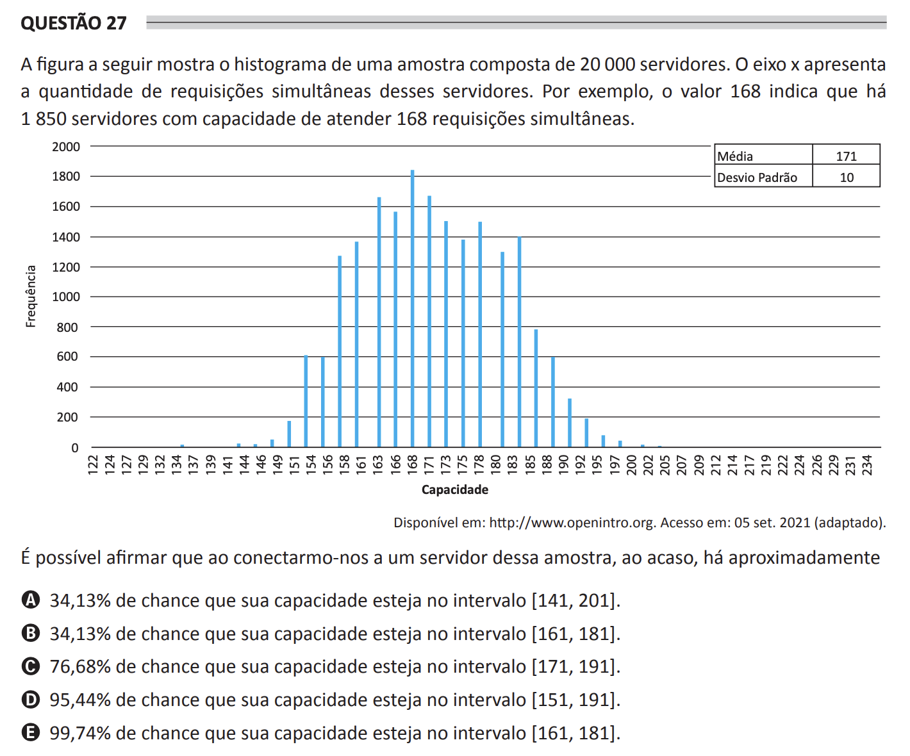

\[ [Questão anterior](q26-por.md) \] \[ [Próxima questão](q28-por.md) \] \[ [Menu inicial](/README.md) \]

## Questão 27 ##

**Prompt**: Responda a questão nesta imagem. Explique o seu raciocínio passo a passo. Ao final, escolha qual das cinco alternativas fornecidas (A-E) é a correta. Informe caso haja mais de uma alternativa correta ou todas as cinco alternativas sejam incorretas.

---

**Resposta do ChatGPT-4 Vision**: 

Vamos começar examinando as informações fornecidas e depois avaliar cada intervalo de capacidade com base na regra empírica para distribuições normais:

Dado:

- Média (μ) = 171
- Desvio Padrão (σ) = 10

**Regra empírica para distribuições normais (curva de sino):**
- Aproximadamente 68% dos dados estão dentro de 1 desvio padrão da média.
- Aproximadamente 95% dos dados estão dentro de 2 desvios padrões da média.
- Aproximadamente 99.7% dos dados estão dentro de 3 desvios padrões da média.

Vamos aplicar essa regra:

1. **1 Desvio Padrão**:
   - Intervalo: [171 - 10, 171 + 10]
   - Intervalo: [161, 181]
   - Chance: 68%

2. **2 Desvios Padrões**:
   - Intervalo: [171 - 2(10), 171 + 2(10)]
   - Intervalo: [151, 191]
   - Chance: 95%

3. **3 Desvios Padrões**:
   - Intervalo: [171 - 3(10), 171 + 3(10)]
   - Intervalo: [141, 201]
   - Chance: 99.7%

Com essas informações, podemos agora avaliar as opções:

A) **[141, 201]**: Este intervalo é 3 desvios padrões da média. Portanto, a chance é de aproximadamente 99.7%.

B) **[161, 181]**: Este intervalo é 1 desvio padrão da média. Portanto, a chance é de aproximadamente 68%.

C) **[171, 191]**: Este intervalo começa na média e se estende por 1 desvio padrão à direita. A metade dos 68% (1 desvio padrão) é 34%. Adicionando a isso, 50% (a metade da distribuição à esquerda da média), obtemos 84%. Mas essa opção é claramente menor do que 95% (2 desvios padrões), então não é exatamente 84%, mas é maior que 68%.

D) **[151, 191]**: Este intervalo é 2 desvios padrões da média. Portanto, a chance é de aproximadamente 95%.

E) **[161, 181]**: Já discutido acima, a chance é de aproximadamente 68%.

Dadas as opções, e usando a regra empírica:

A opção **A** é mais próxima de 99.7%.
A opção **B** é exatamente 68%.
A opção **D** é exatamente 95%.

Portanto, a alternativa correta é a **D, 95,44% de chance que sua capacidade esteja no intervalo [151, 191]**.

---

**Gabarito**: D

---

**Veredito**

A resposta do ChatGPT é consistente com o gabarito.

\[ [Questão anterior](q26-por.md) \] \[ [Próxima questão](q28-por.md) \] \[ [Menu inicial](/README.md) \]
