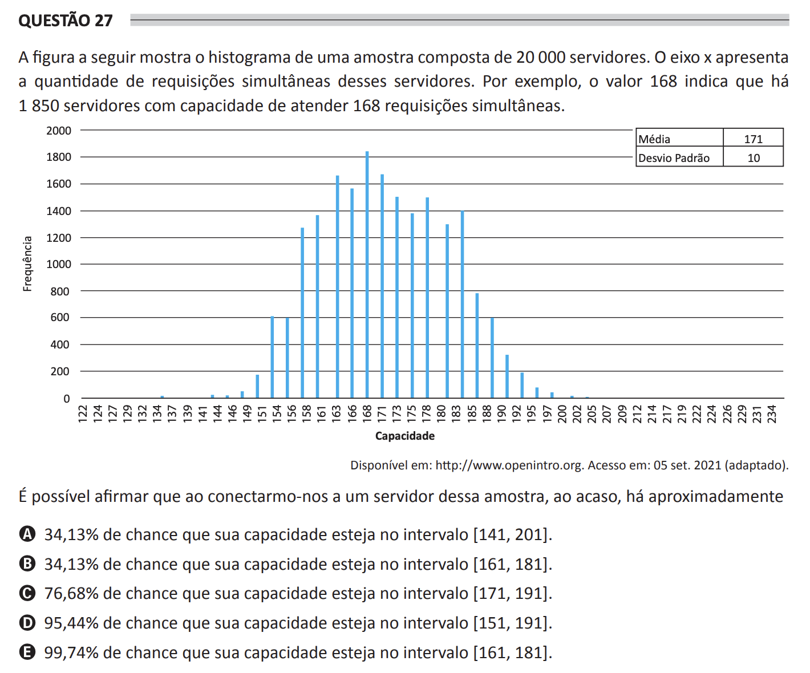

## Question 27 ##

### Original question in image format (in Portuguese): ###

### English translation: ###

**QUESTION 27**

The following figure shows the histogram of a sample composed of 20,000 servers. The x-axis shows the number of simultaneous requests on these servers. For example, the value 168 indicates that there are 1,850 servers with the capacity to handle 168 simultaneous requests.

\[In the image, there is a histogram with the x-axis labeled "Capacity" ranging from values 122 to 234 in increments, and the y-axis labeled "Frequency" ranging from 0 to 2000 in increments. Vertical bars represent the frequency of each capacity value within the sample of servers. At the top right corner, there is a small table with two rows and two columns. The header of the first row is "Mean" with a value of 171 besides it, and the header of the second row is "Standard Deviation" with a value of 10 besides it.\]

Available at: http://www.openintro.org. Accessed on: Sep. 05, 2021 (adapted).

Is it possible to assert that when connecting to a server from this sample at random, there is approximately:

A) 34.13% chance that its capacity is in the interval \[141, 201\].

B) 34.13% chance that its capacity is in the interval \[161, 181\].

C) 76.68% chance that its capacity is in the interval \[171, 191\].

D) 95.44% chance that its capacity is in the interval \[151, 191\].

E) 99.74% chance that its capacity is in the interval \[161, 181\].