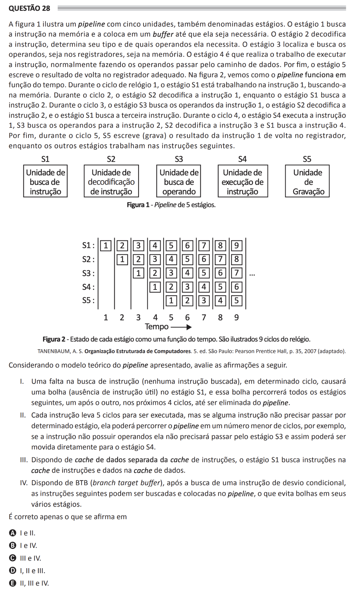

## Question 28 ##

### Original question in image format (in Portuguese): ###

### English translation: ###

**QUESTION 28**

Figure 1 illustrates a pipeline with five units, also called stages. Stage 1 fetches the instruction from memory and places it into a buffer until it is needed. Stage 2 decodes the instruction, determines its type, and which operands it requires. Stage 3 locates and fetches the operands, whether from registers or memory. Stage 4 is the one that performs the work of executing the instruction, typically by passing the operands through the data path. Finally, stage 5 writes the result back into the appropriate register. In figure 2, we see how the pipeline functions over time. During clock cycle 1, stage S1 is working on instruction 1, fetching it from memory. During cycle 2, stage S2 decodes instruction 1, while stage S1 fetches instruction 2. During cycle 3, stage S3 fetches the operands for instruction 1, stage S2 decodes instruction 2, and stage S1 fetches the third instruction. During cycle 4, stage S4 executes instruction 1, S3 fetches operands for instruction 2, S2 decodes instruction 3, and S1 fetches instruction 4. Finally, during cycle 5, S5 writes (records) the result of instruction 1 back into the register, while the other stages work on the following instructions.

\[Figure 1 - Pipeline with 5 stages. The figure shows five rectangles aligned horizontally representing stages S1 to S5, as explained above.\]

\[Figure 2 - State of each stage as a function of time. The figure shows 9 clock cycles. Rows labeled S1 through S5 indicate the stage of the pipeline (such as instruction fetch, decode, operand fetch, execute, write back) and the columns numbered 1 through 9 represent the time (clock cycles). Each cell contains a number indicating which instruction is being processed by a specific stage at a given time.\]

TANENBAUM, A. S. Structured Organization of Computers. 5th ed. São Paulo: Pearson Prentice Hall, p. 35, 2007 (adapted).

Considering the theoretical model of the pipeline presented, evaluate the following statements.

I. A miss in the instruction fetch (no instruction fetched) during a certain cycle will cause a bubble (absence of a useful instruction) in stage S1, and this bubble will travel through all the following stages, one after the other, in the next 4 cycles, until it is eliminated from the pipeline.

II. Each instruction takes 5 cycles to execute, but if some instruction does not need to pass through a certain stage, it can move through the pipeline in fewer cycles, for example, if the instruction does not have operands it will not need to pass through stage S3 and thus can be moved directly to stage S4.

III. With a separate data cache from the instruction cache, stage S1 fetches instructions in the instruction cache and data in the data cache.

IV. With a BTB (branch target buffer), after the fetch of a conditional branch instruction, subsequent instructions can be fetched and placed into the pipeline, which avoids bubbles in its various stages.

It is correct only what is stated in

A) I and II.

B) I and IV.

C) II and IV.

D) I, II and III.

E) II, III and IV.