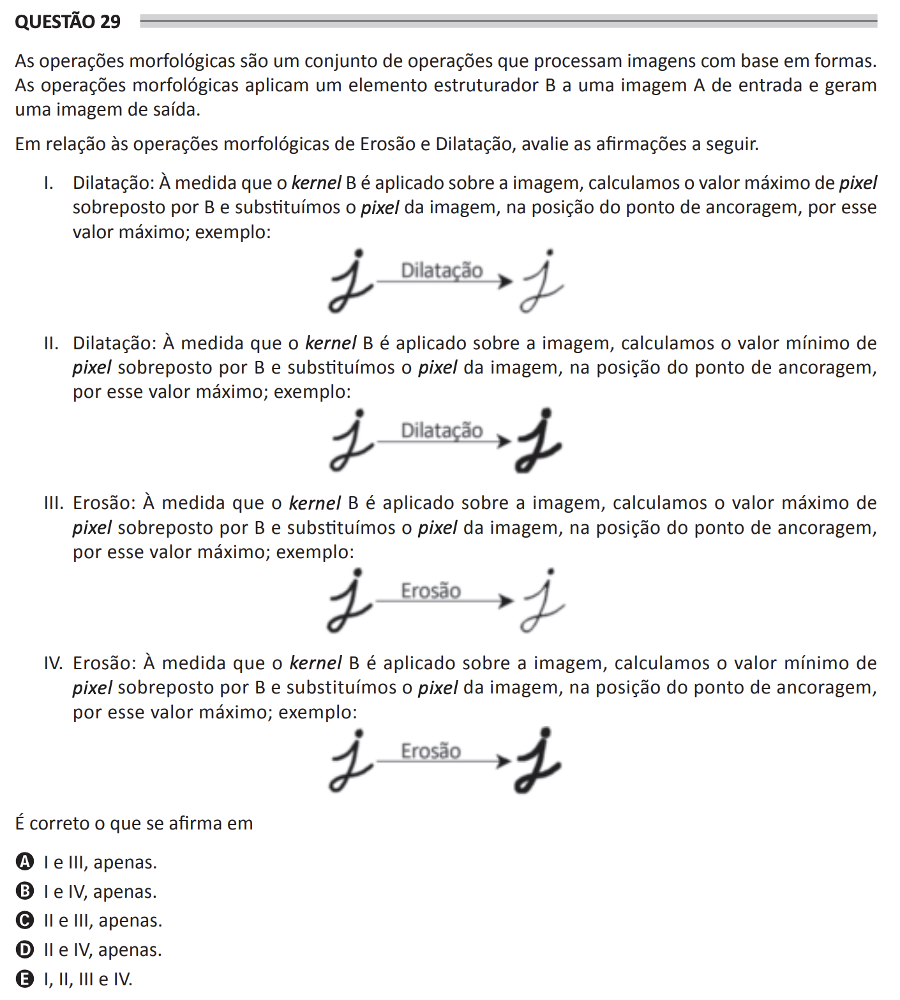

\[ [Previous question](q28-eng.md) \] \[ [Next question](q30-eng.md) \] \[ [Main menu](/README.md) \] \[ [Portuguese version](q29-por.md) \] 

## Question 29 ##

**English transcription of the question:**

Morphological operations are a set of operations that process images based on shapes. Morphological operations apply a structuring element B to an input image A and generate an output image.

In relation to the morphological operations of Erosion and Dilation, evaluate the following statements.

I. Dilation: As the kernel B is applied over the image, we calculate the maximum pixel value overlapping with B and we replace the image pixel, at the anchor point position, with this maximum value; example: \[Graphic depiction of the process of Dilation, showing how the kernel overlaps with pixels and the resulting dilation effect.\]

II. Dilation: As the kernel B is applied over the image, we calculate the minimum pixel value overlapping with B and we replace the image pixel, at the anchor point position, with this maximum value; example: \[Graphic depiction of the process of Dilation, showing how the kernel overlaps with pixels and the error in this example of replacing with a maximum value when it should be minimum.\]

III. Erosion: As the kernel B is applied over the image, we calculate the maximum pixel value overlapping with B and we replace the image pixel, at the anchor point position, with this maximum value; example: \[Graphic depiction of the process of Erosion, showing correct application and the resulting effect of erosion.\]

IV. Erosion: As the kernel B is applied over the image, we calculate the minimum pixel value overlapping with B and we replace the image pixel, at the anchor point position, with this maximum value; example: \[Graphic depiction of the process of Erosion, illustrating an error by suggesting replacement with a maximum value instead of the minimum.\]

Is it correct what is stated in

A) I and III, only.

B) I and IV, only.

C) II and III, only.

D) II and IV, only.

E) I, II, III and IV.

---

**Answer key**: INVALID

\[ [Previous question](q28-eng.md) \] \[ [Next question](q30-eng.md) \] \[ [Main menu](/README.md) \] \[ [Portuguese version](q29-por.md) \] 
