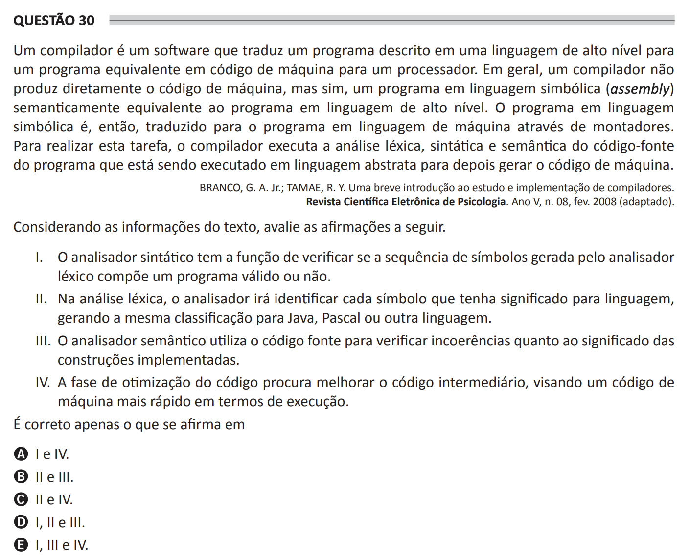

\[ [Questão anterior](q29-por.md) \] \[ [Próxima questão](q31-por.md) \] \[ [Menu inicial](/README.md) \] \[ [Versão em Inglês](q30-eng.md) \] 

## Questão 30 ##

**Prompt**: Responda a questão nesta imagem. Explique o seu raciocínio passo a passo. Ao final, escolha qual das cinco alternativas fornecidas (A-E) é a correta. Informe caso haja mais de uma alternativa correta ou todas as cinco alternativas sejam incorretas.

---

**Resposta do ChatGPT-4 Vision**: 

Vamos analisar as afirmações:

I. O analisador sintático tem a função de verificar se a sequência de símbolos gerada pelo analisador léxico compõe um programa válido ou não.
**Correto**. A análise sintática, ou parsing, verifica se a sequência de tokens (símbolos) gerada pela análise léxica segue as regras gramaticais da linguagem de programação.

II. Na análise léxica, o analisador irá identificar cada símbolo que tenha significado para a linguagem, gerando a mesma classificação para Java, Pascal ou outra linguagem.
**Incorreto**. A análise léxica identifica símbolos e os transforma em tokens, mas a classificação destes tokens não é necessariamente a mesma entre linguagens diferentes como Java e Pascal.

III. O analisador semântico utiliza o código fonte para verificar incoerências quanto ao significado das construções implementadas.
**Correto**. A análise semântica é responsável por verificar se as construções sintaticamente corretas também fazem sentido em termos de sua operação e significado na linguagem.

IV. A fase de otimização do código procura melhorar o código intermediário, visando um código de máquina mais rápido em termos de execução.
**Correto**. A otimização é uma etapa posterior nas fases do compilador que busca melhorar o desempenho do código, tornando-o mais eficiente sem alterar sua semântica.

Dadas as análises, as afirmações corretas são I, III e IV.

A resposta correta é **E) I, III e IV**.

---

**Gabarito**: E

---

**Veredito**

A resposta do ChatGPT é consistente com o gabarito.

\[ [Questão anterior](q29-por.md) \] \[ [Próxima questão](q31-por.md) \] \[ [Menu inicial](/README.md) \]
