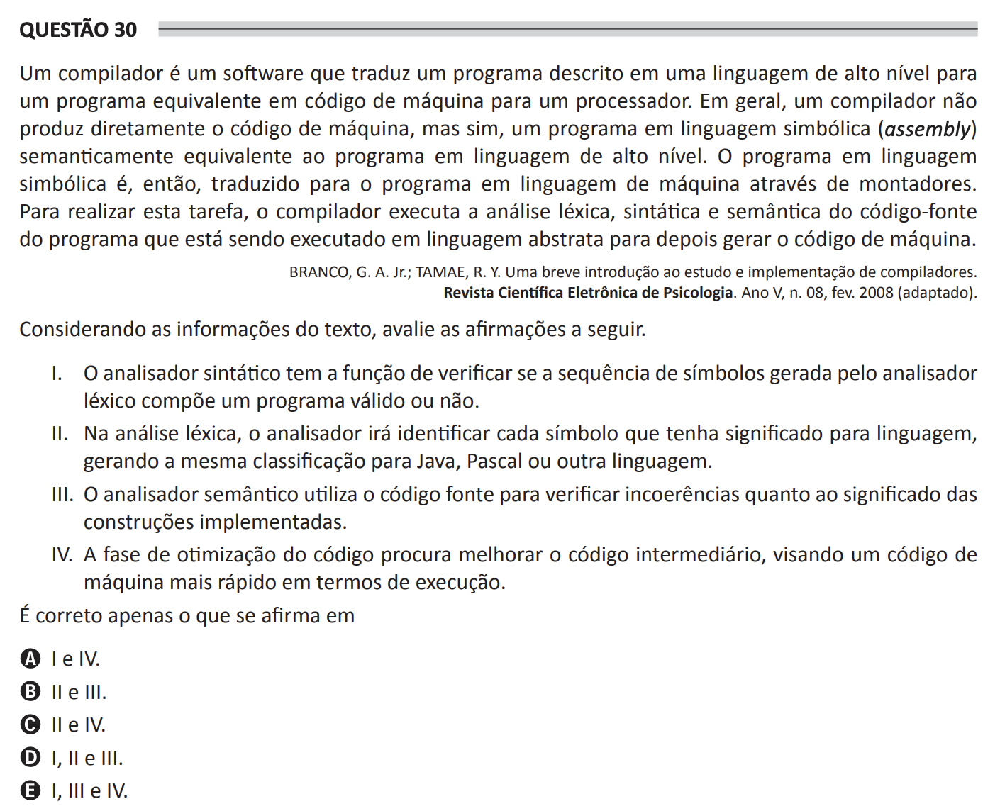

## Question 30 ##

### Original question in image format (in Portuguese): ###

### English translation: ###

**QUESTION 30**

A compiler is software that translates a program described in a high-level language into an equivalent program in machine code for a processor. Generally, a compiler does not directly produce the machine code, but rather, a program in symbolic language (assembly) semantically equivalent to the program in high-level language. The program in symbolic language is then translated into the machine program through assemblers. To carry out this task, the compiler executes lexical, syntactic, and semantic analysis of the source code of the program that is being executed in abstract language to later generate machine code.

BRANCO, G. A. J.; TAMAE, R. Y. A brief introduction to the study and implementation of compilers. Revista Científica Eletrônica de Psicologia. Year V, n. 08, fev. 2008 (adapted).

Considering the information in the text, evaluate the following statements.

I. The syntactic analyzer has the function to verify if the sequence of symbols generated by the lexical analyzer composes a valid program or not.

II. In lexical analysis, the analyzer will identify each symbol that has meaning for the language, generating the same classification for Java, Pascal, or another language.

III. The semantic analyzer uses the source code to verify inconsistencies regarding the meaning of the implemented constructs.

IV. The code optimization phase seeks to improve the intermediate code, aiming for a machine code that runs faster in terms of execution.

It is correct only what is stated in

A) I and IV.

B) II and III.

C) II and IV.

D) I, II, and III.

E) I, III, and IV.