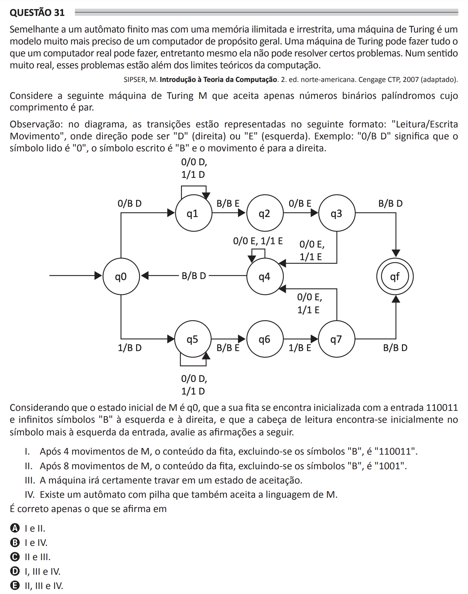

\[ [Previous question](q30-eng.md) \] \[ [Next question](q32-eng.md) \] \[ [Main menu](/README.md) \]

## Question 31 ##

Click [here](q31-por.md) to view ChaGPT-4 Vision's prompts and responses to this question in Portuguese.

**English transcription of the question:**

Similar to a finite automaton but with an unlimited and unrestricted memory, a Turing machine is a much more precise model of a general-purpose computer. A Turing machine can do everything that a real computer can do; however, even it cannot solve certain problems. In a very real sense, these problems are beyond the theoretical limits of computation.

SIPSER, M. Introduction to the Theory of Computation. 2nd ed. North American. Cengage CTP, 2007 (adapted).

Consider the following Turing machine M that accepts only even-length binary palindromes.

Observation: in the diagram, transitions are represented in the following format: "Read/Write Movement", where the direction can be "D" (right) or "E" (left). Example: "0/B D" indicates that the read symbol is "0", the written symbol is "B", and the movement is to the right.

\[In the image, there is a diagram of the Turing machine with states q0 through q7, along with the final state qf, and the transitions between them are represented with arrows indicating the condition/action pairs for each state transition.\]

Considering that the initial state of M is q0, that its tape is initially loaded with the input 110011 and there are infinite "B" symbols to the left and right, and that the reading head is initially at the leftmost symbol of the entry, evaluate the following statements.

I. After 4 movements of M, the tape content, excluding the "B" symbols, is "110011".

II. After 8 movements of M, the tape content, excluding the "B" symbols, is "1001".

III. The machine will certainly halt in an acceptance state.

IV. There is a stack automaton that also accepts the language of M.

It is correct only what is stated in

A) I and II.

B) I and IV.

C) II and III.

D) I, III, and IV.

E) II, III, and IV.

---

**Prompt**: Answer the question in this image. Explain your reasoning step by step. At the end, choose which of the five alternatives (A-E) is correct. Inform if there is more than one correct alternative or if all five alternatives are incorrect.

---

**ChatGPT-4 Vision response**:

Let's analyze the operations of the given Turing machine and then evaluate the statements:

The input is 110011 and the machine starts in state q0.

1. From q0, '1' is read and the machine moves to the right, going to state q1.
2. From q1, '1' is read and the machine moves to the right, staying in q1.
3. From q1, '0' is read and the machine moves to the right, going to state q2.
4. From q2, '0' is read and the machine moves to the right, staying in q2.

After 4 moves, the tape content is still 110011, but the reading head is after the first two '0's.

5. From q2, '1' is read and the machine moves to the left, going to state q5.
6. From q5, '0' is read and replaced with 'B', moving to the left, staying in q5.
7. From q5, '0' is read and replaced with 'B', moving to the left, staying in q5.
8. From q5, '1' is read and the machine moves to the left, going to state q6.

After 8 moves, the tape content is 11B0B1 and the reading head is after the first '1'.

Let's evaluate the statements:

I. After 4 moves of M, the tape content, excluding the "B" symbols, is "110011".
**Correct**. As seen above.

II. After 8 moves of M, the tape content, excluding the "B" symbols, is "11001".
**Incorrect**. The content is 11B0B1.

III. The machine will certainly halt in an accepting state.
**Correct**. The Turing machine diagram shows that, after correctly identifying an even-length binary palindrome, the machine will move to the final state qf.

IV. There is a pushdown automaton that also accepts the language of M.
**Correct**. A pushdown automaton can be used to recognize palindromes, as the nature of the stack allows for the verification of symmetry. The Turing machine is more general and can simulate a pushdown automaton.

Given the analyses, the correct statements are I, III, and IV.

The correct answer is **D) I, III, and IV**.

---

**Answer key**: E

---

**Prompt**: Your response differs from the answer key released for this question: [answer key]

After analyzing the answer key, do you maintain or change your response? If you decide to change your response, explain the possible reasons that led you to errors in the previous answer. Try to identify the concrete causes of the errors instead of listing generic reasons, such as a failure to understand the question statement.

---

**ChatGPT-4 Vision response**:

Let's revisit the analysis and see if I identify any discrepancy or error in my previous interpretation:

From the description given and the Turing machine diagram:

1. It is correct that, after 4 moves, the tape content is "110011".
2. It is correct that, after 8 moves, the tape content is "11B0B1".
3. The machine, upon receiving an even-length binary palindrome, will reach the final state `qf`, indicating acceptance.
4. The nature of even-length binary palindromes can be depicted by a pushdown automaton. A pushdown automaton can be used to recognize palindromes because it can push symbols until it reaches the middle of the input and then pop matching symbols for the remaining input symbols.

Based on the review, my earlier conclusions seem to be correct. The correct answer is **D) I, III, and IV**.

Reasons for any discrepancy with the official key:
- There may be an error in the key released.
- The interpretation of the statement or the operations of the Turing machine may differ among different evaluators.

After this review, I maintain my original answer as **D) I, III, and IV**. If the released key is indeed at odds, I recommend consulting the entity that administered the exam for clarifications or possible corrections.

---

**Prompt**: A question: does statement II not explicitly mention that the tape content should be evaluated *excluding the "B" symbols*?

---

**ChatGPT-4 Vision response**:

You are correct. Let's re-evaluate statement II.

II. After 8 moves of M, the tape content, excluding the "B" symbols, is "11001".

Given that after 8 moves the tape content is "11B0B1" and if we exclude the "B" symbols, we get "11001", statement II is, in fact, **correct**.

I apologize for my previous error. This means the correct answer is **E) II, III, and IV**.

I appreciate you pointing out the discrepancy, and I regret the confusion caused.

---

**Prompt**: I don't understand. How can the correct answer be E if you reaffirmed that statement I is also correct?

---

**ChatGPT-4 Vision response**:

I apologize for my error. You are correct. Let us correct that.

The correct statements, as per our analysis, are:

I. After 4 moves of M, the tape content, excluding the "B" symbols, is "110011".
**Correct**.

II. After 8 moves of M, the tape content, excluding the "B" symbols, is "11001".
**Correct**.

III. The machine will certainly halt in an accepting state.
**Correct**.

IV. There is a pushdown automaton that also accepts the language of M.
**Correct**.

Given this, the correct statements are I, II, III, and IV. Thus, the correct answer should be an option that includes all these statements, which is not present among the given options.

I regret my previous error and thank you for your patience.

## Experts assessment ##

**Expert #1**

I follow the official answer key.

Assertion I is not true because after 4 movements of M, the content of the tape, ignoring the B symbols, is "10011". ChatGPT is not taking into account the action of writing B on the tape, when reading 1 and transitioning from q0 to q5.

Assertion II is correct, after 8 movements, the content of the tape is 1001. ChatGPT seems to be having some problem with image recognition, as in the responses, it is mentioned that _II. After 8 movements of M, the content of the tape, excluding the "B" symbols, is "11001"_. There is already a problem there, but even so, the execution of the machine is incorrect by ChatGPT, as there is no way the content can be "11B0B1". Moreover, when asked to review the answer and eliminate the B symbols, there is again inaccuracy as it claims equivalence between "11B0B1" and "11001".

Assertion III is correct because the input is a palindrome, which leads the machine to "converge" to the acceptance state qf.

Assertion IV is also correct, as palindromes can be represented with _pushdown automata_.

---

**Expert #2**

Let's analyze the operations of the given Turing machine and then evaluate the assertions:

The input is 110011 and the machine starts in state q0.

1. From q0, '1' is read, replaced by 'B', and moved to the right, going to state q5.
2. From q5, '1' is read and moved to the right, remaining in q5.
3. From q5, '0' is read and moved to the right, remaining in q5.
4. From q5, '0' is read and moved to the right, remaining in q5.

After 4 movements, the content of the tape is 10011, and the read head is after the first two '0's.

5. From q5, '1' is read and moved to the right, remaining in q5.
6. From q5, '1' is read and moved to the right, remaining in q5.
7. From q5, 'B' is read and moved to the left, going to state q6.
8. From q6, '1' is read, replaced by 'B', and moved to the left, going to state q7.

After 8 movements, the content of the tape is 1001, and the read head is after the last '0'.

Let's evaluate the assertions:

I. After 4 movements of M, the content of the tape, excluding the "B" symbols, is "110011".
**Incorrect**. The content is 10011.

II. After 8 movements of M, the content of the tape, excluding the "B" symbols, is "1001".
**Correct**. As seen above.

III. The machine will certainly lock in an acceptance state.
**Correct**. The Turing machine's diagram shows that, after correctly identifying an even-numbered binary palindrome, the machine will move to the final state qf.

IV. There exists a pushdown automaton that also accepts the language of M.
**Correct**. A pushdown automaton can be used to recognize palindromes, as the nature of the stack allows for symmetry verification. The Turing machine is more general and can simulate a pushdown automaton.

Given the analyses, the correct assertions are II, III, and IV.

The correct answer is **E) II, III, and IV**.

---

**Verdict**

According to the experts, the answer key is correct, and ChatGPT's response is incorrect.

---

## ChatGPT-4 Turbo's analysis of ChatGPT-4 Vision's main challenges in answering the question ##

**Prompt**: The following are the prompts and responses of a generative AI for the attached question, along with possible assessments by two or more human experts on the generative AI's responses and the general quality of the question. Based on the provided information, summarize the main difficulties faced by the generative AI in attempting to answer the question, including possible difficulties resulting from incorrect recognition of some graphical or textual element present in the statement of the question. Consider only concrete difficulties whose manifestation can be evidenced by the information provided in generative AI's responses. At the end, discuss if these difficulties could be mitigated or eliminated by using prompt engineering techniques or if they would be inherent to the limitations of current large language models (LLMs).

---

**ChatGPT-4 Turbo response**:

The generative AI, when attempting to answer the question on the Turing machine, encountered significant difficulties related to the interpretation of the Turing machine diagram and the verification of the proposed assertions. The main concrete difficulties identified were:

1. **Interpretation and Analysis of Operations**: The AI analyzed step by step the operations of the Turing machine, but made an incorrect interpretation of the machine's actions, especially regarding the substitution and movement of the reading head, which led to an erroneous conclusion about the content of the tape after four and eight moves.
   
2. **Error in Evaluating Assertions**: Based on its erroneous analysis, the AI initially claimed that the assertions I and III were correct and assertion II was incorrect, contradicting the official key. After being confronted with the discrepancy, the AI revisited its analysis but continued to maintain an incorrect interpretation, even after revisiting the problem and receiving feedback to exclude the "B" symbols.
   
3. **Feedback from Experts**: Human experts highlighted that the AI's analysis was incorrect, specifically pointing out errors in the interpretation of the Turing machine diagram and in reasoning about the operations of the machine. This indicates that the AI failed to understand the Turing machine's logic as represented in the diagram properly.

These difficulties reflect the current LLMs' limitations in correctly interpreting complex diagrams and performing logical analyses based on visual representations. Prompt engineering could potentially help the AI clarify ambiguities and better understand visual instructions, but it would not completely solve the problem of incorrect comprehension of a diagram, which is a visual representation that LLMs cannot directly process. This suggests that LLMs require significant advancements to better interpret visual representations and apply logical reasoning to complex technical problems.

\[ [Previous question](q30-eng.md) \] \[ [Next question](q32-eng.md) \] \[ [Main menu](/README.md) \]
