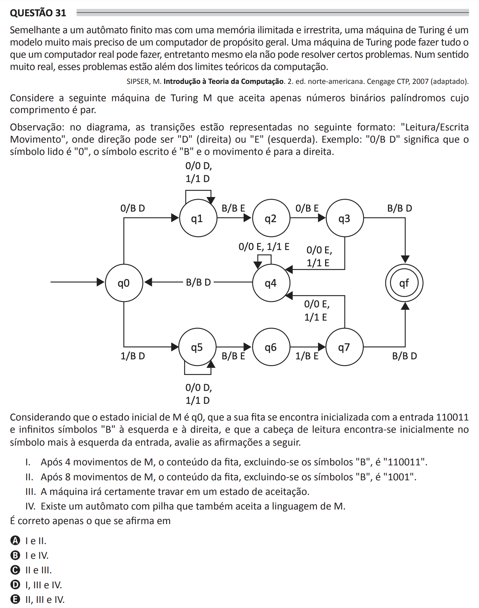

## Question 31 ##

### Original question in image format (in Portuguese): ###

### English translation: ###

**QUESTION 31**

Similar to a finite automaton but with an unlimited and unrestricted memory, a Turing machine is a much more precise model of a general-purpose computer. A Turing machine can do everything that a real computer can do; however, even it cannot solve certain problems. In a very real sense, these problems are beyond the theoretical limits of computation.

SIPSER, M. Introduction to the Theory of Computation. 2nd ed. North American. Cengage CTP, 2007 (adapted).

Consider the following Turing machine M that accepts only even-length binary palindromes.

Observation: in the diagram, transitions are represented in the following format: "Read/Write Movement", where the direction can be "D" (right) or "E" (left). Example: "0/B D" indicates that the read symbol is "0", the written symbol is "B", and the movement is to the right.

\[In the image, there is a diagram of the Turing machine with states q0 through q7, along with the final state qf, and the transitions between them are represented with arrows indicating the condition/action pairs for each state transition.\]

Considering that the initial state of M is q0, that its tape is initially loaded with the input 110011 and there are infinite "B" symbols to the left and right, and that the reading head is initially at the leftmost symbol of the entry, evaluate the following statements.

I. After 4 movements of M, the tape content, excluding the "B" symbols, is "110011".

II. After 8 movements of M, the tape content, excluding the "B" symbols, is "1001".

III. The machine will certainly halt in an acceptance state.

IV. There is a stack automaton that also accepts the language of M.

It is correct only what is stated in

A) I and II.

B) I and IV.

C) II and III.

D) I, III, and IV.

E) II, III, and IV.
