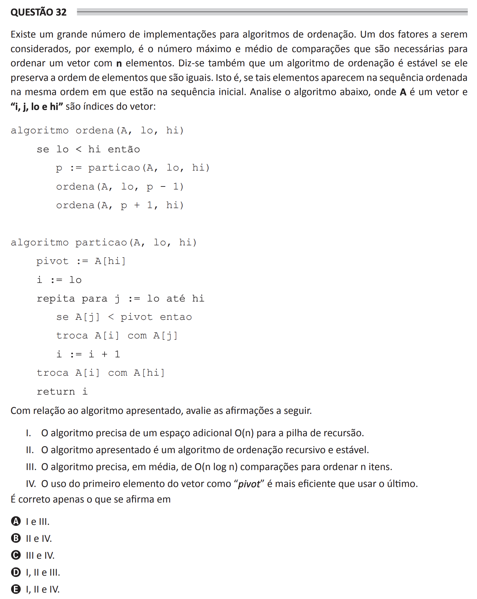

\[ [Questão anterior](q31-por.md) \] \[ [Próxima questão](q33-por.md) \] \[ [Menu inicial](/README.md) \] \[ [Versão em Inglês](q32-eng.md) \] 

## Questão 32 ##

**Prompt**: Responda a questão nesta imagem. Explique o seu raciocínio passo a passo. Ao final, escolha qual das cinco alternativas fornecidas (A-E) é a correta. Informe caso haja mais de uma alternativa correta ou todas as cinco alternativas sejam incorretas.

---

**Resposta do ChatGPT-4 Vision**: 

O algoritmo apresentado é uma implementação do algoritmo de ordenação Quicksort. Vamos analisar as afirmações com base na estrutura e funcionamento deste algoritmo:

I. O algoritmo precisa de um espaço adicional O(n) para a pilha de recursão.

**Correto**. Em pior caso, o Quicksort pode requerer uma pilha de recursão com tamanho O(n), principalmente quando o vetor está quase ordenado ou quase inversamente ordenado e o pivot escolhido é sempre o menor ou o maior elemento.

II. O algoritmo apresentado é um algoritmo de ordenação recursivo e estável.

**Parcialmente correto**. O algoritmo é, de fato, recursivo. No entanto, ele não é estável. A estabilidade em algoritmos de ordenação refere-se à preservação da ordem original dos registros que possuem valores iguais. No Quicksort, como é usado o método de particionamento, é possível que dois valores iguais troquem de posição entre si.

III. O algoritmo precisa, em média, de O(n log n) comparações para ordenar n itens.

**Correto**. Em média, o Quicksort tem uma complexidade de tempo de O(n log n). No entanto, é importante notar que no pior caso sua complexidade pode chegar a O(n^2), mas com boas estratégias de escolha de pivot (como mediana de três), esse comportamento pode ser minimizado.

IV. O uso do primeiro elemento do vetor como “pivot” é mais eficiente que usar o último.

**Incorreto**. A eficiência da escolha do pivot no Quicksort depende da distribuição dos dados no vetor. Usar sempre o primeiro ou o último elemento como pivot pode resultar em desempenho pobre (O(n^2)) se o vetor estiver quase ordenado ou quase inversamente ordenado. Uma estratégia comum para melhorar isso é usar a "mediana de três" como pivot.

Com base nas análises, as afirmações corretas são I e III.

A resposta correta é **A) I e III**.

---

**Gabarito**: A

---

**Veredito**

A resposta do ChatGPT é consistente com o gabarito.

\[ [Questão anterior](q31-por.md) \] \[ [Próxima questão](q33-por.md) \] \[ [Menu inicial](/README.md) \] \[ [Versão em Inglês](q32-eng.md) \] 
