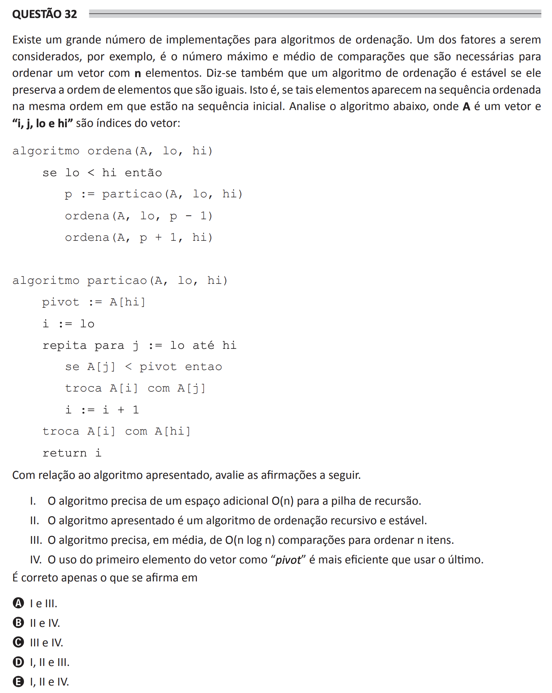

## Question 32 ##

### Original question in image format (in Portuguese): ###


### English translation: ###

**QUESTION 32**

There is a large number of implementations for sorting algorithms. One of the factors to be considered, for example, is the maximum and average number of comparisons that are necessary to sort a vector with n elements. It is also said that a sorting algorithm is stable if it preserves the order of elements that are equal. That is, if such elements appear in the sorted sequence in the same order as they are in the initial sequence. Analyze the algorithm below, where A is a vector and "i, j, lo and hi" are indices of the vector:

```
algorithm sort(A, lo, hi)
    if lo < hi then
        p := partition(A, lo, hi)
        sort(A, lo, p - 1)
        sort(A, p + 1, hi)

algorithm partition(A, lo, hi)
    pivot := A\[hi\]
    i := lo
    repeat for j := lo to hi
        if A\[j\] < pivot then
            swap A\[i\] with A\[j\]
            i := i + 1
    swap A\[i\] with A\[hi\]
    return i
```

In relation to the presented algorithm, evaluate the following statements.

I. The algorithm requires additional *O(n)* space for the recursion stack.

II. The presented algorithm is a recursive and stable sorting algorithm.

III. The algorithm needs, on average, *O(n log n)* comparisons to sort *n* items.

IV. The use of the first element of the vector as the "pivot" is more efficient than using the last one.

It is correct only what is stated in

A) I and III.

B) II and IV.

C) III and IV.

D) I, II and III.

E) I, II and IV.
