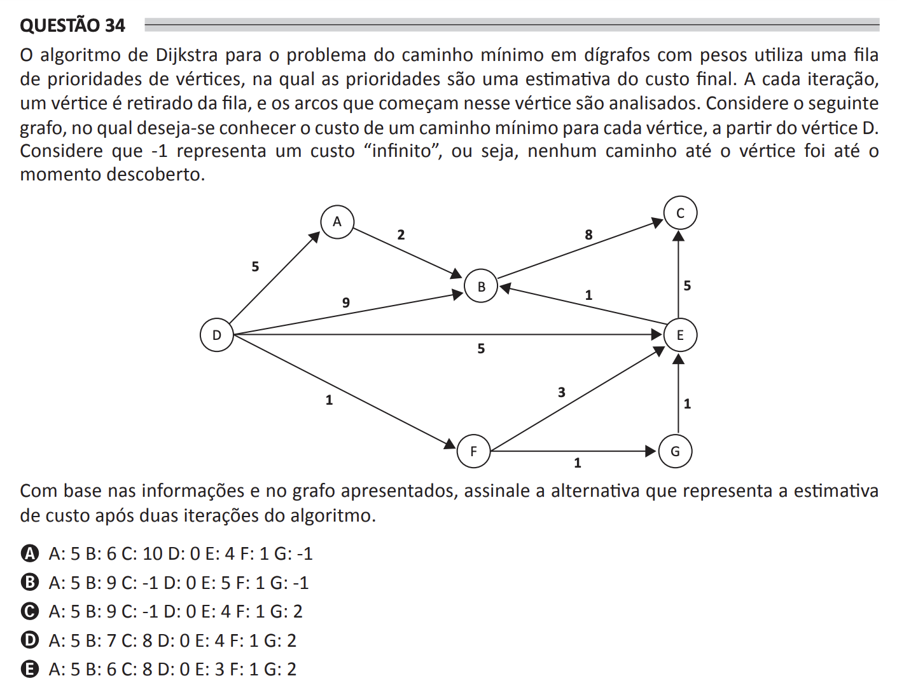

## Question 34 ##

### Original question in image format (in Portuguese): ###

### English translation: ###

**QUESTION 34**

Dijkstra's algorithm for the shortest path problem in weighted digraphs uses a priority queue of vertices, where the priorities are an estimate of the final cost. At each iteration, a vertex is removed from the queue, and the arcs that start at that vertex are analyzed. Consider the following graph, in which the desire is to know the cost of the shortest path for each vertex, starting from vertex D. Assume that -1 represents an "infinite" cost, that is, no path to the vertex has been found up to that moment.

\[The image shows a weighted directed graph (digraph) with vertices labeled A to G and directed edges connecting them with assigned numerical weights.\]

Based on the information and the graph presented, select the alternative that represents the cost estimate after two iterations of the algorithm.

A) A: 5 B: 6 C: 10 D: 0 E: 4 F: 1 G: -1

B) A: 5 B: 9 C: -1 D: 0 E: 5 F: 1 G: -1

C) A: 5 B: 9 C: -1 D: 0 E: 4 F: 1 G: 2

D) A: 5 B: 7 C: 8 D: 0 E: 4 F: 1 G: 2

E) A: 5 B: 6 C: 8 D: 0 E: 3 F: 1 G: 2
