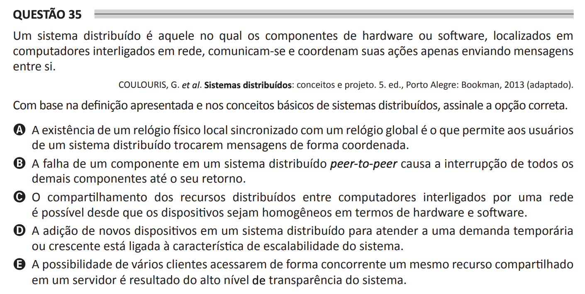

\[ [Questão anterior](q34-por.md) \]  \[ [Menu inicial](/README.md) \]

## Questão 35 ##

**Prompt**: Responda a questão nesta imagem. Explique o seu raciocínio passo a passo. Ao final, escolha qual das cinco alternativas fornecidas (A-E) é a correta. Informe caso haja mais de uma alternativa correta ou todas as cinco alternativas sejam incorretas.

---

**Resposta do ChatGPT-4 Vision**: 

Vamos analisar cada alternativa com base na definição e nos conceitos básicos de sistemas distribuídos:

**A)** *A existência de um relógio físico local sincronizado com um relógio global é o que permite aos usuários de um sistema distribuído trocarem mensagens de forma coordenada.*  
- Não é exatamente verdadeiro. A troca de mensagens em sistemas distribuídos não depende necessariamente de um relógio físico local sincronizado com um relógio global. A sincronização de relógios é útil para ordenar eventos, mas a comunicação pode ocorrer mesmo sem isso.

**B)** *A falha de um componente em um sistema distribuído peer-to-peer causa a interrupção de todos os demais componentes até o seu retorno.*  
- Isso não é verdadeiro. Uma das vantagens dos sistemas distribuídos, especialmente os do tipo peer-to-peer, é a tolerância a falhas. Se um nó falha, os outros nós podem continuar operando normalmente.

**C)** *O compartilhamento dos recursos distribuídos entre computadores interligados por uma rede é possível desde que os dispositivos sejam homogêneos em termos de hardware e software.*  
- Isso é falso. Sistemas distribuídos podem envolver computadores heterogêneos. De fato, muitos sistemas distribuídos são projetados para trabalhar com dispositivos de diferentes tipos e capacidades.

**D)** *A adição de novos dispositivos em um sistema distribuído para atender a uma demanda temporária ou crescente está ligada à característica de escalabilidade do sistema.*  
- Isso é verdadeiro. A escalabilidade é uma das principais vantagens dos sistemas distribuídos. Eles podem ser dimensionados para acomodar mais recursos e atender a uma demanda crescente simplesmente adicionando mais nós ao sistema.

**E)** *A possibilidade de vários clientes acessarem de forma concorrente um mesmo recurso compartilhado em um servidor é resultado do alto nível de transparência do sistema.*  
- Isso é parcialmente verdadeiro. A transparência em sistemas distribuídos se refere ao fato de que os detalhes de onde e como os recursos estão localizados são ocultos dos usuários. Porém, a concorrência é gerenciada por protocolos de controle de concorrência e não necessariamente pela transparência.

Dado o raciocínio acima, a única opção que é totalmente correta é a **D) A adição de novos dispositivos em um sistema distribuído para atender a uma demanda temporária ou crescente está ligada à característica de escalabilidade do sistema.**

---

**Gabarito**: D

---

**Veredito**

A resposta do ChatGPT é consistente com o gabarito.

\[ [Questão anterior](q34-por.md) \]  \[ [Menu inicial](/README.md) \]
